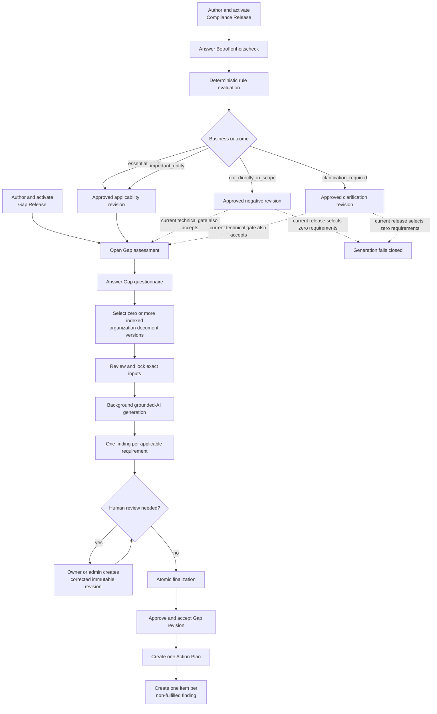
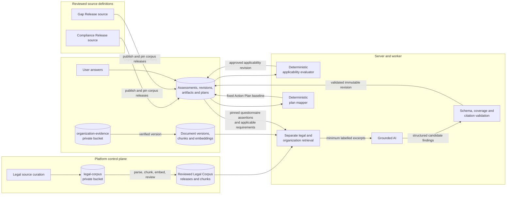
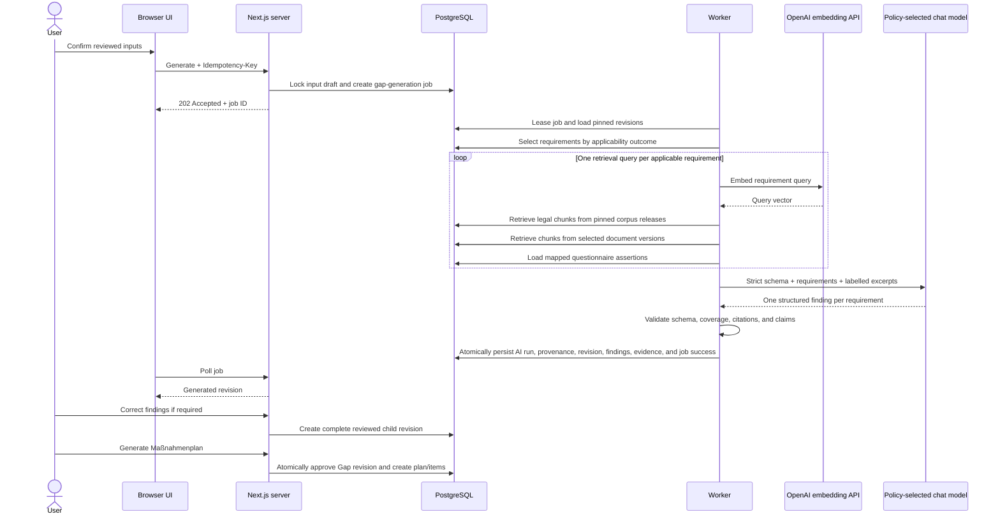

# End-to-End Compliance Workflow

Status: canonical description of the implemented workflow as of 2026-07-24.

This document explains the current architecture from the Applicability Check
(`Betroffenheitscheck`) through the Action Plan (`Maßnahmenplan`). It is the
source of truth for the end-to-end flow and distinguishes implemented behavior
from retained schema structures and planned functionality.

The intended audience is developers and technical product owners. Legal and
compliance stakeholders can use the workflow and provenance sections without
needing to follow the implementation links.

## Executive summary

The system contains two fundamentally different decision stages:

1. The Betroffenheitscheck is deterministic and does not call AI. It evaluates
   organization answers against an immutable Compliance Release.
2. The Gap Analysis is AI-assisted. It evaluates predefined, applicable
   requirements using pinned questionnaire assertions, selected organization
   evidence, and legal excerpts retrieved from pinned Legal Corpus Releases.

The Action Plan is deterministic again. It does not call AI; it creates exactly
one item for each Gap finding whose status is not `fulfilled`.



The dashed negative and clarification branches show an implementation
limitation, not the intended product outcome. The current Gap prerequisite
checks for a compatible approved applicability revision but does not require a
positive business outcome. The current requirements apply only to
`essential_entity` and `important_entity`; other outcomes therefore reach
generation with zero requirements, where the response-schema builder rejects
the operation.

## Architectural boundaries and information sources

| Boundary | Owns | Does not own |
| --- | --- | --- |
| Repository release definitions | Reviewed questionnaires, facts, thresholds, rule models, localized content, Gap requirements, mappings, prompt metadata | Organization answers or generated results |
| PostgreSQL | Published immutable releases, tenant metadata, answers, facts, source pins, extracted chunks, embeddings, jobs, AI provenance, findings, plans, audit records | Original uploaded file bytes |
| `organization-evidence` private bucket | Original organization-provided files | Legal sources, rules, findings, or plans |
| `legal-corpus` private bucket | Original curated legal-source renditions | Organization evidence |
| Legal Corpus database model | Reviewed source versions, renditions, processing generations, chunks, embeddings, immutable corpus releases | Organization implementation facts |
| Deterministic server code | Applicability evaluation, input validation, hashing, applicability filtering, severity calculation, action-item mapping | Free-form Gap rationale and recommendations |
| AI embedding provider | Vectorizes extracted chunks and retrieval queries | Business outcome or final approval |
| Approved chat-model provider | Produces structured Gap findings from supplied context | Applicability, requirement creation, severity policy, approval, or plan decomposition |
| Organization users | Answers, document selection, review corrections, finalization, plan execution state | Shared legal-corpus publication |
| Platform Administrators | Legal-corpus curation/review/publication/activation | Organization membership permissions or tenant findings |

Three distinctions are essential:

- A bucket contains original files. Runtime retrieval reads processed database
  chunks, not arbitrary bucket objects.
- The legal corpus is shared, curated authority. Organization Evidence is
  private proof about one organization. Their retrieval channels are never
  blended into a single unlabelled evidence pool.
- AI evaluates predefined requirements. It does not invent the requirement
  catalogue or decide whether NIS2 applies.

## Information-provenance model



## Control plane: preparing immutable runtime inputs

Runtime workflows consume published releases. They do not read mutable source
definitions directly.

### 1. Curate and activate Legal Corpus Releases

The authoritative legal corpus is prepared independently of any organization:

1. A Platform Administrator creates corpus families and legal-source metadata,
   including framework, jurisdiction, authority tier, publisher, and legal
   effect metadata.
2. A source rendition is imported from a URL or uploaded through a short-lived
   signed upload session into the private `legal-corpus` bucket.
3. Completion verifies the stored object's size, MIME type, and SHA-256 hash.
   It creates an immutable source version and language rendition.
4. `legal-source-process` and `legal-source-embed` worker jobs parse, chunk, and
   embed the rendition. A processing generation records parser, chunker, OCR,
   and embedding configuration. A Docling fallback may be used when configured.
5. A Platform Administrator separately reviews the processed generation.
   Review requires complete embeddings and reliable anchors.
6. Reviewed source versions and processing generations are selected into a
   draft Legal Corpus Release.
7. Publication validates membership, provenance, processing state, rendition
   relationships, and anchors, then makes the member set immutable.
8. A `grounding-evaluation` job evaluates the published release.
9. Activation requires a passed evaluation or an audited emergency override.
   `active_legal_corpus_releases` is the mutable pointer; activation history is
   append-only data.

Publishing a Compliance or Gap release resolves each required corpus family to
its currently active, published, evaluation-passed Legal Corpus Release. Those
exact corpus release IDs and a release-set hash are stored on the workflow
release. Later corpus activation does not rewrite an already-published
workflow release.

Primary implementation:

- [Corpus upload service](../../src/server/corpus/upload-service.ts)
- [Corpus processing workers](../../src/worker/handlers/legal-source-process.ts)
- [Corpus review service](../../src/server/corpus/review-service.ts)
- [Corpus release service](../../src/server/corpus/release-service.ts)
- [Corpus pin resolution](../../src/server/corpus/pinning.ts)

### 2. Author, publish, and activate a Compliance Release

The Betroffenheitscheck source is authored under
`src/server/compliance/nis2/releases/`. The current repository definition is
`nis2/2026-v1`.

A Compliance Release includes:

- questionnaire wording, options, visibility, and fact mappings;
- stable EU and national entity identities;
- thresholds and comparison semantics;
- jurisdiction profiles, national mappings, designations, and effective-state
  declarations;
- deterministic evaluator kind/version and compiled rule set;
- localized outcome, reason, disclaimer, and legal-provision content;
- legal instruments and source URLs; and
- required Legal Corpus families.

Publication validates and hashes the definition, creates immutable component
versions, resolves active Legal Corpus pins, and creates one aggregate
`compliance_check_releases` record. Publication never activates the release.
Activation validates completeness and advances
`active_compliance_check_releases`.

Non-production commands:

```powershell
npm.cmd run db:publish:compliance -- --release nis2/2026-v1
npm.cmd run db:activate:compliance -- --release nis2/2026-v1
```

Primary implementation:

- [Current Compliance Release](../../src/server/compliance/nis2/releases/2026-v1/release.ts)
- [Compliance publisher](../../src/server/compliance/publishing/publish-release.ts)
- [Compliance activator](../../src/server/compliance/publishing/activate-release.ts)
- [Runtime release assembler](../../src/server/compliance/runtime-release/postgres-assembler.ts)

### 3. Author, publish, and activate a Gap Analysis release

Gap requirements are authored, not AI-generated. A Gap release contains:

- its own questionnaire;
- a versioned requirement set;
- each requirement's code, localized title, requirement text, default
  recommendation, criticality, and legal references;
- `questionStableKeys`, which map questionnaire assertions to requirements;
- `applicableOutcomeCodes`, which determine which requirements apply to each
  applicability outcome;
- the compatible Compliance Release;
- prompt and output-schema metadata;
- evaluator and model-policy metadata; and
- required Legal Corpus families.

The repository definitions remain bilingual. Publication stores the title and
requirement text in immutable `content_revisions`/`content_translations` and
pins both revision IDs on `gap_requirement_versions`. Recommendation and
legal-reference labels remain localized JSON on the requirement version.

The compiler requires every requirement to map at least one known question and
every question to be mapped at least once. It permits a requirement to list
multiple questions and permits the same question to be reused by multiple
requirements. The relationship is therefore many-to-many:

```text
questions <-> requirements -> exactly one finding per applicable requirement
```

Publication stores stable requirements, immutable requirement versions,
requirement-set membership, question mappings, applicability conditions,
prompt metadata, and exact corpus pins. Activation advances
`active_gap_analysis_releases`.

Non-production commands:

```powershell
npm.cmd run db:publish:gap -- --release nis2-gap/guided-v3
npm.cmd run db:activate:gap -- --release nis2-gap/guided-v3
```

The current `guided-v3` definition inherits its requirements from `guided-v2`,
which inherits four demo-originated requirements from `demo-v1`: access
control, backup and recovery, incident response, and supply-chain security.
This is a current product limitation, not a complete NIS2 control catalogue.

Primary implementation:

- [Current Gap release](../../src/server/gap-analysis/releases/guided-v3/release.ts)
- [Inherited requirement definitions](../../src/server/gap-analysis/releases/demo-v1/release.ts)
- [Gap release compiler](../../src/server/gap-analysis/publishing/compile-release.ts)
- [Gap release publisher](../../src/server/gap-analysis/publishing/publish-release.ts)
- [Gap release activator](../../src/server/gap-analysis/publishing/activate-release.ts)

## Runtime workflow

### Phase 1: Betroffenheitscheck

#### Load

The server loads the active `nis2_applicability` release through the runtime
release reader. The UI receives localized questions and option catalogues.
Immutable published bundles may be cached; the active-release pointer,
organization state, answers, and results are not cached as immutable content.

An authenticated workflow loads the organization's latest answers. A guest
workflow creates a token-backed `guest_applicability_checks` record with an
expiry time and returns a fresh questionnaire session.

#### Validate and derive facts

On submission, the server:

1. validates the request with Zod;
2. calculates question visibility from earlier answers;
3. requires every visible, required question to be answered;
4. verifies each selected option belongs to its question;
5. maps answers to language-neutral decisive facts; and
6. builds an input hash from the answers, facts, Compliance Release ID, and
   rule-set ID.

Question text and labels are display content. Stable option values and derived
facts drive the evaluator.

#### Evaluate without AI

`evaluateRuleSet` applies the pinned deterministic rule document to the
language-neutral facts. It evaluates EU activity, country and jurisdiction,
national entity classifications and mappings, designations, company size and
aggregation, scope bases, obligation overlays, indirect exposure, and
unresolved decisive facts.

It produces one of four business outcomes:

| Outcome | Meaning for the current workflow |
| --- | --- |
| `essential_entity` | Positive applicability result; current Gap requirements apply |
| `important_entity` | Positive applicability result; current Gap requirements apply |
| `not_directly_in_scope` | Negative direct-scope conclusion; current Gap release has no applicable requirements |
| `clarification_required` | The pinned release cannot make a reliable positive or negative classification; current Gap release has no applicable requirements |

The evaluator also returns reason codes, legal-provision keys, matched entity
types, size classification, jurisdiction basis, national mappings, decisive
facts, and unresolved fact codes. Localized result text is looked up from the
pinned release; it is not written by AI.

The Legal Corpus is a publication prerequisite and provenance pin here, but
the Betroffenheitscheck does not perform runtime RAG over legal chunks. It uses
the compiled relational release content and deterministic rule set.

#### Persist

For an organization, one transaction:

- creates or reuses an active `assessments` identity;
- creates a new immutable `assessment_revisions` snapshot;
- stores answer rows, selected options, and derived organization facts;
- creates an `affectedness_result` artifact revision with status `approved`;
- stores the deterministic result and searchable projection;
- pins the assessment revision as an artifact source; and
- advances the artifact's `current_revision_id`.

Every valid evaluator outcome is technically stored as an approved revision.
Here, “approved” means the deterministic execution succeeded; it does not mean
the business outcome was positive.

A guest result remains in the guest record until claimed. Claiming replays the
stored guest answers through the guest's pinned Compliance Release and persists
a normal organization assessment/result before marking the guest session
claimed.

Primary implementation:

- [Applicability service](../../src/server/applicability-check/service.ts)
- [Deterministic evaluator](../../src/server/applicability-check/rules.ts)
- [Submission persistence](../../src/server/applicability-check/submission-persistence.ts)
- [Stored result schema](../../src/server/applicability-check/rule-evaluation-schema.ts)

### Phase 2: Start and pin the Gap assessment

Opening a Gap assessment requires:

- an active, published Gap release;
- its questionnaire to be available; and
- a current approved `affectedness_result` created by the exact Compliance
  Release declared compatible with the Gap release.

Creating the assessment pins:

- `gapAnalysisReleaseId`; and
- `applicabilityArtifactRevisionId`.

At that moment, applicability recalculation becomes locked for the
organization. The check cannot be resubmitted after a Gap assessment exists,
because doing so would invalidate the pinned prerequisite.

The current prerequisite query checks compatibility and approved status, but
not whether the outcome is `essential_entity` or `important_entity`. This is
why negative and clarification outcomes can currently enter the Gap wizard
even though they select no requirements later.

Primary implementation:

- [Gap assessment service](../../src/server/gap-analysis/assessment-service.ts)
- [Applicability recalculation lock](../../src/server/applicability-check/recalculation-lock.ts)
- [Gap prerequisite reader](../../src/server/gap-analysis/postgres-page-data.ts)

### Phase 3: Capture the Gap input snapshot

The UI exposes four steps:

1. **Answer questions**
2. **Select documents**
3. **Review information**
4. **Gap Analysis results**

#### Gap questionnaire

Every required Gap question must be answered exactly once. Submission creates a
new immutable assessment revision, stores answer/option rows, supersedes the
previous assessment revision, and advances `assessments.current_revision_id`.

Answers are organization assertions. They can support a finding's compliance
status, but they are not documentary proof.

#### Optional organization documents

Organization documents are a separate, reusable library. Upload uses a
short-lived signed session to send the original file to the private
`organization-evidence` bucket. Completion downloads and verifies the object,
then creates:

- a stable `documents` identity;
- an immutable `document_versions` row with storage path and content hash;
- an extraction record;
- citeable database chunks; and
- an embedding generation with 1,536-dimensional vectors.

Text PDF, DOCX, TXT, and Markdown are supported up to 10 MB. Scanned PDFs and
OCR are not supported for Organization Evidence. Processing currently occurs
synchronously in the upload-completion request after the object is verified.

The Gap selection may be empty. If documents are selected, they must be active,
current organization-owned versions with successful extraction and embedding.
The exact version IDs—not stable document IDs—are selected.

#### Prepared input draft

The implementation uses `gap_reassessment_drafts` and
`gap_reassessment_draft_documents` to hold the initial generation input bundle.
The “reassessment” name is retained from an earlier architecture; in the
current product this structure is used to prepare and lock the one permitted
initial generation.

An open draft pins:

- the Gap assessment;
- the exact Gap questionnaire revision;
- the Gap release;
- zero or more exact document versions; and
- a lock version for optimistic concurrency.

Saving the document step creates or updates that draft. Starting generation
changes it from `open` to `locked`, records the lock date, creates an
idempotency record, and enqueues one cancellable `gap-generation` job.
Questionnaire and evidence-selection mutations are rejected while the draft is
locked.

Primary implementation:

- [Gap questionnaire service](../../src/server/gap-analysis/questionnaire-service.ts)
- [Organization document service](../../src/server/documents/service.ts)
- [Gap input-draft service](../../src/server/gap-analysis/reassessment-service.ts)
- [Lifecycle guards](../../src/server/gap-analysis/lifecycle-guards.ts)

### Phase 4: Generate the grounded Gap Analysis



#### Requirement selection

The worker reloads the assessment's pinned Gap release and pinned approved
applicability revision. It filters requirements using:

```text
requirement.applicabilityOutcomeCodes includes applicability.outcome
```

The requirement—not the question—is the evaluation unit. The output contract
requires exactly one finding for every selected requirement.

#### Separate retrieval channels

For every applicable requirement, the server creates a query from the
requirement title, requirement text, and legal-reference metadata.

The Grounding Gateway then builds three labelled channels:

1. **Legal authority** — hybrid lexical/vector retrieval from the Legal Corpus
   Releases pinned by the Gap release, filtered by family, framework,
   jurisdiction, legal-effect date, language/rendition, processing generation,
   and authority-tier quotas.
2. **Organization documents** — hybrid lexical/vector retrieval restricted to
   the organization and the explicitly selected immutable document versions.
3. **Questionnaire assertions** — answers whose stable question keys are mapped
   to that requirement.

Legal and organization retrieval occur separately. Their results are combined
only after each has been independently scoped and labelled. An original file
is not placed in the chat prompt; the model receives selected excerpt
snapshots and citation IDs.

#### Provider policy

The Grounding Gateway loads `organization_ai_provider_policies`. The default
policy allows `company_hosted` and `self_hosted` modes and disallows external
disclosure. OpenAI chat generation is selectable only when the organization's
policy explicitly permits it. If no configured provider satisfies the policy,
generation fails closed.

The selected provider, model, policy version, prompt hash, token usage, and
whether context was disclosed through OpenAI chat are stored on the AI run and
its provenance rows.

#### AI responsibilities

For each requirement, AI proposes:

- `status`;
- `evidenceSufficiency`;
- localized rationale;
- localized recommendation;
- assumptions;
- citation IDs;
- contradictions;
- questionnaire disagreements; and
- `requiresReview`.

The allowed statuses are:

- `fulfilled`;
- `partially_fulfilled`;
- `not_fulfilled`; and
- `insufficient_evidence`.

Status and documentary evidence sufficiency are independent. A questionnaire
assertion may support `fulfilled` even when no organization document was
selected. “No document provided” is therefore a UI warning, not an automatic
finding status or Action Plan item.

#### Deterministic validation and derived fields

The model output is rejected unless:

- it matches the strict response schema;
- every requested requirement appears exactly once;
- no unknown or duplicate requirement appears;
- every citation ID was supplied for the same requirement;
- binding legal claims cite qualifying legal authority;
- contradictions set `requiresReview`; and
- grounded-claim coverage is complete.

The database independently enforces one finding per requirement per artifact
revision.

Severity is not chosen freely by AI. It is derived from the requirement's
published criticality and the validated status:

| Finding status | Derived severity |
| --- | --- |
| `fulfilled` | `low` |
| `not_fulfilled` | Requirement criticality |
| `insufficient_evidence` | Requirement criticality, except `critical` becomes `high` |
| `partially_fulfilled` | `critical` becomes `high`, `high` becomes `medium`; lower levels remain unchanged |

#### Successful persistence

The Grounding Gateway creates the AI run before the provider call and persists
retrieved context, claim validation, citation provenance, and exact source
hashes around the validated response. These records can therefore retain a
failed attempt even when no business result is created.

After validation, one final database transaction creates or updates:

- a `gap_analysis_result` artifact and immutable generated revision;
- artifact source links to the questionnaire revision, applicability revision,
  and selected document versions;
- one `gap_findings` row per applicable requirement;
- exact `gap_finding_evidence` excerpt snapshots and source foreign keys;
- the AI run's successful output-artifact pointer;
- draft status `generated`;
- background-job status `succeeded`; and
- generation audit events.

After the first successful revision exists, lifecycle guards reject further
questionnaire changes, evidence changes, and generation requests. There is no
second AI generation in the current product.

Primary implementation:

- [Gap generation service](../../src/server/gap-analysis/generation-service.ts)
- [Grounding Gateway](../../src/server/ai/grounding/gateway.ts)
- [Legal retrieval](../../src/server/ai/grounding/legal-retrieval.ts)
- [Organization retrieval](../../src/server/ai/grounding/organization-retrieval.ts)
- [Grounded-output validation](../../src/server/ai/grounding/validation.ts)
- [Gap response validation](../../src/server/gap-analysis/generation-schema.ts)

### Phase 5: Review and correct findings

All organization members with read access can inspect the immutable result and
its pinned inputs. Owner/admin management permission is required to correct or
finalize it.

A correction does not update the generated revision in place. It:

1. locks the stable artifact;
2. verifies the source revision is still current and no active plan exists;
3. requires a reason for every changed finding;
4. requires a resolution reason when clearing `requiresReview`;
5. recalculates severity if status changes;
6. creates a complete immutable child revision with status `reviewed`;
7. copies every unchanged finding, source pin, and evidence row;
8. records review resolutions and audit metadata; and
9. atomically advances `generated_artifacts.current_revision_id`.

AI questionnaire-disagreement metadata is informational. A manual correction
suppresses stale disagreement metadata for the corrected requirement.
Contradictions are blocking: every `requiresReview` flag must be resolved
before finalization.

Primary implementation:

- [Gap review service](../../src/server/gap-analysis/review-service.ts)
- [Gap workflow reader](../../src/server/gap-analysis/workflow-reader.ts)

### Phase 6: Finalize and create the Maßnahmenplan

There is no standalone Gap approval in the current lifecycle. The only
supported approval boundary is “Generate action plan.”

Before starting the transaction, finalization rejects a Gap revision when:

- a pinned assessment revision is no longer the current assessment revision;
- a pinned document is archived or no longer its document's current version;
- the pinned applicability artifact is no longer current or is archived;
- the pinned Gap release is no longer active; or
- the Gap revision itself is archived.

Inside one database transaction, the service:

1. locks the organization's Gap artifact;
2. requires the requested revision to be current;
3. rejects the request if any Action Plan already exists for the organization;
4. reconstructs and validates the pinned assessment and applicability chain;
5. recomputes the exact applicable requirement set;
6. requires exactly one finding for every applicable requirement;
7. rejects unresolved review blockers or malformed citations;
8. changes the Gap revision from `generated`/`reviewed` to `approved`;
9. sets `generated_artifacts.accepted_revision_id`;
10. creates one active `action_plans` row;
11. creates the fixed item baseline;
12. writes approval and generation audit events; and
13. completes the idempotency record.

Any failure rolls the whole transaction back.

#### Finding-to-item cardinality

Action Plan generation is deterministic:

| Finding status | Number of plan items |
| --- | ---: |
| `fulfilled` | 0 |
| `partially_fulfilled` | 1 |
| `not_fulfilled` | 1 |
| `insufficient_evidence` | 1 |

Two findings are never merged into one item, and one finding is never split
into multiple items.

Each created item starts with:

| Action Plan field | Source |
| --- | --- |
| `sourceFindingId` | Current approved Gap finding |
| `title` | Localized published requirement title |
| `description` | Current finding recommendation, AI-generated or human-corrected |
| `priority` | Deterministically derived finding severity |
| `status` | Constant `open` |
| `ownerUserId` | Initially `null` |
| `dueDate` | Initially `null` |

Primary implementation:

- [Atomic finalization service](../../src/server/gap-analysis/finalization-service.ts)
- [Deterministic Action Plan mapping](../../src/server/action-plans/service.ts)

### Phase 7: Operate the Action Plan

The generated item set is fixed. Contributors can update:

- status: `open`, `in_progress`, `done`, or `cancelled`;
- responsible active organization member; and
- due date.

Updates use optimistic concurrency: the caller supplies the expected item
version, the item and plan versions advance atomically, and a stale write
returns `PRECONDITION_FAILED`. Every update writes an organization audit event.

The Gap Analysis remains readable but permanently locked after plan creation.
Its results, inputs, and history remain available. There is no current route to
regenerate the Gap Analysis, reconcile plan items, replace the plan, or create
a later plan revision.

## Field-level provenance matrix

| Output or field | Immediate source | Source category | AI involvement | Persistence |
| --- | --- | --- | --- | --- |
| Applicability question text/options | Pinned Compliance Release | Reviewed repository definition published to DB | None | Questionnaire/content version tables |
| Applicability answers | User selection | Organization input | None | `assessment_answers`, option joins |
| Decisive facts | Deterministic fact mapping from answers | Server-derived | None | Organization fact values and joins |
| Applicability outcome | Pinned rule set + decisive facts | Deterministic server result | None | `generated_artifact_revisions.result`, `outcome_code` |
| Applicability reason/legal keys | Deterministic evaluator + release model | Deterministic server result | None | Artifact result JSON |
| Localized applicability explanation | Pinned localized release content | Reviewed published content | None | Rendered DTO; language-neutral evidence remains stored |
| Gap question text/options | Pinned Gap release | Reviewed repository definition published to DB | None | Questionnaire version tables |
| Gap answers/assertions | User selection | Organization input | Sent as labelled assertions to chat provider | Gap assessment revision/answer tables and AI context |
| Applicable requirement set | Gap release rules filtered by pinned applicability outcome | Deterministic server result | AI cannot add/remove requirements | Requirement/release tables; selected set implicit in findings |
| Legal excerpts | Hybrid retrieval from Gap release's pinned corpus releases | Shared Legal Corpus | Embedding API ranks retrieval; excerpts may be sent to chat provider | AI context snapshots and legal-input provenance |
| Organization excerpts | Hybrid retrieval from explicitly selected document versions | Private Organization Evidence | Embedding API ranks retrieval; excerpts may be sent to chat provider | AI context snapshots and finding evidence |
| Finding status | Structured model output, optionally human-corrected | AI then human-reviewable | Yes | `gap_findings.status` |
| Evidence sufficiency | Structured model output, optionally human-corrected | AI then human-reviewable | Yes | `gap_findings.evidence_sufficiency` |
| Finding rationale | Structured localized model output, optionally corrected | AI then human-reviewable | Yes | `gap_findings.rationale` |
| Finding recommendation | Structured localized model output, optionally corrected | AI then human-reviewable | Yes | `gap_findings.recommendation` |
| Finding assumptions/disagreements/contradictions | Structured model output | AI metadata | Yes | Finding/revision result and review metadata |
| Finding citations | Model chooses only from supplied IDs; server validates and resolves | AI selection under deterministic validation | Yes, constrained | `gap_finding_evidence`, AI provenance tables |
| Finding severity | Requirement criticality + final finding status | Deterministic server-derived | AI influences status, not severity formula | `gap_findings.severity` |
| Plan existence and item count | Finalization command + non-fulfilled findings | Deterministic server-derived | No new AI call | `action_plans`, `action_plan_items` |
| Plan item title | Published requirement title | Reviewed release content | None | `action_plan_items.title` snapshot |
| Plan item description | Current finding recommendation | AI or human-corrected upstream | No plan-generation AI | `action_plan_items.description` snapshot |
| Plan item priority | Current finding severity | Deterministic upstream | No plan-generation AI | `action_plan_items.priority` |
| Plan item owner/due date/status | Organization contributor | Operational organization state | None | Mutable columns with version/audit history |

## Immutability and reproducibility

The architecture uses stable identities plus immutable revisions:

- Active-release pointers are mutable; published releases are immutable.
- Assessments are stable workflow identities; submitted assessment revisions
  and answers are immutable.
- Documents are stable identities; document versions and content hashes are
  immutable.
- Generated artifacts are stable result identities; result revisions are
  immutable.
- `current_revision_id` means the latest working revision.
- `accepted_revision_id` means the approved authoritative Gap result.
- AI runs store source hashes, prompt/model metadata, exact excerpt snapshots,
  claims, and citation links.
- Action Plan items snapshot requirement titles and recommendations so later
  release activation cannot rewrite the plan.

`artifact_revision_sources` is the central cross-workflow lineage:

```text
Gap revision
  -> exact Gap questionnaire assessment revision
  -> exact approved applicability artifact revision
  -> exact selected document versions
  -> pinned Gap release
      -> exact requirement versions
      -> exact Legal Corpus Releases
```

## Authorization, trust, and disclosure boundaries

### Organization authorization

The browser does not have a supported direct table-access path. Routes
authenticate the user, validate input, and call server services. Effective
permissions in the workflow are:

- active members can read according to their organization capabilities;
- owners, admins, and members can contribute Gap answers, documents, and
  generation requests;
- owners and admins can correct/finalize the Gap Analysis;
- owners, admins, and members can update Action Plan execution fields; and
- auditors are read-oriented.

The applicability submission service currently checks organization access
rather than its more specific `applicability:submit` capability. This is an
as-built detail worth resolving if auditor immutability is required.

Platform corpus capabilities are separate from organization roles. Being an
organization owner does not grant corpus administration.

### Private storage

Both source buckets are private:

- `organization-evidence` for tenant documents; and
- `legal-corpus` for shared curated legal renditions.

Uploads use short-lived signed upload tokens. Completion verifies the object
before a durable version becomes usable. Original-file reads use authorized,
short-lived signed URLs. PostgreSQL stores paths, hashes, derived text, chunks,
and embeddings; it does not store original file bytes.

### Model disclosure

For chat generation, the intended disclosure boundary is the minimum retrieved
excerpts needed for each requirement. The prompt labels legal,
organization-document, and questionnaire channels, instructs the model to
ignore instructions found inside sources, and forbids invented citation IDs.

When OpenAI is the selected chat mode, provenance rows mark supplied context as
externally disclosed. Company-hosted and self-hosted modes are available when
configured.

There is an important current implementation caveat: the embedding provider is
hard-wired to OpenAI `text-embedding-3-small`. Organization document chunks are
sent to that embedding API during indexing, and requirement queries are sent
there during both legal and organization retrieval. Legal source chunks are
also embedded through the same default provider. This path does not consult
`organization_ai_provider_policies`, and its disclosures are not represented by
the chat run's `disclosedExternally` flag. The effective data boundary is
therefore broader than the chat-provider policy alone suggests.

### Audit and concurrency

- Organization workflow actions write `audit_events`.
- Corpus control-plane actions write `platform_audit_events`.
- The Supabase operator script installs a database trigger that rejects update
  or delete of `audit_events`.
- Costly create-once commands use idempotency keys.
- Shared updates use row locks or optimistic versions.
- Gap correction and plan finalization serialize on the stable artifact.
- Background work uses durable jobs with leases, heartbeats, polling, explicit
  cancellation, and safe failure messages.

## Rejection, failure, and recovery branches

| Stage | Condition | Current result/recovery |
| --- | --- | --- |
| Compliance release load | No active published release | Questionnaire unavailable; administrator must publish/activate |
| Applicability submission | Invalid, hidden, missing, or mismatched answer | Request rejected; user corrects answers |
| Applicability evaluation | Required decisive fact unresolved | Successful `clarification_required` business result |
| Applicability evaluation | Organization outside supported direct scope | Successful `not_directly_in_scope` business result |
| Guest workflow | Started/submitted session expires | Guest record becomes unavailable/expired; start again |
| Gap start | No compatible approved applicability revision | Gap assessment creation rejected |
| Gap start | Gap assessment already exists | Existing assessment reused |
| Applicability resubmission | Any Gap assessment exists | Rejected with `APPLICABILITY_RECALCULATION_LOCKED` |
| Gap questionnaire | Required question missing or option mismatch | Submission rejected |
| Document upload | Unsupported type, over 10 MB, or no extractable text | Upload/processing rejected; use a supported text document |
| Evidence selection | Selected version is cross-tenant, non-current, archived, or unindexed | Draft preparation/update rejected |
| Generation enqueue | Draft changed or another generation owns the slot | Conflict; reload current shared state |
| Generation enqueue | Reused idempotency key with different input | Rejected |
| Generation | Zero applicable requirements | Fails closed while building the strict response schema |
| Generation | Missing AI provider policy or no permitted configured provider | Fails closed; configure organization/provider policy |
| Generation | Missing/incomplete pinned corpus releases | Fails closed; fix and republish workflow release |
| Generation | Job cancelled before persistence | Draft/job become cancelled; explicit retry is available |
| Generation | Provider/retrieval/validation failure | Job/draft become failed; explicit retry is available |
| Generation | Output omits/duplicates a requirement or uses invalid citations | No result revision is persisted |
| Generation | Successful Gap revision already exists | Further generation/input mutation rejected with `GAP_ALREADY_GENERATED` |
| Review | Contradiction remains unresolved | Finalization blocked with `GAP_REVIEW_UNRESOLVED` |
| Correction | Missing correction/resolution reason | Correction rejected |
| Correction | Concurrent newer revision or existing plan | Correction rejected |
| Finalization | Pinned assessment/document/applicability source changed or archived | Rejected with `GAP_SOURCES_STALE` |
| Finalization | Active Gap release changed | Rejected as outdated |
| Finalization | Requirement coverage or citation integrity is invalid | Rejected; no partial plan |
| Finalization | Any Action Plan already exists | Rejected with `ACTION_PLAN_ALREADY_EXISTS` |
| Finalization | Any transactional step fails | Entire approval/plan transaction rolls back |
| Plan update | Stale expected item version | `PRECONDITION_FAILED`; reload and retry |
| Plan update | Assignee is not an active organization member | Update rejected |

## Main database ownership map

| Concern | Principal tables |
| --- | --- |
| Compliance release | `compliance_check_releases`, active/activation tables, questionnaire/fact/content/rule/threshold/profile tables, `compliance_check_release_corpus_releases` |
| Applicability runtime | `assessments`, `assessment_revisions`, `assessment_answers`, option joins, organization fact values, `generated_artifacts`, `generated_artifact_revisions`, `nis2_result_projections` |
| Legal corpus | `legal_corpus_families`, `legal_sources`, `legal_source_versions`, `legal_source_renditions`, `legal_source_processing_generations`, legal chunks/embeddings, corpus release/member/activation tables |
| Gap release | `gap_requirements`, `gap_requirement_versions`, requirement-set/version/member tables, `gap_analysis_releases`, applicability rules, active/activation tables, `gap_analysis_release_corpus_releases` |
| Organization evidence | `documents`, `document_versions`, `document_extractions`, `document_chunks`, `document_embedding_generations`, `document_chunk_embeddings` |
| Generation coordination | `gap_reassessment_drafts`, `gap_reassessment_draft_documents`, `background_jobs`, `idempotency_records` |
| AI provenance | `ai_processing_runs`, `ai_processing_run_inputs`, `ai_processing_run_legal_inputs`, `ai_processing_run_context`, `ai_processing_run_claims`, claim/context joins |
| Gap result | `generated_artifacts`, `generated_artifact_revisions`, `artifact_revision_sources`, `gap_findings`, `gap_finding_evidence`, `gap_finding_review_resolutions` |
| Action Plan | `action_plans`, `action_plan_items` |
| Audit | `audit_events`, `platform_audit_events` |

The complete schema remains in [src/db/schema.ts](../../src/db/schema.ts).

## Current limitations and retained future structures

These points describe the implementation, not desired behavior:

1. **The Gap requirement catalogue is demo-derived.** `guided-v3` contains only
   four inherited requirements with demo-labelled legal-reference metadata.
2. **Positive applicability is not explicitly gated.** Any compatible approved
   applicability revision satisfies the Gap prerequisite, but the current Gap
   release maps requirements only to essential/important outcomes. Negative and
   clarification results therefore fail later with zero requirements.
3. **Gap release model policy is stored but not enforced by generation.** The
   current Grounding Gateway selects the chat provider/model from organization
   policy and environment configuration. `modelPolicy.model` and
   `maxRequirementsPerBatch` from the Gap release are not used in the current
   generation path.
4. **Embedding disclosure bypasses organization chat policy.** The OpenAI
   embedding path is fixed independently of
   `organization_ai_provider_policies`.
5. **Organization-document processing is synchronous and has no OCR.** Legal
   corpus processing is worker-based and may use configured Docling fallback;
   Organization Evidence cannot.
6. **The lifecycle is generate-once.** Although tables and routes retain
   “reassessment” names, lifecycle guards reject a second generation after the
   first result exists.
7. **There is no plan reconciliation or replacement.** The historical
   reconciliation tables and application routes have been removed.
8. **The service permits only one plan ever, not merely one active plan.**
   Finalization rejects when any plan row already exists for the organization.
9. **Staleness can create a product dead end before finalization.** A new
   selected-document version, document archive, or Gap-release activation can
   make the generated revision non-finalizable, while generate-once guards
   prevent rebuilding it. No current product recovery path reconciles this
   state.
10. **Grounding policy is currently fixed to NIS2 EU/DE families and retrieves
    legal context in German.** Output can be German or English, but legal
    retrieval passes `language: "de"`.

Historical reassessment, candidate/accepted comparison, and Action Plan
reconciliation concepts may still appear in older design documents. They are
not part of the current organization-facing lifecycle described here.

## Related documentation

- [Current Gap-Analysis Workflow](../product/gap-analysis-current-workflow.md)
- [Product structure](../product/product-structure.md)
- [Database structure](./database-structure.md)
- [Internal API architecture](./organization-api-architecture.md)
- [Supabase security and retention runbook](../database/supabase-security-runbook.md)
- [Separate legal and organization retrieval](../adr/0009-separate-legal-and-organization-retrieval.md)
- [Centralize production AI grounding](../adr/0010-centralize-production-ai-grounding.md)
- [Govern external model disclosure](../adr/0011-govern-external-model-disclosure.md)
- [Require immutable citation traceability](../adr/0024-require-immutable-citation-traceability.md)
