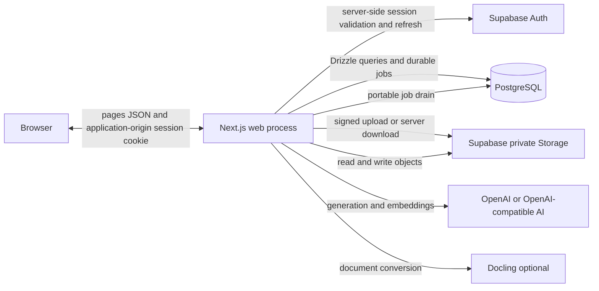
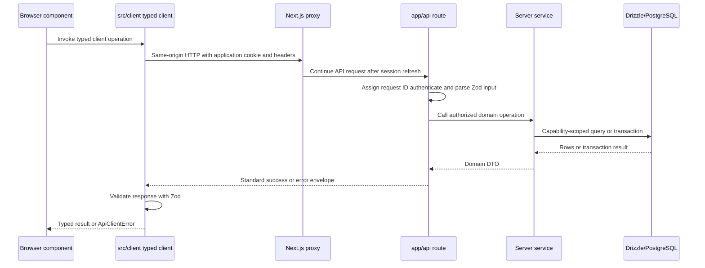
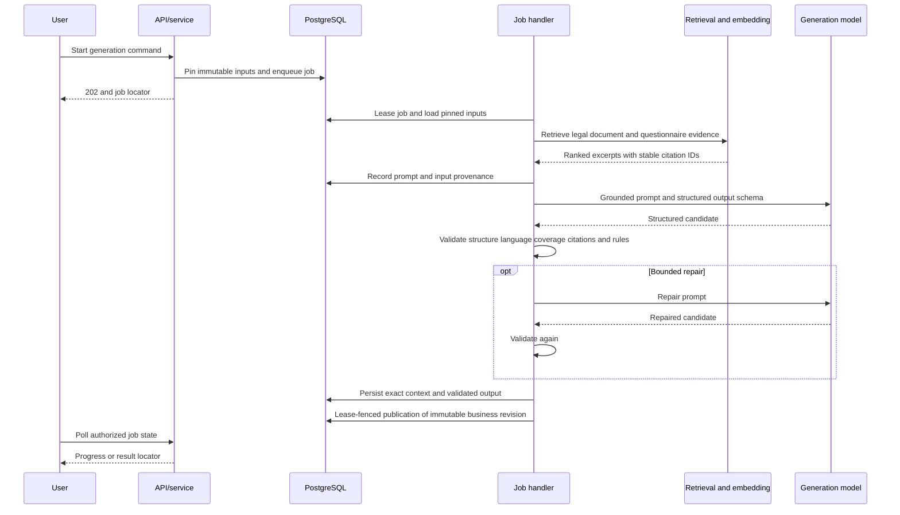

# System architecture overview

Status: current implementation as of 3 August 2026.

This is the starting point for the application architecture, its invariants,
deployment modes, and primary flows. Route inventories, schema details, and
executable operator procedures live in the linked specialist documents.

## Short answer

The product is a Next.js application whose web process owns both HTTP handling
and bounded background-job execution. It uses PostgreSQL, private Supabase
Storage, and a durable job runtime.

- Next.js renders pages and exposes thin HTTP route handlers.
- Supabase provides authentication and private object storage. Browser session
  cookies terminate at the Next.js application origin; server-side Supabase
  clients call Auth using the request session.
- Application tables are queried server-side through Drizzle, not directly from
  the browser through PostgREST.
- Long-running handlers execute at least once. Idempotency and lease-fenced
  transactions protect publication where the workflow implements them.
- Submitted questionnaire revisions, generated result revisions, document
  versions, and provenance snapshots are immutable. Current-revision pointers,
  drafts, job state, processing state, and other operational statuses are
  intentionally mutable.
- Applicability and Gap questionnaires are versioned application code. The
  database stores drafts, immutable submissions, definition hashes, and results.

## System context and deployment modes

Next.js starts a portable job drain after a response, and a scheduled
authenticated recovery route supplies durable wake-ups. Both entry points
invoke the same handlers.

## Main modules

| Module | Main location | Responsibility |
| --- | --- | --- |
| Pages and interactive UI | `app/`, `components/` | Rendering, forms, workflow state, and polling |
| Browser API clients | `src/client/` | Same-origin JSON, headers, response validation, and typed errors |
| HTTP boundary | `app/api/`, `src/server/api/` | Authentication, route/input validation, envelopes, request IDs, and service dispatch |
| Domain services and contracts | `src/server/<domain>/`, `src/contracts/` | Authorization, rules, transactions, persistence, and DTOs |
| Code-owned definitions | `src/server/definitions/`, `src/server/compliance/`, `src/server/gap-analysis/releases/` | Questionnaires, rules, requirements, localization, and prompt contracts |
| Background jobs | `src/server/jobs/`, `src/server/job-execution/` | Queueing, leases, heartbeats, cancellation, retries, and handlers |
| AI and retrieval | `src/server/ai/`, `src/server/platform/ai/` | Provider selection, evidence retrieval, prompts, generation, and validation |
| Database | `src/db/` | Drizzle schema, relations, pool, and query entry point |
| Files and output | `src/server/documents/`, `src/server/corpus/`, `src/server/reports/` | Private objects, versions, chunks, embeddings, legal corpus, and PDFs |
| Operations | `scripts/`, `infra/`, `docs/runbooks/` | Guarded schema operations, qualification, deployment, and recovery |

React Server Components can call server services directly for initial reads.
Interactive browser components use HTTP routes. Both paths converge on the same
domain services; routes and components are not alternate domain layers.

## API request flow

`proxy.ts` refreshes sessions and supplies a convenience guard for page
navigation. It is not authoritative API authorization. Every API route
authenticates independently with `requireApiUser()`, validates its input, and
calls a server service. Initial server-rendered reads use `requireAuth()` and
usually avoid an internal HTTP hop.

Organization identity in a URL is never authority. Human organization reads
and commands use the scope functions in
`src/server/auth/organization-scope.ts`, which resolve capabilities and retain
the organization predicate through the query or transaction. All ordinary
public tables have RLS enabled with no browser-role application policies.
Default-deny RLS protects direct browser access; service-layer scopes protect
tenant locality for trusted server connections.

Retryable commands use durable idempotency where required. Expensive commands
normally enqueue a `background_jobs` row, return `202`, and let the browser poll
an authorized status endpoint.

## Background execution semantics

A drain claims an eligible job with `FOR UPDATE SKIP LOCKED`, records a lease,
and heartbeats while its handler runs. A crash, timeout, or expired lease can
cause another executor to run the handler again, so handler delivery is
at-least-once rather than exactly-once.

Retries, cancellation requests, progress, safe errors, and result locators are
durable in PostgreSQL. Where a handler publishes a business result, idempotency
prevents duplicate logical commands and a lease-fenced transaction prevents an
executor that lost ownership from publishing late. These guarantees describe
the implemented publication seams; they do not make arbitrary external side
effects exactly-once.

Remote Storage and AI work stays outside database transactions. Publication
re-enters a transaction and verifies the current lease. Job handlers use the
organization identity pinned on the job rather than replaying a human session.

## Grounded generation flow

Provider mode is selected from the organization for grounded text generation;
embedding configuration is deployment-wide. An unavailable selected provider
fails explicitly. The model cannot choose server-owned identities, deterministic
facts, authorization, or publication rules. Gap generation synthesizes grounded
prose and atomic gaps within deterministic trigger policy; Action Plan
generation is a separate operation over a finalized Gap revision.

Raw organization evidence, legal sources, and report PDFs live in private
Storage. PostgreSQL owns their stable identities, immutable versions, processing
state, chunks, vectors, lineage, and access metadata. Legal text is evidence for
generation, not executable questionnaire configuration.

## Data ownership and mutability

| Data | Source of truth | Mutability model |
| --- | --- | --- |
| Questionnaire text, options, rules, requirements, and localization | Versioned application releases under `src/server/` | Code changes create new definition/build hashes; submitted answer revisions stay immutable |
| Applicability and generated analysis | Server evaluators and grounded generation | Published revisions and their evidence/provenance are immutable; parent current pointers and workflow status may advance |
| Gap and Action Plan workflows | PostgreSQL plus code-owned contracts | Draft answers, progress, and operational status are mutable; finalized revisions and pinned inputs are immutable |
| Users, organizations, memberships, and settings | PostgreSQL | Mutable transactional state with capability and audit controls |
| Uploaded and legal files | Private Storage plus PostgreSQL metadata | Object versions and corpus snapshots are immutable lineage; processing/current state is mutable |
| Jobs and AI runs | PostgreSQL | Lease, retry, progress, and terminal status evolve; recorded prompts, inputs, context, and published results are retained |
| Provider credentials and model deployment IDs | Deployment environment | Operational configuration, never application-table content |

`src/db/schema.ts` owns ordinary public tables, columns, constraints, indexes,
generated search vectors, enums, and RLS enablement. Fixed operator SQL owns only
the vector extension and two append-only audit triggers. Exact disposable schema
commands, approval, failure handling, verification, and zero-drift evidence live
only in the canonical [schema runbook](../database/drizzle-workflow.md).

## Practical navigation

1. Start at the page in `app/` and identify its server loader and interactive
   component.
2. Follow browser interaction through `src/client/` and the thin `app/api/`
   route into `src/server/<domain>/`.
3. Follow persistence into `src/db/schema.ts` and `src/db/relations.ts`.
4. For asynchronous work, continue through `src/server/jobs/`,
   `src/server/job-execution/`, and the domain handler.
5. For AI work, continue through grounding, retrieval, and the current prompt
   and output contract.
6. For questionnaire or rule changes, follow the release selected by
   `src/server/definitions/`; do not edit the database as content management.

## Related documents

- [End-to-end compliance workflow](./end-to-end-compliance-workflow.md)
- [Database structure](./database-structure.md)
- [Disposable schema plan and apply runbook](../database/drizzle-workflow.md)
- [API route inventory](./api-route-inventory.md)
- [AI generation contract versions](./ai-generation-contract-versions.md)
- [Portable job execution](../runbooks/portable-job-execution.md)
- [Deployment topology](../../infra/README.md)
