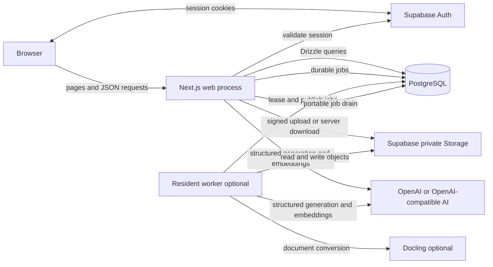
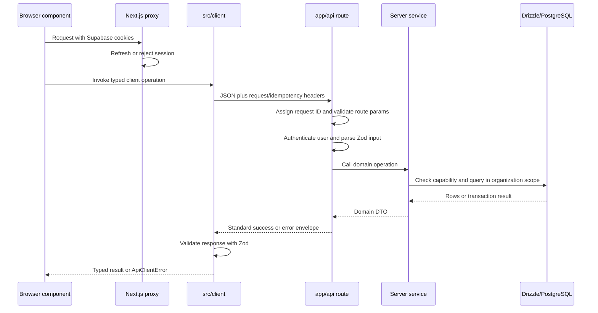
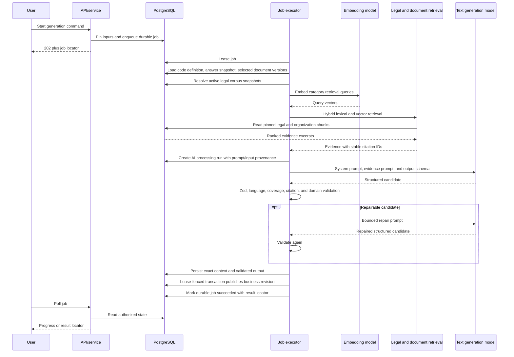
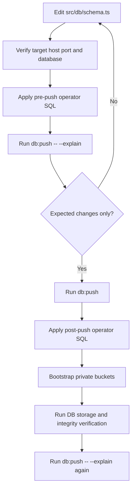

# System architecture overview

Status: current implementation as of 3 August 2026.

This document explains how the application fits together without cataloguing
individual routes. It is the starting point for understanding request flow, AI
generation, PostgreSQL and Drizzle, schema deployment, storage, and the source
of questionnaires and other domain data.

## Short answer

The application is a Next.js application with two server execution surfaces:
the Next.js web process and an optional resident worker. Both use the same
server services and the same PostgreSQL database.

- Next.js renders the UI and exposes thin HTTP route handlers.
- Supabase provides authentication and private object storage. The application
  data model is queried server-side through Drizzle, not through PostgREST.
- PostgreSQL stores organizations, submissions, immutable results, document and
  legal-corpus metadata, AI provenance, jobs, and audit history.
- Drizzle code in `src/db/schema.ts` defines the ordinary public schema and
  `src/db/relations.ts` defines relational-query metadata.
- Long-running work is represented by durable PostgreSQL jobs and can run after
  a response, while the client polls, from a recovery route, or in the resident
  worker.
- AI generation is a bounded background operation. It retrieves evidence,
  builds a grounded prompt, calls the configured provider through the AI SDK,
  validates structured output, and only then publishes a business result.
- Both the applicability and Gap questionnaires are application code, not
  database-authored questionnaires. The database stores draft answers,
  immutable submitted answer snapshots, definition hashes, and results.

## System context



In a small or serverless deployment, the web process can drain jobs itself. In
the self-hosted deployment, the resident worker provides continuous throughput.
The job handler implementation is shared, so these are wake-up and hosting
choices rather than separate business implementations.

## Main layers

The repository follows a practical layered structure:

| Layer | Main location | Responsibility |
| --- | --- | --- |
| Pages and layouts | `app/**/page.tsx`, `app/**/layout.tsx` | Server-rendered screens, authentication entry, and initial data loading |
| Interactive UI | `components/` | Client interaction, forms, workflow presentation, and polling |
| Browser API clients | `src/client/` | JSON requests, request headers, response validation, and job polling |
| HTTP routes | `app/api/**/route.ts` | HTTP boundary, auth, input parsing, idempotency/rate-limit wiring, service calls |
| Shared contracts | `src/contracts/` | Zod schemas and DTO contracts shared across boundaries |
| Server services | `src/server/<domain>/` | Authorization, domain rules, transactions, persistence, and DTO projection |
| Code-owned definitions | `src/server/definitions/`, `src/server/compliance/`, `src/server/gap-analysis/releases/` | Versioned questionnaires, rules, requirements, prompt contracts, and localization |
| AI pipeline | `src/server/ai/`, `lib/ai/` | Provider selection, retrieval, prompts, structured generation, validation, retries |
| Job execution | `src/server/jobs/`, `src/server/job-execution/`, `src/worker/` | Durable queue, leases, heartbeats, cancellation, handlers, and worker loop |
| Database | `src/db/` | Drizzle schema, relations, connection pool, and query entry point |
| Storage and external processing | `src/server/documents/`, `src/server/corpus/`, `src/server/reports/` | Private files, parsing, chunks, embeddings, legal corpus, and PDFs |
| Operations | `scripts/`, `infra/`, `docs/runbooks/` | Schema/bootstrap commands, verification, Docker topology, deployment, and recovery |

Some React Server Components call server services directly for their initial
render. Interactive client components use the HTTP API. Both paths deliberately
converge on the same domain services; route handlers are not the domain layer.

## API request flow

### General shape



The main boundary pieces are:

1. `proxy.ts` delegates to `lib/supabase/proxy.ts`. It refreshes the Supabase
   session and blocks private page/API access before the request reaches most
   application code.
2. Browser requests go through `src/client/api-client.ts`. It sends same-origin
   credentials and optional locale, request ID, idempotency, and conditional
   headers. It validates both success and error envelopes.
3. A route normally uses `apiRoute()` from `src/server/api/handler.ts`. The
   wrapper validates UUID-like route parameters, assigns a request ID, produces
   consistent JSON, hides unexpected server errors, and logs duration/status.
4. Authentication is repeated at the route boundary with `requireApiUser()`.
   This resolves the current Supabase user and synchronizes the small local user
   directory.
5. Request bodies and query data are parsed with Zod using schemas in
   `src/contracts/` or domain validation modules.
6. The route calls a service in `src/server/<domain>/`. Services check role
   capabilities and organization ownership before reading or changing data.
7. Mutating operations can add durable idempotency, rate limiting, optimistic
   conditions, audit writes, and a database transaction. These concerns are
   kept out of UI components.
8. Success responses have `{ data, meta }`; failures have `{ error }`. Both
   contain a request ID, also returned as `x-request-id`.

### Reads versus commands

- Initial page reads often run in React Server Components and call server
  services directly after `requireAuth()`. This avoids an internal HTTP hop.
- Interactive reads and all client-side changes use the JSON API.
- Commands which must be safe to retry require an `Idempotency-Key`.
  `idempotency_records` stores a request fingerprint and the small locator of
  the completed result. Reusing a key with different input is rejected.
- Expensive commands usually create a `background_jobs` row and return `202`.
  The browser polls job state rather than keeping the original request open.

### Authorization and database access

Supabase proves user identity. Application services then resolve membership and
capabilities from PostgreSQL. Organization-scoped operations must use a service
that performs this check; possession of an organization UUID is not authority.

All ordinary public application tables have RLS enabled, but browser roles have
no application-table policies. The browser does not query the domain tables
directly. Trusted web/worker code connects through `DATABASE_URL` and enforces
organization scope and capabilities in the server service layer.

## Background jobs

`background_jobs` is the durable queue. A worker claims one eligible row in a
transaction using `FOR UPDATE SKIP LOCKED`, records a lease owner and expiry,
and heartbeats while the handler runs. Publication paths verify the live lease
so a worker that lost ownership cannot publish a late result.

The same drain can be started by:

- `after_response`: Next.js `after()` when an API response returns `202`;
- `polling`: a non-terminal job-status read wakes another drain;
- `recovery_route`: the authenticated internal scheduled drain;
- `resident_worker`: the loop in `src/worker/main.ts`;
- `script`: operator or qualification execution.

Retries, cancellation requests, progress, safe errors, and result locators all
remain in PostgreSQL. The queue therefore survives a web-process restart.

## AI calling

There is currently no general-purpose chat API. AI is invoked for constrained
background workflows such as Gap synthesis, contradiction regeneration, Action
Plan generation, and embeddings used by document/legal retrieval.

### Provider and model selection

Three provider modes are supported in `lib/ai/types.ts`:

- `openai`: the official OpenAI provider;
- `company_hosted`: an OpenAI-compatible company endpoint;
- `self_hosted`: an OpenAI-compatible local/customer endpoint.

For grounded text generation, the selected mode comes from
`organizations.ai_provider_mode`. `lib/ai/providers.ts` constructs the relevant
AI SDK provider from environment configuration, and `lib/ai/models.ts` resolves
the configured model ID. An unavailable selected provider fails explicitly; it
does not silently fall back to another provider.

Embedding configuration is deployment-wide rather than per organization. It is
derived from `AI_DEFAULT_PROVIDER` and the associated embedding model variables
in `src/server/documents/document-config.ts`. The stored vector dimension is
fixed at 1536.

### Grounded generation flow



The important stages are:

1. The command pins the definition hash, locale, assessment revision, selected
   immutable document versions, and other workflow inputs before generation.
2. The job executor chooses the organization's provider and pins the current
   required legal-corpus snapshots.
3. Legal and organization evidence is retrieved with a hybrid lexical/vector
   query. Questionnaire answers are added as their own citation channel.
4. `src/server/ai/grounding/gateway.ts` builds the exact prompt and records
   provider, model, prompt hash, definition/build hash, input manifest, locale,
   and idempotency key in `ai_processing_runs`.
5. `generateObject()` from the AI SDK requests output conforming to a dynamic
   Zod schema. The provider request has a timeout and no SDK-level retries.
6. The category coordinator supplies bounded transient retries and at most one
   content-repair phase. Category concurrency is bounded.
7. Local validation checks structure, output language, query-unit coverage,
   citations, supported claims, deterministic facts, and workflow-specific
   invariants. The model is not trusted to decide server-owned identities or
   publication rules.
8. Exact non-questionnaire evidence excerpts are persisted in
   `ai_processing_run_context`. Validated model output is persisted on the AI
   run. Business publication then occurs through a lease-fenced transaction.

Gap analysis is category-oriented: deterministic evaluation establishes the
category status and trigger policy, while AI synthesizes the grounded prose and
atomic gaps within that policy. Action Plan generation is a distinct operation
over the finalized Gap revision, not a continuation of an open chat.

### Raw files, chunks, and retrieval

Raw organization evidence, legal-source files, and report PDFs live in private
Supabase Storage buckets. PostgreSQL stores their stable identities, immutable
versions, processing state, chunks, search vectors, embeddings, lineage, and
access metadata.

- Organization evidence bucket: `organization-evidence`
- Authoritative legal corpus bucket: `legal-corpus`
- Generated report bucket: `compliance-reports`

Document indexing parses a file, creates chunks, and generates embeddings.
Legal material has additional source, rendition, processing-generation,
provision-binding, and immutable snapshot lineage. Legal text is evidence for
the AI; it is not executable questionnaire or evaluator configuration.

## Database and Drizzle

### Connection

`src/db/index.ts` is the application database entry point. It creates one
`postgres-js` client and passes it to Drizzle together with the relation graph.

- The connection string is `DATABASE_URL`.
- Prepared statements are disabled because the Supabase transaction pooler does
  not support them.
- Pool size and idle timeout are configurable and validated.
- `db` is shared by server services and job handlers.
- `db.transaction()` is used where several writes must publish atomically.

`drizzle.config.ts` is the Drizzle Kit entry point. For schema operations it
prefers `DATABASE_URL`, converting Supabase transaction-pooler port `6543` to
session-pooler port `5432`; otherwise it uses `DRIZZLE_DATABASE_URL`.

### Query styles

The code uses both supported Drizzle styles:

```ts
const organization = await db.query.organizations.findFirst({
  columns: { id: true, aiProviderMode: true },
  where: {
    RAW: (table, operators) =>
      operators.eq(table.id, organizationId) ?? operators.sql`true`,
  },
});
```

The relational `db.query.<table>` API uses the metadata exported by
`src/db/relations.ts`. It is convenient for single-entity and nested reads.

```ts
const rows = await db
  .select({ id: assessmentAnswers.id, value: assessmentAnswers.answerValue })
  .from(assessmentAnswers)
  .where(eq(assessmentAnswers.assessmentRevisionId, revisionId))
  .orderBy(asc(assessmentAnswers.position));
```

The SQL-like builder is used for explicit joins, projections, ordering,
locking, vector/lexical expressions, inserts, and updates. Table and column
objects always come from `src/db/schema.ts`; operators come from `drizzle-orm`.

For multi-step state changes, put all dependent reads/writes inside the
transaction callback and use `tx`, not the outer `db`. For organization data,
authorization and organization filters remain required even though RLS is
enabled.

### Data ownership groups

The complete column-level model is documented in
[`database-structure.md`](./database-structure.md). At a high level:

| Group | Representative tables |
| --- | --- |
| Identity and tenancy | `organizations`, `user_profiles`, `organization_memberships`, `organization_invitations` |
| Questionnaire submissions | `assessments`, `assessment_revisions`, `assessment_answers`, `guest_applicability_checks` |
| Generated analysis | `analysis_outputs`, `analysis_output_revisions`, `analysis_output_document_sources` |
| Gap workflow | `gap_analysis_cycles`, `gap_analysis_cycle_documents`, `gap_findings`, `gap_items`, context-link tables |
| Documents | `documents`, `document_versions`, `document_chunks`, `upload_sessions` |
| AI and jobs | `background_jobs`, `ai_processing_runs`, `ai_processing_run_context` |
| Legal corpus | corpus families, sources, versions, renditions, processing generations, chunks, embeddings, bindings, snapshots |
| Downstream output | `action_plans`, `action_plan_items`, `action_plan_item_gaps`, `reports`, `report_document_sources` |
| Reliability and audit | `idempotency_records`, `api_rate_limit_windows`, `audit_events`, `platform_audit_events` |

Stable parent rows commonly point to a current immutable revision. This gives
the UI an efficient current view while retaining reproducible history.

## Where does each kind of data come from?

| Data | Source of truth | Runtime persistence |
| --- | --- | --- |
| Applicability questionnaire text, options, facts, thresholds, entity catalog, country profile, and evaluator input | Code under `src/server/compliance/nis2/releases/`; selected and compiled by `src/server/definitions/applicability.ts` | Definition/build hashes and localized submitted answer snapshots are stored with assessments/results |
| Applicability evaluation algorithm | `src/server/applicability-check/rules.ts` plus the compiled code-owned release artifact | Immutable evaluated result in `analysis_output_revisions` |
| Gap questionnaire text, options, requirements, mappings, and legal provision keys | Code under `src/server/gap-analysis/releases/`; current executable contract selected by `src/server/gap-analysis/current-contract.ts` and compiled by `src/server/definitions/gap.ts` | Draft answers in `gap_analysis_cycles.draft_answers`; submitted localized snapshots in `assessment_revisions` and `assessment_answers` |
| Gap deterministic status/trigger policy | Code in `src/server/gap-analysis/` | Findings, atomic gaps, and exact evidence links are persisted after publication |
| AI prompts and output schemas | Code in Gap/Action Plan current-contract and prompt-contract modules plus `src/server/ai/` | Exact prompt hash, provider/model, inputs, context, output, tokens, and validation state in AI run tables |
| Organization AI provider choice | Organization setting in PostgreSQL | `organizations.ai_provider_mode` |
| Provider credentials and model IDs | Deployment environment | Not stored in application tables |
| User/organization state | PostgreSQL | PostgreSQL |
| Uploaded organization files | Private Storage | File bytes in Storage; metadata, versions, chunks, vectors, and state in PostgreSQL |
| Authoritative legal text | Operator-provisioned private Storage and reviewed corpus lineage | Source/version/rendition/chunk/embedding/snapshot data in PostgreSQL |
| UI translations outside executable compliance definitions | `lib/i18n/` | Locale preference/session only; copy remains code-owned |

Therefore, changing questionnaire wording or logic requires a code change and a
new definition hash/build. Editing the database is not how a questionnaire is
published. Existing submissions remain reproducible because they carry the
definition hash and localized question/answer snapshot used at submission.

## Schema changes and pushes

`src/db/schema.ts` is the source of truth for ordinary public tables, columns,
enums, constraints, indexes, generated search vectors, and RLS enablement.
`drizzle.config.ts` limits Drizzle Kit to the explicit application table list in
the `public` schema.

Only three database objects are intentionally outside normal Drizzle ownership:

- the `vector` extension, applied before a push;
- the append-only trigger for organization audit events;
- the append-only trigger for platform audit events.

The SQL files are fixed and allowlisted by `scripts/apply-operator-sql.ts`.
There is no general arbitrary-SQL discovery step.



For the current disposable pre-production workflow:

```powershell
npm run db:apply-operator-sql -- pre-push
npm run db:push -- --explain
npm run db:push
npm run db:apply-operator-sql -- post-push
npm run storage:bootstrap

npm run db:verify:server-only
npm run db:verify:integrity
npm run storage:verify
npm run db:push -- --explain
```

The first explanation is a review gate; the final explanation must report zero
drift. `--force` is not part of the normal workflow.

The current repository does not operate a checked-in sequential migration
chain; the directories under `drizzle/` are empty placeholders. The documented
push process is explicitly limited to disposable, non-production environments.
Production deployment forbids `drizzle-kit push` and requires a separately
reviewed clean-baseline or migration procedure. See
[`drizzle-workflow.md`](../database/drizzle-workflow.md) before changing a
connected database.

## Practical navigation

When following a feature, use this order:

1. Start at its page in `app/` and identify the server data loader and client
   workflow component.
2. For browser interactions, follow the matching module in `src/client/` to the
   thin `app/api/` route.
3. Follow the route import into `src/server/<domain>/`; this is where the domain
   behavior, permissions, and transaction boundary live.
4. Follow Drizzle table imports into `src/db/schema.ts` and relations into
   `src/db/relations.ts`.
5. If the operation returns a job, follow it through `src/server/jobs/`, then
   `src/server/job-execution/runtime.ts`, then the domain handler.
6. For AI work, continue into `src/server/ai/grounding/gateway.ts`, the current
   prompt/output contract, and the retrieval modules.
7. For questionnaire/rule changes, go to the code-owned definition selected by
   `src/server/definitions/`, not to the database schema.

## Related documents

- [End-to-end compliance workflow](./end-to-end-compliance-workflow.md)
- [Database structure](./database-structure.md)
- [Drizzle schema-change workflow](../database/drizzle-workflow.md)
- [API route inventory](./api-route-inventory.md)
- [AI generation contract versions](./ai-generation-contract-versions.md)
- [Portable job execution](../runbooks/portable-job-execution.md)
- [Deployment topology](../../infra/README.md)
