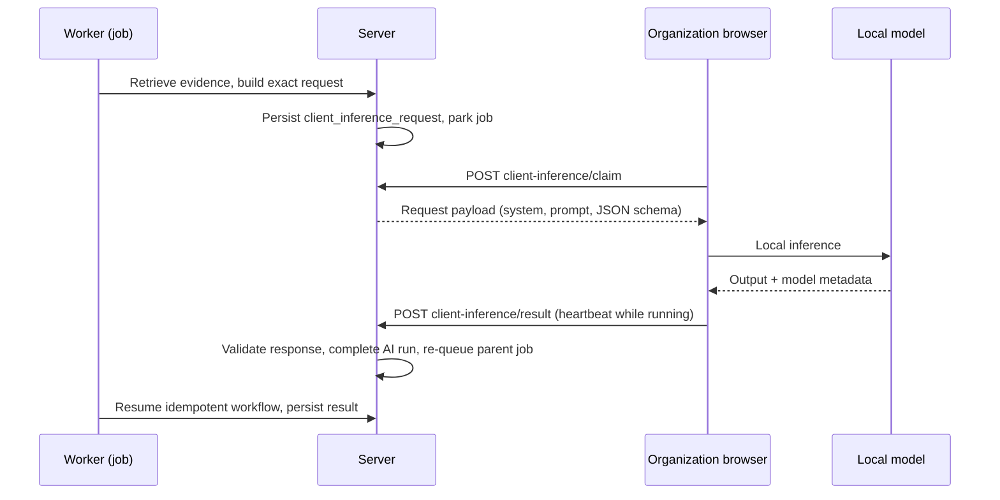

# Local AI

> Status: current as of 7 August 2026.

## What "local AI" means here

An organization can opt into `self_hosted` AI: models it controls, running
either on a user's machine (browser relay) or on a network the server can
reach directly (local development / on-premises `SELF_HOSTED_AI_*`
endpoint). This document covers the browser-relayed mechanism, which is the
shipped shape for remote deployments, and the direct endpoint used locally.

## Why a relay

A deployed server cannot connect to a user's `localhost`. The browser relay
reverses the direction: the server persists an inference request, the user's
browser claims it, runs the local model, and submits the response back. No
inbound firewall port is needed.

## Flow

## Request lifecycle

Requests live in `client_inference_requests`, with kind `generation` or
`embedding`:

- **Claiming**: a request is claimable by clients of its organization. Claims
  are leased (`CLIENT_LEASE_SECONDS` = 90 s, refreshed by heartbeats).
- **Boundaries**: a request expires after 30 minutes
  (`CLIENT_REQUEST_TTL_SECONDS`); one user may hold at most 3 open claims; one
  claim may not exceed 15 minutes total — this bounds how much a hostile
  member can park.
- **Submission**: the response is validated before it becomes authoritative:
  schema conformance, output language, required query-unit coverage, exact
  citation identifiers, and claim support against the server-selected
  context. Usage reported by the client is attested, never metered as cost.
- **Cancellation**: cancelling the parent job also invalidates pending or
  running relay work; late responses for cancelled or expired claims are
  rejected.

## Interaction with jobs

The parent background job (e.g., `gap_analysis`) owns the whole workflow. When
it hands a model call to the relay, the AI run enters `awaiting_client` and
the job parks (reported as `parked` by the drain). When the client answers,
the job is re-queued and resumes idempotently — the server recomputes the
same inputs, finds the answered run by input hash, and continues without a
second provider call.

The relay carries only the inference request; the server never hands the
browser database credentials or business logic.

## Direct self-hosted endpoint

For local development and on-premises deployments, `self_hosted` can point at
an OpenAI-compatible endpoint reachable from the server (`SELF_HOSTED_AI_*`
environment). In that shape the AI SDK provider calls the endpoint directly,
no relay is involved, and usage is measured normally.

## Embedding relay

Document indexing and query embedding can also use a local model. The relay
payload is an embedding request with the exact values and expected
dimensions; a dimension mismatch is treated as a configuration error. The
embedding identity (model, revision, dimensions, instruction profile) is
stored with every version, so a switched model triggers a resumable
re-embedding migration rather than mixing vector spaces.

## Trust boundary

- The local model response is untrusted input until server validation passes.
- Local model credentials and URLs stay with the client; the server records
  only client-reported model metadata.
- The selected provider never falls back silently to another provider; an
  offline client or model causes the operation to wait or fail per its
  explicit timeout and retry policy.

## Practical navigation

- Relay implementation: `src/server/ai/client-inference/`.
- Relay provider adapter: `src/server/ai/grounding/providers/client-relay.ts`.
- Organization model settings: `src/server/organizations/model-settings-service.ts`.
- Claim/heartbeat/result routes: `app/api/organizations/:id/client-inference/`.
- Local development: run Ollama on the host; select `self_hosted` via
  `AI_DEFAULT_PROVIDER` or per-organization settings.

