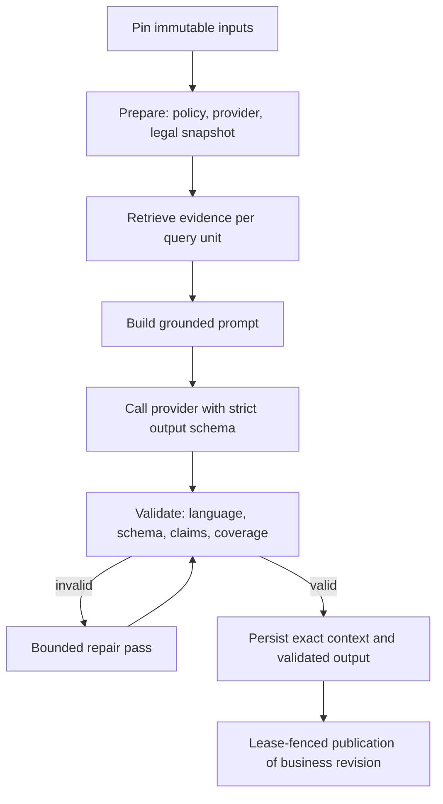

# AI Usage

> Status: current as of 3 September 2026.

## What AI is used for

The backend uses AI in three places:

1. **Grounded text generation** — Gap-Analyse findings, contradiction
   resolution, and Action Plan items. This is the core AI feature.
2. **Embeddings** — organization document chunks and queries for retrieval.
3. **Legal corpus processing** — chunking legal sources (AI embeddings may be
   involved; parsing/chunking itself is deterministic).

## Provider model

Each organization has an AI provider mode (`ai_provider_mode`:
`openai` or `self_hosted`). One code-owned NIS2 grounding policy supplies the
provider and legal scope for Gap generation, contradiction resolution, and
Action Plan generation:

- `openai` — the server calls OpenAI directly through the AI SDK
  (`src/server/modules/grounding/providers/ai-sdk.ts`).
- `self_hosted` — two shapes:
  - An organization that recorded its chosen models in
    `organization_model_settings` runs them on a user's machine through the
    **browser relay** (`providers/client-relay.ts`).
  - An organization without that record uses the deployment's
    `SELF_HOSTED_AI_*` endpoint directly — the local development and
    on-premises topology where the server can reach the model over a network.

The selection happens in one place
(`src/server/modules/grounding/gateway.ts`), so all generation call sites inherit
the relay without knowing it exists. An unavailable selected provider fails
explicitly; there is no silent fallback.

## The grounded generation pipeline

### Preparation

`prepareGroundingOperation` resolves:

- the shared NIS2 grounding policy (legal corpus families, jurisdictions, and
  provider selection);
- the concrete provider;
- the pinned legal snapshot scope (`resolvePinnedLegalScope`), so generation
  is reproducible against a fixed set of legal sources.

### Retrieval

For every query unit (a requirement/category), the gateway retrieves in
parallel:

- **Legal context**: pinned legal snapshot chunks, resolved through reviewed
  provision bindings, ranked lexically, filtered by authority tier
  (`legal-retrieval.ts`).
- **Organization evidence**: chunks of the selected document versions, ranked
  by fused semantic (embedding) and lexical scores
  (`organization-retrieval.ts`).
- **Guidance context**: optional reviewed guidance bound to the same
  provision keys.
- **Questionnaire assertions**: the exact answers used, as citable excerpts.

Every context item carries a stable citation ID and excerpt hash.

### Prompt and output contract

The assistant prompt is built by `src/server/modules/grounding/prompts/` from
the query units and context.
Query units, prompts, operation kinds, locale, and response schemas remain
workflow-specific. The response schema is a strict Zod contract per domain, defined in
`src/server/modules/gap-analysis/current-contract.ts` and
`src/server/modules/action-plans/current-contract.ts`. The model supplies only bounded
prose and optional organization citations; the server owns categories, gap
kinds, priorities, ordering, mandatory citations, locale, and persistence.

### Validation and repair

Output must satisfy:

- schema conformance;
- requested output language (validated by a language detector);
- complete query-unit coverage;
- every claim supported by the exact server-selected context, with material
  contradictions returning the exact unique allowlisted citation IDs.

Invalid output triggers a bounded repair pass against the same context;
unrecoverable failures fail the job with a safe error code.

## Provenance and recovery

Every provider call is recorded in `ai_processing_runs`:

- actual provider and model;
- `prompt_hash` (exact normalized messages plus response-schema metadata);
- `definition_hash` (the code-owned domain contract) and `build_hash`
  (`APP_BUILD_SHA`);
- the input manifest (query units, selected evidence versions, pinned legal
  snapshots, assessment revision);
- attempt counts, token usage, and the validated output;
- `claim_validation` status and per-claim results.

`ai_processing_run_context` stores the exact admitted evidence with scores
and citation metadata — the canonical record findings link to.

Runs are idempotency-keyed per operation, and `generation_reservation_key`
groups repair/retry candidates. A run that already produced
validated output is recovered (not re-invoked) when a parked job wakes or a
retry re-enters the gateway; a run whose business result already published is
rejected as a duplicate.

## Generation concurrency and failures

- Category generation is coordinated with bounded concurrency
  (`src/server/platform/ai/generation/concurrency.ts`, `category-coordinator.ts`).
- Provider calls are limited by a permit limiter.
- Failures are classified (`failures.ts`) into transient provider failures
  (retryable with delay), content/validation failures (non-retryable), and
  cancellation; safe codes are persisted on the run and the job.
- Job-linked runs require the parent job's live lease both at creation and
  publication (`job-run-lifecycle.ts`).

## Embeddings

- Organization documents are chunked (`paragraph-v1`) and embedded with the
  organization's configured embedding provider; chunks store the vector and
  a generated search vector.
- Embedding identity (provider, model, revision, dimensions, retrieval
  instruction, chunking version) is hashed onto every `document_versions`
  row, so retrieval never mixes vectors from different spaces.
- Changing the embedding model triggers a resumable
  `organization_reembedding` job.

## Practical navigation

- Gateway and grounding: `src/server/modules/grounding/`.
- Generation coordination: `src/server/platform/ai/generation/`.
- Prompts and model configuration: `src/server/platform/ai/`.
- Provider implementations: `src/server/modules/grounding/providers/`.
- Browser relay specifics: [Local AI](./local-ai.md).
