# Backend Architecture — Combined Reference

> Consolidated from every Markdown document under `backend-architecture/` on 9 September 2026. The original files remain the source documents and have not been removed.

## Contents

- [Documentation guide](#documentation-guide)
- [End-to-End Backend Workflows](#end-to-end-backend-workflows)
- [System Overview](#system-overview)
- [Deployment](#deployment)
- [Database Schema](#database-schema)
- [AI Usage](#ai-usage)
- [Local AI](#local-ai)
- [Gap-Analyse Calculation](#gap-analyse-calculation)
- [Action Plan Calculation](#action-plan-calculation)
- [Betroffenheitscheck Calculation](#betroffenheitscheck-calculation)
- [Background Jobs](#background-jobs)
- [API Conventions](#api-conventions)
- [API Route Map](#api-route-map)
- [Authentication and Authorization](#authentication-and-authorization)
- [Organizations (Multi-Tenancy)](#organizations-multi-tenancy)
- [Object Storage](#object-storage)
- [Organization Documents](#organization-documents)
- [Legal Corpus](#legal-corpus)
- [PDF Reports](#pdf-reports)

---

## Documentation guide

_Source: `README.md`_


> Status: current as of 9 September 2026.
> Scope: backend and database only. Frontend pages, browser components, and
> browser API clients are intentionally not covered.

This folder explains how the backend of the NIS2 Compliance Checker works:
the system as a whole, the database, the API, background jobs, AI usage, the
compliance calculations, and the main backend domains.

The documentation is self-contained. You do not need to read any other
documentation folder to understand the architecture, and nothing in this
folder links out to the older architecture notes.

### Folder map

```
backend-architecture/
├── README.md                  ← you are here: index, reading paths, glossary
├── system/
│   ├── overview.md            ← system context, processes, module map
│   ├── workflows.md           ← the main end-to-end backend journeys
│   └── deployment.md          ← deployment modes and self-hosted topology
├── database/
│   └── schema.md              ← data model, table inventory, RLS, immutability
├── ai/
│   ├── usage.md               ← provider modes, grounding, generation pipeline
│   └── local-ai.md            ← local and browser-relayed model inference
├── calculations/
│   ├── gap-analysis.md        ← how Gap-Analyse results are computed
│   ├── action-plan.md         ← how Action Plans are generated
│   └── applicability-check.md ← Betroffenheitscheck calculation
├── jobs/
│   └── jobs.md                ← durable job runtime and job catalog
├── api/
│   ├── conventions.md         ← envelopes, auth, validation, errors, limits
│   └── route-map.md           ← every API route grouped by domain
└── domains/
    ├── auth.md                ← authentication and authorization
    ├── organizations.md       ← multi-tenancy, members, invitations
    ├── storage.md             ← private object storage and uploads
    ├── documents.md           ← organization document processing
    ├── corpus.md              ← the authoritative legal corpus
    └── reports.md             ← PDF report generation
```

### How to read this

**For a professor or someone new to the project** — start with the journeys
in `system/workflows.md`, then read `system/overview.md` to see the parts of
the system those journeys touch. Follow up with `database/schema.md` and the
`calculations/` folder. The `api/`, `jobs/`, `ai/`, and `domains/` folders
provide detail on demand.

**For a developer joining the project** — start with `system/overview.md` and
`api/conventions.md`, then `jobs/jobs.md`. The route map, database inventory,
and domain docs are the practical reference for making changes. Every doc
contains code pointers so you can jump from a concept to the implementation.

### Conventions used here

- Every document carries a status line naming the date it reflects.
- Diagrams are Mermaid and describe the backend; browsers appear only as
  system boundaries.
- Source code is referenced by path relative to `compliance/my-app/`, e.g.
  `src/server/modules/gap-analysis/`.
- The documentation is written in English. German product terms are kept
  where they are part of the product vocabulary and glossed at first use.

### Glossary

| Term | Meaning |
| --- | --- |
| Betroffenheitscheck | The applicability check: a questionnaire that decides whether an organization is affected by NIS2 in a jurisdiction. |
| Gap-Analyse | Gap analysis: an AI-grounded assessment of an organization's compliance against NIS2 requirements, producing findings and atomic gaps. |
| Action Plan (Maßnahmenplan) | The generated remediation plan built from a finalized Gap revision. |
| Compliance release | A versioned, immutable bundle of questionnaire, rules, and evaluator code for a calculation. |
| Organization | The tenant boundary of the application; all compliance data belongs to one organization. |
| Revision | An immutable, published snapshot of an assessment or generated result. |
| Evidence | Legal text or organization documents retrieved and cited by a generation run. |
| Grounding | Supplying the model with exact, retrievable evidence and validating that its output stays within that evidence. |
| Durable job | A long-running background task whose state and leases live in PostgreSQL. |
| Legal corpus | The centrally curated, versioned collection of legal sources used for grounding. |
| RLS | Row-Level Security, PostgreSQL's per-row access control. |

### What is intentionally not here

- Frontend rendering, components, and browser-side API clients.
- Step-by-step operational runbooks (schema changes, incident recovery,
  deployment procedures).
- Product-level documentation of questionnaire content.

---

## End-to-End Backend Workflows

_Source: `system/workflows.md`_


> Status: current as of 9 September 2026.

This document walks the main journeys through the backend and shows which
API routes, jobs, AI calls, and database tables fire at each step. It is the
fastest way to see how the parts fit together.

### 1. Guest Betroffenheitscheck (public applicability check)

A visitor who is not signed in can run the applicability check. This is the
only flow that does not require an account.

1. The browser loads the questionnaire for a country and answers questions.
2. `POST /api/guest/applicability-check/submissions` stores the answers in
   `guest_applicability_checks` with a claim token hash and an expiry.
3. The check is evaluated deterministically against the current
   applicability definition (`src/server/modules/applicability-check/`); the result
   snapshot is stored with the submission.
4. The visitor can later claim the result via
   `POST /api/guest/applicability-check/claim`, read it via
   `GET /api/guest/applicability-check/result`, and delete it via
   `DELETE /api/guest/applicability-check/result`.

Tables: `guest_applicability_checks`.

### 2. Organization setup and membership

1. A signed-in user creates an organization (`POST /api/organizations`).
2. The creator becomes `owner`. Owners invite members
   (`POST /api/organizations/:id/invitations`); invitations are pending-only
   rows with token hashes and expiry (`organization_invitations`).
3. Invitees accept via `POST /api/organization-invitations/:invitationId/accept`,
   which creates an `organization_memberships` row with a role
   (`owner`, `contributor`, or `viewer`).
4. Members can be listed, promoted/demoted, and removed under
   `/api/organizations/:id/members`; at least one owner must remain.
5. Owners can configure the organization's AI model settings
   (`GET/PUT /api/organizations/:id/model-settings`) and update settings
   (`GET/PATCH /api/organizations/:id/settings`).

Tables: `organizations`, `organization_memberships`,
`organization_invitations`, `user_profiles`, `organization_model_settings`.

### 3. Document upload and indexing

1. The browser creates an upload session
   (`POST /api/organizations/:id/documents/upload-sessions`). The server
   validates file name, MIME type, size, and optional SHA-256, then returns a
   signed upload URL for the private `organization-evidence` bucket.
2. The browser uploads directly to Storage and completes the session
   (`POST /api/organizations/:id/document-upload-sessions/:sessionId/complete`).
   The server verifies the object's size, MIME type, and hash before creating
   an immutable `document_versions` row.
3. A `document_indexing` job is enqueued. The job handler parses the file
   (`src/server/platform/content-processing/parser.ts`), chunks it, computes search vectors and
   embeddings, and stores `document_chunks`.
4. Members read the document list and metadata under
   `/api/organizations/:id/documents`; downloads and source access are served
   from Storage through the server.
5. If the current version fails, a member can retry indexing
   (`POST .../documents/:documentId/retry-indexing`). The server resets the
   failed indexing state, enqueues a replacement job, and explicitly wakes an
   after-response drain even though the resource response remains `200`.

Tables: `upload_sessions`, `documents`, `document_versions`,
`document_chunks`, `background_jobs`.

### 4. Signed-in applicability check (Betroffenheitscheck)

1. `GET /api/organizations/:id/applicability-check/questionnaire` returns the
   versioned questionnaire.
2. Answers are submitted (`POST .../applicability-check/submissions`), which
   creates an immutable `assessment_revisions` row with the definition and
   build hash, and evaluates the rule set deterministically.
3. The result is published as an `analysis_output_revisions` row of kind
   `applicability`, including `gapEligible` — the flag that unlocks Gap.

Tables: `assessments`, `assessment_revisions`, `assessment_answers`,
`analysis_outputs`, `analysis_output_revisions`.

### 5. Gap-Analyse (gap analysis)

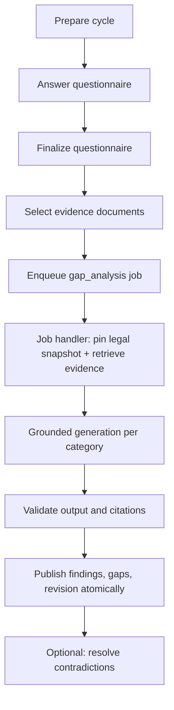

1. An eligible organization prepares one unfinished cycle
   (`POST /api/organizations/:id/gap-analysis/cycles`), which pins the
   applicable definition and locale.
2. Members answer the questionnaire; answers autosave
   (`PATCH .../gap-analysis/questionnaire-draft/answers/:questionKey`) and a
   final submission creates the immutable assessment revision
   (`POST .../gap-analysis/questionnaire-submissions`).
3. The cycle selects current, indexed document versions as evidence
   (`PUT .../gap-analysis/cycles/:cycleId/evidence`).
4. `POST .../gap-analysis/cycles/:cycleId/generation-jobs` enqueues a
   `gap_analysis` job and returns `202`.
5. The job handler pins legal corpus snapshots, retrieves legal and organization
   evidence, invokes the provider through the current contract, and validates
   strict grounded output. One transaction publishes normalized findings,
   atomic gaps, exact evidence links, the immutable output revision,
   successful AI-run state, and current pointers.
6. If a finding contains a material contradiction, the reviewer chooses
   "trust questionnaire" or "trust document"
   (`POST .../gap-analysis/revisions/:revisionId/contradictions/:findingId/resolve`).
   Questionnaire-authoritative decisions reject only the conflicting document
   contexts; document-authoritative decisions regenerate that one finding
   from only those exact excerpts. Either way a new immutable Gap revision is
   created.

Tables: `gap_analysis_cycles`, `gap_analysis_cycle_documents`,
`gap_findings`, `gap_items`, `gap_finding_context_links`,
`gap_item_context_links`, `analysis_output_revisions`,
`ai_processing_runs`, `ai_processing_run_context`, `background_jobs`.

### 6. Action Plan generation

1. A member with the `plans:manage` capability (owner or contributor) starts
   the organization's single Action Plan from the current, compatible,
   unblocked Gap revision
   (`POST /api/organizations/:id/action-plan`, returns `202`).
2. A `action_plan_generation` job runs a distinct grounded provider operation
   that produces complete, category-scoped, many-to-many Gap coverage.
3. Plan, items, gap links, audit rows, and job success publish atomically
   under the executor's live lease.
4. Item statuses can be updated status-only
   (`PATCH /api/organizations/:id/action-plan/items/:itemId`); the plan itself
   is immutable.

Tables: `action_plans`, `action_plan_items`, `action_plan_item_gaps`,
`ai_processing_runs`, `background_jobs`.

### 7. PDF report

1. A member with the `reports:create` capability creates a report
   (`POST /api/organizations/:id/reports`). The server pins the current
   applicability revision and, when available, the current Gap revision, the
   optional Action Plan, and the selected document versions. A report can be
   created before Gap Analysis; that PDF identifies itself as
   applicability-only and omits Gap and Action Plan sections.
2. A `report_render` job builds an exact in-memory render snapshot (including
   current Action Plan item statuses), hashes it, renders the PDF with
   `@react-pdf/renderer`, uploads it to the `compliance-reports` bucket under
   a deterministic key, and commits the hash with all PDF metadata in one
   fenced transaction.
3. Completed reports are immutable and downloadable
   (`POST /api/organizations/:id/reports/:reportId/download`).

Tables: `reports`, `report_document_sources`, `background_jobs`.

### 8. Legal corpus provisioning (operator workflow)

Operators (not organizations) maintain the authoritative legal corpus:

1. Sources, versions, and renditions are created from a reviewed manifest
   (`src/server/modules/legal-corpus/`).
2. A `legal_source_processing` job parses each rendition and produces
   `legal_source_chunks` with search vectors.
3. Reviewers bind stable provision keys to exact chunks
   (`legal_provision_chunk_bindings`); validation proves completeness and
   citation resolvability.
4. Activation advances the immutable family snapshot pointer
   (`legal_corpus_snapshots`, `legal_corpus_snapshot_members`). Workflows pin
   the snapshot at generation time, so results stay reproducible.

Tables: `legal_corpus_families`, `legal_sources`, `legal_source_versions`,
`legal_source_renditions`, `legal_source_processing_generations`,
`legal_source_chunks`, `legal_provision_chunk_bindings`,
`legal_corpus_snapshots`, `legal_corpus_snapshot_members`.

### Where to go next

- [System overview](#system-overview) — the module map and guarantees behind
  these journeys.
- [Database schema](#database-schema) — every table mentioned above.
- [Gap analysis calculation](#gap-analyse-calculation) — how the
  deterministic and grounded parts combine.
- [Jobs](#background-jobs) — how the background steps execute reliably.

---

## System Overview

_Source: `system/overview.md`_


> Status: current as of 9 September 2026.

### Short answer

The product is a Next.js application whose web process serves requests and
runs the portable job runtime after responses or through an authenticated
scheduled recovery route. It uses PostgreSQL and private Supabase object
storage.

- The web process renders pages and exposes thin HTTP API routes.
- Supabase provides authentication and private object storage. Browser
  session cookies terminate at the application origin; server-side Supabase
  clients use the request session.
- Application tables are queried server-side through Drizzle ORM. Browsers
  never query PostgreSQL directly.
- Long-running work (AI generation, document indexing, PDF rendering) runs as
  durable background jobs that execute at least once.
- Immutable business results are published by revision; current pointers,
  drafts, job state, and operational status are mutable.

### System context

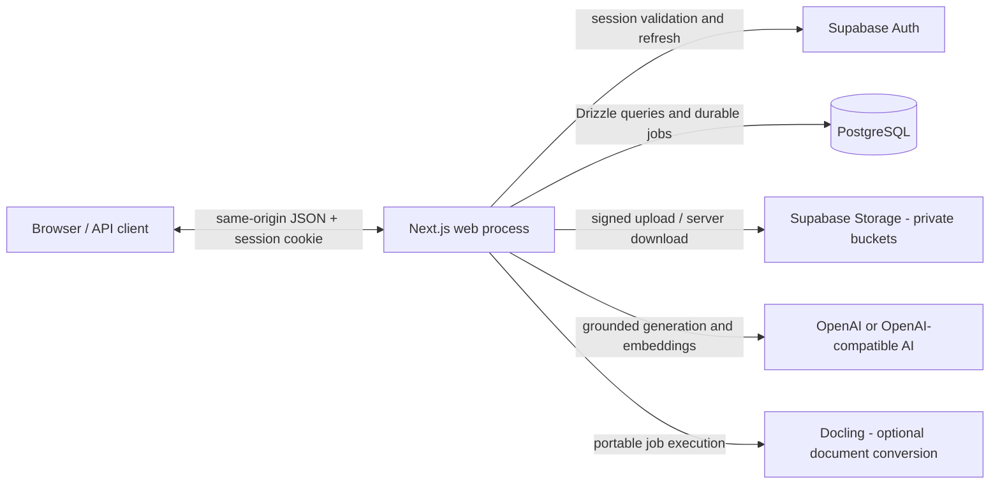

### Processes and execution surfaces

There is one code base and one set of handlers. Hosting and wake-up
mechanisms do not create separate business implementations.

| Surface | Location | Role |
| --- | --- | --- |
| Web process | `next start` | Renders pages, serves API routes, and schedules a portable job drain after responses that enqueue work. |
| Recovery route | `app/api/internal/jobs/drain/route.ts` | Authenticated scheduled endpoint that wakes and drains jobs (cron in hosted deployments). |
| Scripts | `scripts/` | Operator and verification commands run directly against the same services. |

### Module map

| Module | Main location | Responsibility |
| --- | --- | --- |
| HTTP boundary | `app/api/`, `src/server/platform/http/` | Authentication, input validation, envelopes, request IDs, rate limits, service dispatch |
| Business modules | `src/server/modules/`, `src/contracts/` | Authorization, rules, workflows, persistence, and public module interfaces |
| Code-owned definitions | `src/server/modules/applicability-check/release/`, `src/server/modules/compliance/nis2/`, `src/server/modules/gap-analysis/release/` | Questionnaires, rules, requirements, localization, prompt contracts |
| Jobs | `src/server/platform/jobs/`, `src/server/bootstrap/job-definitions.ts` | Generic queue execution plus composition of business handlers |
| AI and retrieval | `src/server/platform/ai/`, `src/server/modules/grounding/`, `src/server/platform/ai/` | Provider integration, evidence retrieval, prompts, generation, validation |
| Database | `src/db/` | Drizzle schema, relations, connection pool |
| Files and output | `src/server/modules/documents/`, `src/server/modules/legal-corpus/`, `src/server/modules/reports/`, `src/server/platform/storage/` | Private objects, versions, chunks, embeddings, legal corpus, PDFs |
| Tenancy and access | `src/server/platform/auth/`, `src/server/modules/organizations/` | Session actors, capabilities, organization scopes, membership |
| Operations | `scripts/`, `src/server/operations/`, `infra/` | Guarded schema operations, provisioning, deployment, verification |

React Server Components can call server services directly for initial reads;
interactive browser components use the HTTP API. Both paths converge on the
same domain services — routes are not an alternate domain layer.

### API request flow

Dependencies point inward from delivery and composition code to stable module
interfaces: `app` and `scripts` call `src/server/modules/<module>/index.ts`;
business modules may use other modules only through those interfaces; platform
code does not import business modules. `src/server/bootstrap/` is the explicit
composition root for workflows that combine both layers.

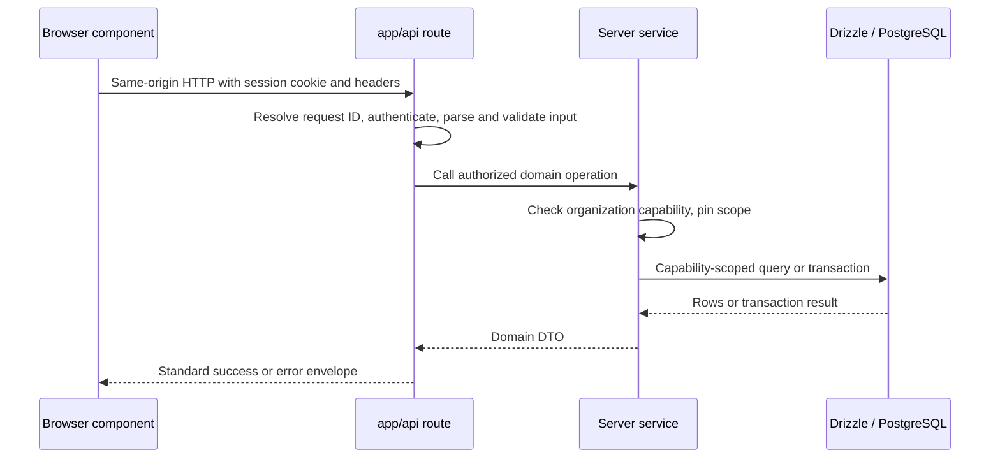

Every API route authenticates independently with `requireApiUser()` in
`src/server/platform/http/auth.ts`. Organization identity in a URL is never authority:
server services resolve the actor's membership and capability through
`src/server/platform/auth/organization-scope.ts` and pin the organization predicate
through the query or transaction.

All ordinary public tables have RLS enabled with no browser-role application
policies. Default-deny RLS protects direct browser access; the service layer
provides tenant locality for trusted application connections.

Expensive commands enqueue a `background_jobs` row and let the browser poll
an authorized status endpoint. Most return `202`; synchronous resource
updates that enqueue follow-up indexing or re-embedding return `200` and
schedule the same after-response drain explicitly.

### Cross-cutting guarantees

#### Immutability and mutability

| Data | Mutability model |
| --- | --- |
| Questionnaire content, rules, requirements | Code-owned releases; answers and results are immutable snapshots |
| Applicability and Gap results | Published revisions and their evidence/provenance are immutable; current pointers and workflow status advance |
| Gap and Action Plan workflows | Drafts, progress, and status are mutable; finalized revisions and pinned inputs are immutable |
| Users, organizations, memberships, settings | Mutable transactional state with capability and audit controls |
| Uploaded and legal files | Object versions and corpus snapshots are immutable lineage; processing state is mutable |
| Jobs and AI runs | Lease, retry, progress, and terminal status evolve; prompts, context, and published results are retained |

#### At-least-once execution

A job drain claims eligible rows with `FOR UPDATE SKIP LOCKED`, records a
lease, and heartbeats while a handler runs. A crash or expired lease can cause
another executor to run the handler again, so delivery is at-least-once.
Where a handler publishes a business result, idempotency records and a
lease-fenced publication transaction prevent duplicate logical commands and
late publication by an executor that lost ownership.

#### Code-owned definitions

Executable questionnaire behavior, rules, and prompt contracts are application
code, not database rows. Definition hashes and build hashes are recorded on
revisions and AI runs for provenance and staleness detection. Legal text in
the corpus is evidence for generation, never executable configuration.

### Practical navigation

1. Identify the API route under `app/api/` and follow its import to a public
   module interface in `src/server/modules/<module>/index.ts`.
2. Open the owning module implementation, then follow persistence into the
   matching file under `src/db/schema/`; relations remain in `src/db/relations.ts`.
3. For asynchronous work, inspect the generic runtime in
   `src/server/platform/jobs/`, its composition in
   `src/server/bootstrap/job-definitions.ts`, and the owning module handler.
4. For AI work, distinguish provider/runtime code in `src/server/platform/ai/`
   from compliance evidence coordination in `src/server/modules/grounding/`.
5. For questionnaire or rule changes, follow the owning module's `release/` or
   `nis2/` directory; never edit the database as content management.

### Related documents in this folder

- [Workflows](#end-to-end-backend-workflows) — end-to-end journeys through the backend.
- [Deployment](#deployment) — deployment modes and self-hosted topology.
- [Database schema](#database-schema) — the data model.
- [Jobs](#background-jobs) — the durable job runtime.
- [API conventions](#api-conventions) — request/response contract.

---

## Deployment

_Source: `system/deployment.md`_


> Status: current as of 9 September 2026.

### Execution model

The application ships as one web process:

- The **web process** (`next start`) serves pages and API routes. Responses
  that enqueue work can run a bounded portable job drain via Next.js
  `after()` (`src/server/platform/jobs/execution/after-response.ts`). The API
  wrapper schedules it automatically for `202`; successful `200` commands
  that enqueue follow-up work schedule it explicitly.
- A scheduled, authenticated recovery route
  (`app/api/internal/jobs/drain/route.ts`) provides durable wake-ups for
  all deployments. Hosted deployments register it as a cron job; self-hosted
  deployments can call the authenticated route from their scheduler.

All execution surfaces use the same handlers; hosting differences only change
who wakes the queue.

### Deployment modes

#### Hosted / serverless (Vercel-style)

- Web process only.
- After-response drains plus the scheduled recovery route
  (`vercel.json` registers `/api/internal/jobs/drain` as a daily cron).
- Suitable for low throughput; job processing happens opportunistically after
  responses and on the cron schedule.

#### Private self-hosted (Docker Compose)

- Web container with after-response drains plus an authenticated scheduled
  call to the recovery route.
- PostgreSQL, Supabase Auth, and Storage run in the same Compose project
  (`infra/compose/app-host/`), coordinated with Caddy as the TLS edge.
- Blue/green release projects swap application images by digest without
  rebuilding source (`infra/scripts/deploy-app-host.sh`).
- Optional observability stack: Prometheus, Grafana, Loki, Alertmanager, and
  Alloy.

#### Local development

- Next.js dev server against a hosted Supabase project; `.env.local` holds
  configuration. Requests trigger after-response drains, and the recovery
  route can be invoked with `CRON_SECRET` when needed.
- Optional local model testing runs Ollama natively on the host; see
  [Local AI](#local-ai).

### Self-hosted topology

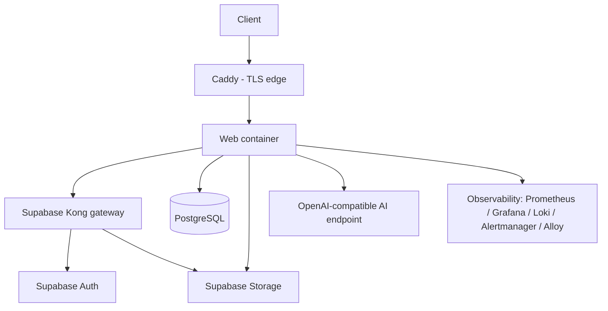

Internal `app` and `data` networks are not published to the host; database
backup, Auth SMTP, and Storage S3 egress use a separate un-published network.

### Configuration

Configuration is environment-based and secret-bearing files stay outside Git:

| Area | Environment variables |
| --- | --- |
| Database | `DATABASE_URL` (application role), `DRIZZLE_DATABASE_URL` (operator role), pool settings |
| Supabase | `SUPABASE_URL`, publishable/secret keys, JWT secrets, SMTP settings |
| AI | `AI_DEFAULT_PROVIDER`, `OPENAI_API_KEY`/`OPENAI_MODEL`, `SELF_HOSTED_AI_*` endpoint for local/on-prem inference, embedding model |
| Build | `APP_BUILD_SHA` recorded on revisions and AI runs for provenance |
| Rate limiting / pagination | `API_CURSOR_SECRET` (or Supabase secret) for signed cursors |

The organization's AI provider mode is per-organization application state;
deployment-wide provider configuration only supplies the fallback.

### Security posture of containers

The first-party web container runs non-root, read-only, capability-free,
with PID/memory/CPU bounds and tmpfs for temporary writes. Only Caddy keeps
`NET_BIND_SERVICE`; no service mounts the Docker socket; images are pinned by
digest.

### Health endpoints

- `GET /api/health/live` — process liveness.
- `GET /api/health/ready` — checks database readiness (503 while not ready).

### Notes

- This document describes the topology conceptually. Step-by-step deployment
  procedures are intentionally not part of this self-contained folder.
- Job execution uses the same PostgreSQL schema as the web application; there
  is no separate queue service or worker deployment.

---

## Database Schema

_Source: `database/schema.md`_


> Status: current as of 9 September 2026.

### Source of truth

The schema is owned by application code:

- `src/db/schema.ts` — the stable public schema facade used by existing
  imports and Drizzle tooling.
- `src/db/schema/` — ownership-based schema files containing every table,
  column, enum, constraint, index, generated search vector, and RLS
  declaration. Shared enums and helpers live in `_shared.ts`.
- `src/db/relations.ts` — Drizzle relations used by query builders.
- `src/db/index.ts` — connection pool and typed query entry point.

The database is PostgreSQL (Supabase PostgreSQL 15 in self-hosted
deployments). Drizzle ORM talks to it through the `postgres` driver. Two
append-only audit triggers and the `vector` extension are the only operator
SQL outside the schema file.

### What lives in PostgreSQL vs. in code

PostgreSQL stores customer state, immutable snapshots, direct lineage, AI
provenance, evidence, durable operations, legal-source history, and audit.

Application code owns the executable questionnaires, rules, requirement
metadata, mappings, prompts, and localized copy. Those are versioned releases
under their owning business modules in `src/server/modules/`, and changing
them produces new definition hashes rather than database edits.

### Core entity relationships

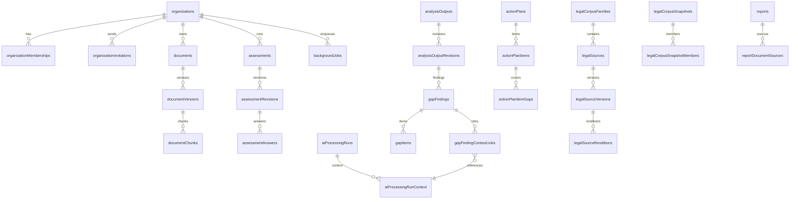

### Table inventory

All 48 ordinary tables, grouped by domain. Names are the Drizzle export names;
the physical table names are the same in snake_case.

#### Tenancy and access

| Table | Purpose |
| --- | --- |
| `organizations` | Tenant root: name, country, AI provider mode, archive flag. |
| `organizationMemberships` | Existence-based membership of a user in an organization with a role. |
| `organizationInvitations` | Pending invitations with hashed tokens and expiry; deleted when accepted/revoked/expired. |
| `userProfiles` | Minimal user display data mirrored from Supabase Auth. |
| `organizationModelSettings` | Per-organization choice of generation/embedding models and embedding identity. |
| `organizationEmbeddingMigrations` | Resumable re-embedding runs when an organization changes embedding provider. |

#### Assessments and generated analysis

| Table | Purpose |
| --- | --- |
| `assessments` | Stable identity of one assessment per organization and kind (applicability, gap). |
| `assessmentRevisions` | Immutable submitted answers with definition/build hashes, locale, and input hash. |
| `assessmentAnswers` | Localized answer rows pinned to an assessment revision. |
| `guestApplicabilityChecks` | Temporary public applicability submissions and result snapshots until claim or expiry. |
| `analysisOutputs` | Stable identity of one generated result per organization and kind. |
| `analysisOutputRevisions` | Immutable published result revisions with inputs, outcome metadata, and generation-job lineage. |
| `analysisOutputDocumentSources` | Document versions selected as evidence for an output revision. |

#### Documents

| Table | Purpose |
| --- | --- |
| `documents` | Stable document identity with a current-version pointer and archive flag. |
| `documentVersions` | One immutable indexing lifecycle per upload: file metadata, storage location, content hash, embedding identity, indexing status. |
| `documentChunks` | Text chunks with page/section metadata, generated search vector, and embedding vector. |

#### Gap analysis

| Table | Purpose |
| --- | --- |
| `gapAnalysisCycles` | One unfinished cycle per organization: stage, draft answers, generation job, and output revision pointers. |
| `gapAnalysisCycleDocuments` | Selected evidence document versions for a cycle. |
| `gapFindings` | Normalized findings per requirement with status, criticality, and contradiction metadata. |
| `gapItems` | Atomic gaps (missing/partial/uncertain) belonging to a finding, with statements and recommendations. |
| `gapFindingContextLinks` | Exact evidence links per finding with relationship (`supporting`/`conflicting`) and resolution disposition. |
| `gapItemContextLinks` | Exact evidence links per atomic gap item. |

#### Action plans

| Table | Purpose |
| --- | --- |
| `actionPlans` | The single Action Plan per organization, pinned to a source Gap revision. |
| `actionPlanItems` | Generated plan items with title, separate result text, a JSON string array of suggested evidence, and status-only mutation. |
| `actionPlanItemGaps` | Many-to-many coverage links from plan items to gap items; the owning plan is reached through the item. |

#### AI processing

| Table | Purpose |
| --- | --- |
| `aiProcessingRuns` | One inference call: provider/model, prompt and definition hashes, input manifest, validated output, usage, and lifecycle. |
| `aiProcessingRunContext` | The canonical admitted evidence record: exact text, scores, citation metadata, and channel. |
| `clientInferenceRequests` | Browser-relayed inference requests (generation or embedding) with claims, leases, and heartbeats. |

#### Legal corpus

| Table | Purpose |
| --- | --- |
| `legalCorpusFamilies` | Framework/jurisdiction boundary with a current snapshot pointer. |
| `legalSources` | Legal documents with authority tier and jurisdiction. |
| `legalSourceVersions` | Immutable versions of a source with effective dates and content hash. |
| `legalSourceRenditions` | Language-specific renditions with translation status and storage location. |
| `legalSourceProcessingGenerations` | One processing run per rendition: parser, status, and job link. |
| `legalSourceChunks` | Chunks of legal text with generated search vector. |
| `legalProvisionChunkBindings` | Reviewed stable provision keys bound to exact chunks. |
| `guidanceSources` | Curated guidance documents with provenance metadata. |
| `guidanceChunks` | Chunks of guidance text. |
| `guidanceProvisionBindings` | Reviewed provision bindings for guidance chunks. |
| `legalCorpusSnapshots` | Validated, immutable selections of processed source versions. |
| `legalCorpusSnapshotMembers` | Exact processing-generation members of a snapshot; rendition, version, and source resolve through the normalized hierarchy. |

#### Reports

| Table | Purpose |
| --- | --- |
| `reports` | Immutable PDF reports pinned to an applicability revision, an optional Gap revision and Action Plan, and render metadata. |
| `reportDocumentSources` | Document versions selected for a report. |

#### Operations

| Table | Purpose |
| --- | --- |
| `backgroundJobs` | Durable job rows: kind, state, payload, lease, attempts, progress, result locator. |
| `uploadSessions` | Prepared uploads with expected size/hash and completion state. |
| `idempotencyRecords` | Idempotency claims with actor, scope, operation, request hash, and result locator. |
| `apiRateLimitWindows` | Durable rate-limit counters per window. |

#### Audit

| Table | Purpose |
| --- | --- |
| `auditEvents` | Organization-scoped append-only audit stream. |
| `platformAuditEvents` | Platform-level append-only audit stream (operator actions). |

### Enums

The schema defines 22 enums, including:

| Enum | Values (key ones) |
| --- | --- |
| `organization_role` | owner, contributor, viewer |
| `ai_provider_mode` | openai, self_hosted |
| `assessment_kind` | applicability, gap |
| `analysis_output_kind` | applicability, gap |
| `gap_analysis_cycle_stage` | draft answers, evidence, generation, review, etc. |
| `gap_finding_status` / `gap_item_kind` | fulfilled/partial/missing statuses; missing/partial/uncertain |
| `action_plan_item_status` | open / in progress / done etc. |
| `background_job_state` | queued, leased, running, succeeded, failed, cancelled (the API reports `cancellation_requested` while a cancellation is pending) |
| `background_job_kind` | gap_analysis, gap_conflict_resolution, action_plan_generation, report_render, document_indexing, organization_reembedding, legal_source_processing, maintenance_cleanup |
| `idempotency_state` | in_progress, completed, failed |
| `legal_authority_tier` | primary_authority, official_guidance, curated_secondary |
| `legal_translation_status` | official, reviewed_internal, machine_assisted |
| `grounding_context_channel` | legal_authority, organization_evidence |

### Security model

- Every ordinary public table is declared with RLS enabled
  (`pgTable.withRLS(...)`).
- Browser-facing roles have no application policies, so direct client access
  is denied by default.
- Trusted application connections authenticate as the application role and
  rely on server-side capability checks and organization scopes for tenant
  locality.
- Audit tables are append-only via operator triggers.

### Lifecycle and immutability rules

- Completed assessment/output revisions, findings/items, generated Action
  Plan content, document versions, reports, corpus snapshots, and audit rows
  are never updated.
- Stable parents (e.g., `documents.current_version_id`,
  `analysis_outputs.current_revision_id`, `legal_corpus_families.current_snapshot_id`)
  are the only mutable current pointers.
- A contradiction decision creates a new Gap revision instead of editing the
  old one.
- Organizations are archived, never deleted.
- Job-linked AI-run creation and Gap/Action Plan/report publication lock the
  parent job and require the executing drain to own its current, unexpired
  lease; a candidate produced after lease turnover is discarded.
- One Action Plan may be created per organization, ever.

Normalized lineage deliberately has one path for each fact:
`gap_item -> finding -> output_revision`,
`action_plan_item_gap -> item -> plan`, and
`legal_chunk/snapshot_member -> processing_generation -> rendition -> version -> source`.
Generated Gap and Action Plan artifacts point to a job; all selected AI runs
are found through `ai_processing_runs.job_id`.

### Practical navigation

- Tables live in ownership-based files under `src/db/schema/`; use
  `src/db/schema.ts` as the public import surface and follow relations in
  `src/db/relations.ts`.
- For a new column or index, extend the schema and use the guarded schema
  workflow from `scripts/`; never hand-edit the database.
- The schema is RLS-everywhere by convention; new tables must follow it.

---

## AI Usage

_Source: `ai/usage.md`_


> Status: current as of 9 September 2026.

### What AI is used for

The backend uses AI in three places:

1. **Grounded text generation** — Gap-Analyse findings, contradiction
   resolution, and Action Plan items. This is the core AI feature.
2. **Embeddings** — organization document chunks and queries for retrieval.
3. **Legal corpus processing** — chunking legal sources (AI embeddings may be
   involved; parsing/chunking itself is deterministic).

### Provider model

Each organization has an AI provider mode (`ai_provider_mode`:
`openai` or `self_hosted`). One code-owned NIS2 grounding policy supplies the
provider and legal scope for Gap generation, contradiction resolution, and
Action Plan generation:

- `openai` — the server calls OpenAI directly through the AI SDK
  (`src/server/modules/grounding/providers/ai-sdk.ts`).
- `self_hosted` — two shapes:
  - An organization that recorded its chosen models in
    `organization_model_settings` runs them on a user's machine through the
    **browser relay**
    (`src/server/modules/grounding/providers/client-relay.ts`).
  - An organization without that record uses the deployment's
    `SELF_HOSTED_AI_*` endpoint directly — the local development and
    on-premises topology where the server can reach the model over a network.

The selection happens in one place
(`src/server/modules/grounding/gateway.ts`), so all generation call sites inherit
the relay without knowing it exists. An unavailable selected provider fails
explicitly; there is no silent fallback.

### The grounded generation pipeline

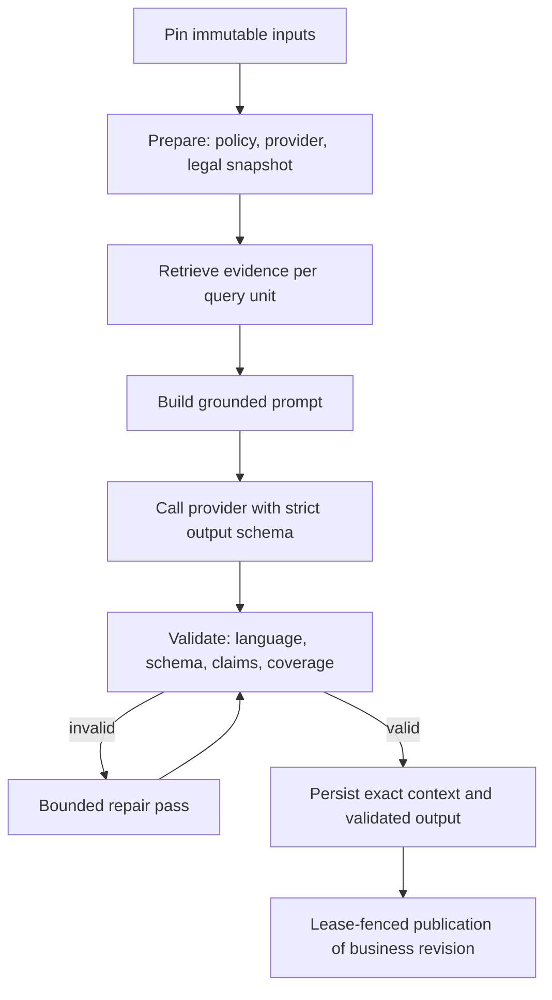

#### Preparation

`prepareGroundingOperation` resolves:

- the shared NIS2 grounding policy (legal corpus families, jurisdictions, and
  provider selection);
- the concrete provider;
- the pinned legal snapshot scope (`resolvePinnedLegalScope`), so generation
  is reproducible against a fixed set of legal sources.

#### Retrieval

For every query unit (a requirement/category), the gateway retrieves in
parallel:

- **Legal context**: pinned legal snapshot chunks, resolved through reviewed
  provision bindings, ranked lexically, filtered by authority tier
  (`src/server/modules/grounding/legal-retrieval.ts`).
- **Organization evidence**: chunks of the selected document versions, ranked
  by fused semantic (embedding) and lexical scores
  (`src/server/modules/grounding/organization-retrieval.ts`).
- **Guidance context**: optional reviewed guidance bound to the same
  provision keys.
- **Questionnaire assertions**: the exact answers used, as citable excerpts.

Every context item carries a stable citation ID and excerpt hash.

#### Prompt and output contract

The assistant prompt is built by `src/server/modules/grounding/prompts/` from
the query units and context.
Query units, prompts, operation kinds, locale, and response schemas remain
workflow-specific. The response schema is a strict Zod contract per domain, defined in
`src/server/modules/gap-analysis/current-contract.ts` and
`src/server/modules/action-plans/current-contract.ts`. The model supplies only bounded
prose and optional organization citations; the server owns categories, gap
kinds, priorities, ordering, mandatory citations, locale, and persistence.

#### Validation and repair

Output must satisfy:

- schema conformance;
- requested output language (validated by a language detector);
- complete query-unit coverage;
- every claim supported by the exact server-selected context, with material
  contradictions returning the exact unique allowlisted citation IDs.

Invalid output triggers a bounded repair pass against the same context;
unrecoverable failures fail the job with a safe error code.

### Provenance and recovery

Every provider call is recorded in `ai_processing_runs`:

- actual provider and model;
- `prompt_hash` (exact normalized messages plus response-schema metadata);
- `definition_hash` (the code-owned domain contract) and `build_hash`
  (`APP_BUILD_SHA`);
- the input manifest (query units, selected evidence versions, pinned legal
  snapshots, assessment revision);
- attempt counts, token usage, and the validated output;
- `claim_validation` status and per-claim results.

`ai_processing_run_context` stores the exact admitted evidence with scores
and citation metadata — the canonical record findings link to.

Runs are idempotency-keyed per operation, and `generation_reservation_key`
groups repair/retry candidates. A run that already produced
validated output is recovered (not re-invoked) when a parked job wakes or a
retry re-enters the gateway; a run whose business result already published is
rejected as a duplicate.

### Generation concurrency and failures

- Category generation is coordinated with bounded concurrency
  (`src/server/platform/ai/generation/concurrency.ts`,
  `src/server/platform/ai/generation/category-coordinator.ts`).
- Provider calls are limited by a permit limiter.
- Failures are classified
  (`src/server/platform/ai/generation/failures.ts`) into transient provider
  failures (retryable with delay), content/validation failures
  (non-retryable), and cancellation; safe codes are persisted on the run and
  the job.
- Job-linked runs require the parent job's live lease both at creation and
  publication (`src/server/platform/ai/generation/job-run-lifecycle.ts`).

### Embeddings

- Organization documents are chunked (`paragraph-v1`) and embedded with the
  organization's configured embedding provider; chunks store the vector and
  a generated search vector.
- Embedding identity (provider, model, revision, dimensions, retrieval
  instruction, chunking version) is hashed onto every `document_versions`
  row, so retrieval never mixes vectors from different spaces.
- Changing the embedding model triggers a resumable
  `organization_reembedding` job.

### Practical navigation

- Gateway and grounding: `src/server/modules/grounding/`.
- Generation coordination: `src/server/platform/ai/generation/`.
- Prompts and model configuration: `src/server/platform/ai/`.
- Provider implementations: `src/server/modules/grounding/providers/`.
- Browser relay specifics: [Local AI](#local-ai).

---

## Local AI

_Source: `ai/local-ai.md`_


> Status: current as of 9 September 2026.

### What "local AI" means here

An organization can opt into `self_hosted` AI: models it controls, running
either on a user's machine (browser relay) or on a network the server can
reach directly (local development / on-premises `SELF_HOSTED_AI_*`
endpoint). This document covers the browser-relayed mechanism, which is the
shipped shape for remote deployments, and the direct endpoint used locally.

### Why a relay

A deployed server cannot connect to a user's `localhost`. The browser relay
reverses the direction: the server persists an inference request, the user's
browser claims it, runs the local model, and submits the response back. No
inbound firewall port is needed.

### Flow

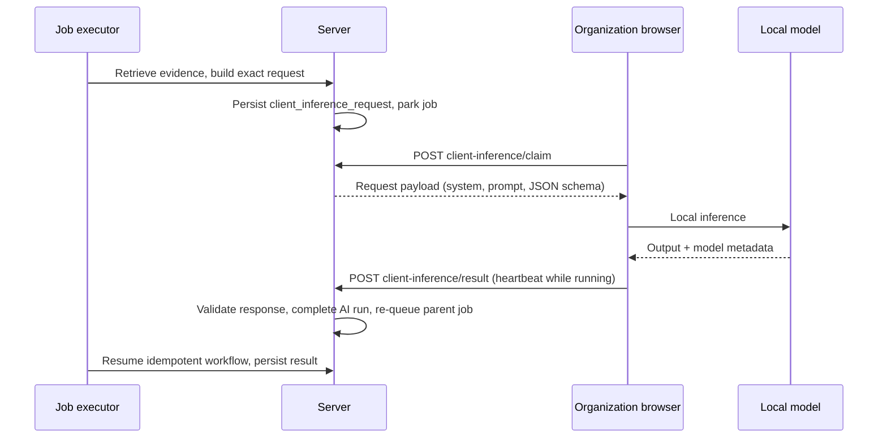

### Request lifecycle

Requests live in `client_inference_requests`, with kind `generation` or
`embedding`:

- **Claiming**: a request is claimable by clients of its organization. Claims
  are leased (`CLIENT_LEASE_SECONDS` = 90 s, refreshed by heartbeats).
- **Boundaries**: a request expires after 30 minutes
  (`CLIENT_REQUEST_TTL_SECONDS`); one user may hold at most 3 open claims; one
  claim may not exceed 15 minutes total — this bounds how much a hostile
  member can park.
- **Submission**: the response is validated before it becomes authoritative:
  schema conformance, output language, required query-unit coverage, exact
  citation identifiers, and claim support against the server-selected
  context. Usage reported by the client is attested, never metered as cost.
- **Cancellation**: cancelling the parent job also invalidates pending or
  running relay work; late responses for cancelled or expired claims are
  rejected.

### Interaction with jobs

The parent background job (e.g., `gap_analysis`) owns the whole workflow. When
it hands a model call to the relay, the AI run enters `awaiting_client` and
the job parks (reported as `parked` by the drain). When the client answers,
the job is re-queued and resumes idempotently — the server recomputes the
same inputs, finds the answered run by input hash, and continues without a
second provider call.

The relay carries only the inference request; the server never hands the
browser database credentials or business logic.

### Direct self-hosted endpoint

For local development and on-premises deployments, `self_hosted` can point at
an OpenAI-compatible endpoint reachable from the server (`SELF_HOSTED_AI_*`
environment). In that shape the AI SDK provider calls the endpoint directly,
no relay is involved, and usage is measured normally.

### Embedding relay

Document indexing and query embedding can also use a local model. The relay
payload is an embedding request with the exact values and expected
dimensions; a dimension mismatch is treated as a configuration error. The
embedding identity (model, revision, dimensions, instruction profile) is
stored with every version, so a switched model triggers a resumable
re-embedding migration rather than mixing vector spaces.

### Trust boundary

- The local model response is untrusted input until server validation passes.
- Local model credentials and URLs stay with the client; the server records
  only client-reported model metadata.
- The selected provider never falls back silently to another provider; an
  offline client or model causes the operation to wait or fail per its
  explicit timeout and retry policy.

### Practical navigation

- Relay implementation: `src/server/platform/ai/client-inference/`.
- Relay provider adapter: `src/server/modules/grounding/providers/client-relay.ts`.
- Organization model settings: `src/server/modules/organizations/model-settings-service.ts`.
- Claim/heartbeat/result routes: `app/api/organizations/:id/client-inference/`.
- Local development: run Ollama on the host; select `self_hosted` via
  `AI_DEFAULT_PROVIDER` or per-organization settings.

---

## Gap-Analyse Calculation

_Source: `calculations/gap-analysis.md`_


> Status: current as of 9 September 2026.

### What this calculation produces

The Gap-Analyse turns an organization's questionnaire answers, selected
evidence documents, and pinned legal sources into a compliance assessment:
findings per NIS2 requirement, atomic gaps with recommendations, exact
citations, and an immutable result revision.

It is deliberately a combination of **deterministic evaluation** (server-owned
logic that cannot be changed by the model) and **grounded generation**
(bounded prose produced by the provider from exact evidence).

### Inputs

| Input | Source | Why it matters |
| --- | --- | --- |
| Applicability result | `analysis_output_revisions` (kind `applicability`) | `gap_eligible` unlocks Gap; the source applicability revision is pinned |
| Questionnaire answers | Immutable `assessment_revisions` | Assertions the model may use as evidence |
| Selected documents | `gap_analysis_cycle_documents` | Organization evidence versions, current and indexed only |
| Legal corpus | Pinned snapshots per family | The legal basis; chosen by the grounding policy |
| Definition release | `src/server/modules/gap-analysis/current-contract.ts` | Code-owned questionnaire, requirements, prompts, and response schema |
| Locale | Cycle locale (`de`/`en`) | Output language |

### Deterministic part

#### Category status

Each requirement/category groups a set of questions. Answer values are
`fully_implemented`, `partially_implemented`, `not_implemented`, `unsure`,
or `not_applicable`. `evaluateGapCategory` in
`src/server/modules/gap-analysis/deterministic-evaluator.ts` derives the status:

- any `not_implemented` → `not_fulfilled`;
- else any `partially_implemented` → `partially_fulfilled`;
- else any `unsure` → `insufficient_evidence`;
- else any `fully_implemented` → `fulfilled`;
- all `not_applicable` → `insufficient_evidence`.

#### Trigger policy

`deriveAtomicGapTriggerPolicy` in
`src/server/modules/gap-analysis/trigger-policy.ts` decides which questions trigger
generation of atomic gaps:

- `partially_implemented`, `not_implemented`, and `unsure` always trigger;
- `not_applicable` triggers only when the whole category is not applicable;
- `fully_implemented` questions are recorded as satisfied.

The policy also carries the preferred legal provision keys used to retrieve
and cite legal context.

#### Server-owned semantics

The server owns category identity, gap kinds (`missing`, `partial`,
`uncertain`), statement cardinality, priority, ordering, mandatory
citations, and locale. The provider supplies only the bounded prose and
optional organization citations allowed by the strict current schema.

### Grounded generation

For each category, the job handler runs the grounded pipeline described in
[AI Usage](#ai-usage):

1. Pin legal snapshot scope and resolve the provider.
2. Retrieve legal, organization, guidance, and questionnaire-assertion
   context for the category's query unit.
3. Build the prompt from the current contract and invoke the provider with
   the strict category response schema.
4. Normalize the response: atomic gaps with statements, recommendations,
   and citation IDs.
5. Validate language, schema, query-unit coverage, and claim support;
   run a bounded repair pass on invalid output.
6. Persist the exact admitted context and validated output in
   `ai_processing_run_context` / `ai_processing_runs`.

Generation is coordinated across categories with bounded concurrency, and
the AI run is created only while the parent job owns its live lease.

### Publication

One transaction publishes:

- normalized `gap_findings` (one per requirement, with status, criticality,
  summary, and guidance);
- `gap_items` (atomic gaps) with exact `gap_item_context_links`;
- `gap_finding_context_links` recording evidence relationship
  (`supporting`/`conflicting`) and resolution disposition;
- the immutable `analysis_output_revisions` row (kind `gap`) with definition
  and build hashes, input hash, and provenance;
- the successful AI-run state and the current pointer on `analysis_outputs`;
- audit rows and job success.

The revision points to its generation job. Every selected category run is
resolved through `ai_processing_runs.job_id`; there is no single-run pointer
on the revision.

Missing or weak evidence does not block generation — it is reported as
`insufficient_evidence`, not fabricated.

### Contradiction resolution

If a finding contains a material direct contradiction, the reviewer chooses
one of two paths
(`src/server/modules/gap-analysis/contradiction-resolution-service.ts`):

- **Trust questionnaire**: only the `conflicting` document context links are
  marked rejected; unrelated `supporting` links remain.
- **Trust document**: a new `gap_conflict_resolution` job regenerates exactly
  that one finding from only the exact cited excerpts.

Either choice creates a new immutable Gap revision with actor/time, a
tenant-safe self-reference to the original finding, source choice, and exact
resolution citation IDs. Findings and gaps
are never edited in place.

### Practical navigation

- Current contract and response schema:
  `src/server/modules/gap-analysis/current-contract.ts`,
  `src/server/modules/gap-analysis/generation-schema.ts`.
- Deterministic evaluation:
  `src/server/modules/gap-analysis/deterministic-evaluator.ts`,
  `src/server/modules/gap-analysis/trigger-policy.ts`.
- Generation: `src/server/modules/gap-analysis/atomic-gap-generation.ts`,
  `src/server/modules/gap-analysis/generation-domain.ts`.
- Publication: `src/server/modules/gap-analysis/` (atomic-gap-generation and
  workflow services).
- Contradiction resolution:
  `src/server/modules/gap-analysis/contradiction-resolution-service.ts`.

---

## Action Plan Calculation

_Source: `calculations/action-plan.md`_


> Status: current as of 9 September 2026.

### What this calculation produces

The Action Plan (Maßnahmenplan) converts a finalized Gap revision into
remediation items with titles, result text, suggested evidence lists, and statuses, so an organization
can track what to do. Each organization may create **one** Action Plan, ever,
from its current, compatible, unblocked Gap revision.

It uses the shared NIS2 grounding policy while retaining a distinct workflow
prompt, operation kind, query unit, and code-owned output contract
(`src/server/modules/action-plans/current-contract.ts`).

### Inputs

| Input | Source |
| --- | --- |
| Gap revision | The current, compatible `analysis_output_revisions` row (kind `gap`) |
| Findings and gaps | The revision's `gap_findings` and `gap_items` |
| Legal and organization context | Retrieved again through the grounding pipeline for each category |
| Locale | `de` or `en` |
| Action Plan contract | `src/server/modules/action-plans/current-contract.ts` |

### Deterministic part

The server owns:

- **Category scoping**: generation happens per category, and every gap in the
  source revision must be covered.
- **Coverage**: complete within-category many-to-many links between plan
  items and gap items (`action_plan_item_gaps`) — no gap may be left
  uncovered, and no item may reference gaps outside its category.
- **Ordering, priority, and persistence metadata**.

The provider supplies only the item titles, result text, suggested evidence, and optional
organization citations within the strict schema; it cannot add, drop, or
re-scope gaps.

### Generation

1. A member with the `plans:manage` capability starts generation
   (`POST /api/organizations/:id/action-plan`), which enqueues an
   `action_plan_generation` job and returns `202`.
2. The job handler pins the source Gap revision, retrieves evidence per category,
   and runs the grounded provider operation with the Action Plan schema.
3. Output is validated (language, schema, coverage, citations) with a bounded
   repair pass.
4. The result is published only under the executor's **live lease**:
   `assertActionPlanPublicationLease` verifies the job is still running, owned
   by this executor, lease unexpired, and not cancelled.

### Publication

One transaction publishes:

- the `action_plans` row pinned to the source Gap revision and generation job;
- `action_plan_items` with separate `result` text and `suggested_evidence`
  JSON arrays plus initial status;
- `action_plan_item_gaps` coverage links;
- audit rows and job success.

After publication the plan is immutable except for **item status**, which can
be updated status-only (`PATCH /api/organizations/:id/action-plan/items/:itemId`).
All selected AI runs resolve through `action_plans.generation_job_id` and
`ai_processing_runs.job_id`.

### Practical navigation

- Contract and response schema:
  `src/server/modules/action-plans/current-contract.ts`,
  `src/server/modules/action-plans/generation-schema.ts`.
- Generation: `src/server/modules/action-plans/generation-service.ts`.
- Publication lease:
  `src/server/modules/action-plans/publication-lease-policy.ts`.
- Item status updates and reads:
  `src/server/modules/action-plans/action-plan.ts`,
  `src/server/modules/action-plans/progress-service.ts`.

---

## Betroffenheitscheck Calculation

_Source: `calculations/applicability-check.md`_


> Status: current as of 9 September 2026. Describes the guided-wizard
> applicability check (`nis2_applicability`, release `2026-v2`, evaluator
> `nis2_scope_v3`).

### Purpose

The Betroffenheitscheck (applicability check) decides whether an organization
is affected by NIS2 in Germany and, if so, which entity categories apply. It is
the gate that unlocks the Gap-Analyse (`gap_eligible`).

The wizard is Germany-only. Germany is the only supported jurisdiction
(`SUPPORTED_JURISDICTION_CODES = ["DE"]`), and the first question covers every
German-competence case. Non-German cases end in `not_directly_in_scope` or
`clarification_required` through the equivalent evaluator facts.

Release `2026-v2` inherits the `2026-v1` questionnaire and evaluator unchanged
and extends only the versioned legal-provision catalogue used by the current
Gap release.

### Guided wizard

The release publishes eight questions (Q1–Q6, with Q5 split into the three
size-bucket questions). The step-by-step wizard used by the guest
(`/check/applicability`) and authenticated
(`/tool/organizations/<organization-id>/applicability-check/new`) flows shows
only the questions that the route logic requires and submits immediately after
terminal END routes.

| Question | Stable key | Answer type | Mapped facts |
| --- | --- | --- | --- |
| Q1 Germany connection | `bc.germany_connection` | single choice | `eu_activity`, `jurisdiction_country`, `jurisdiction_basis`; terminal routes additionally `member_state_designation`, `nis2_entity_types`, and size facts |
| Q2 Special legal status | `bc.special_status` | single choice | `member_state_designation`; designation routes additionally representative entity and size facts |
| Q3 Area of activity | `bc.sector` | multi choice | `nis2_entity_types` (`none_of_these` / `unsure` defaults only) |
| Q4 Specific activity | `bc.activity` | multi choice, sections visible per selected sector | `nis2_entity_types` (German catalogue codes) |
| Q5 Size ranges | `bc.employee_count`, `bc.annual_revenue`, `bc.balance_sheet_total` | single choice each | the three bucket facts |
| Q6 Group aggregation | `bc.aggregation` | single choice | `sme_figures_verified` |

#### Q1 route table

| Answer | Wizard route | Facts written (besides `eu_activity`/country/basis) |
| --- | --- | --- |
| Established in Germany | Q2 → Q3 → Q4 → Q5 → Q6 | default entity `de_bsig_electricity_supplier` (overwritten by Q3/Q4) |
| Critical installation in Germany | END: particularly important | `member_state_designation=de_critical_installation`, representative entity, concrete small size + verified aggregation |
| Federal administration | END: federal route | `nis2_entity_types=["de_bsig_federal_authority"]` |
| Cross-border digital provider, DE competent | Q2 → Digital Q4 → Q5 → Q6 | default entity `de_bsig_cloud_service_provider` (overwritten by Q4) |
| Public telecom service/network, DE competent | Q2 → Q5 → Q6 | telecom entities pre-selected |
| Regional administration under Land law | END: clarification required | `nis2_entity_types=["de_bsig_regional_public_administration"]` |
| None of these | END: not directly in scope | `eu_activity=no` |
| Not sure | END: clarification required | `eu_activity=unsure` |

#### Q2 route table

| Answer | Wizard route | Facts written |
| --- | --- | --- |
| None | continue | `member_state_designation=none` |
| Critical installation | END: particularly important | `member_state_designation=de_critical_installation` + size facts |
| Authority essential / CER critical | END: particularly important | `member_state_designation=cer_critical` + size facts |
| Authority important | continue (important floor) | `member_state_designation=important` |
| Not sure | END: clarification required | `member_state_designation=unsure` |

#### Q3 and Q4

`bc.sector` is only shown for the establishment route. `bc.activity` is shown
for the establishment route (sections filtered by the selected sectors) and
for the cross-border digital route (digital section only). The strongest
applicable route wins with evaluator precedence
(E → I → T → A1 → A2 → R; any "unsure" selection forces clarification, and any
domain-registration selection forces clarification with the §34 overlay):

- E (DNS, TLD registry, qualified trust): END particularly important.
- I only (non-qualified trust): END important.
- T / A1 / A2: continue to Q5.
- R (domain-name registration): END clarification required with the §34
  obligations overlay.
- No covered activity (only per-section "none"): not directly in scope, unless
  the Q2 important floor upgrades to important.

#### Q5 and Q6

Size uses the unchanged `2003-361-v1` thresholds with paired financial tests:

```text
LARGE  = employees >= 250 OR (turnover > 50m AND balance > 43m)
MEDIUM = not LARGE AND (employees >= 50 OR (turnover > 10m AND balance > 10m))
SMALL  = otherwise
```

Q6 applies the size/skip table. When the classification is already decisive,
the wizard auto-answers the aggregation question with
`verified_de_without_it_exception`; otherwise the user answers it.

| Activity route | Small | Medium | Large |
| --- | --- | --- | --- |
| T (telecom) | Q6 | skip Q6 | skip Q6 |
| A1 (Annex 1) | Q6 | Q6 | skip Q6 |
| A2 (Annex 2) | Q6 | skip Q6 | skip Q6 |

### Fact derivation

`deriveFactsForAnswers` (`src/server/modules/applicability-check/fact-derivation.ts`)
projects answered questions onto language-neutral decisive facts. Each
question carries `factMappings`; a mapping with `byOption` expands the selected
option value(s) through the per-option table (for example one Q4 activity to
several German entity-catalogue codes), while a mapping without `byOption`
writes the raw answer value. Terminal END routes never short-circuit the
evaluator — they write the equivalent facts and let `nis2_scope_v3` produce the
outcome and reason codes.

Q4 selections expand to the German profile's entity identities
(`nis2_entity_types`); the jurisdiction basis written by Q1 must permit them,
otherwise the evaluator reports `unresolved_profile_jurisdiction`.

### Outputs

Each submission produces an immutable applicability revision with:

- `jurisdiction_country` (always `DE` for positive German journeys),
- outcome (`essential_entity`, `important_entity`,
  `not_directly_in_scope`, `clarification_required`),
- evaluator evidence (scope bases, matched German entities, unresolved fact
  codes, obligation overlays, decisive facts),
- gap eligibility (`gap_eligible` is true only for DE
  `essential_entity`/`important_entity`),
- definition hash and input hash pinning the release and answer set.

The sector-regime overlay and the indirect supply-chain notice are no longer
produced: their facts (`sector_specific_regime`, `serves_critical_customers`,
`has_customer_security_evidence_requests`) were removed with the dropped
questions.

### Source files

- Current release definition: `src/server/modules/compliance/nis2/releases/2026-v2/release.ts`
- Wizard question content: `src/server/modules/compliance/nis2/releases/2026-v1/release-source.ts`
- Evaluator: `src/server/modules/compliance/nis2/rules.ts`
- Fact derivation: `src/server/modules/applicability-check/fact-derivation.ts`
- Visibility/route model: `src/server/modules/compliance/runtime-release/question-visibility.ts`
- Wizard UI: `components/applicability-check/applicability-wizard.tsx` and
  `components/applicability-check/wizard-flow.ts`

---

## Background Jobs

_Source: `jobs/jobs.md`_


> Status: current as of 9 September 2026.

### Why durable jobs

AI generation, document indexing, corpus processing, and PDF rendering can
take minutes. The application does not hold an HTTP request open for them:
an API route enqueues a `background_jobs` row and the browser polls
`GET /api/jobs/:jobId` for progress and the final result locator. Most
long-running commands return `202`; synchronous resource updates that enqueue
follow-up work can return `200`.

The queue is PostgreSQL itself — there is no separate message broker.

### Job lifecycle

The database enum `background_job_state` stores `queued`, `leased`
(compatibility), `running`, `succeeded`, `failed`, and `cancelled`. The API
additionally reports `cancellation_requested` while a cancellation is pending
— it is derived from the `cancellation_requested_at` timestamp on a
non-terminal job, not a stored state.

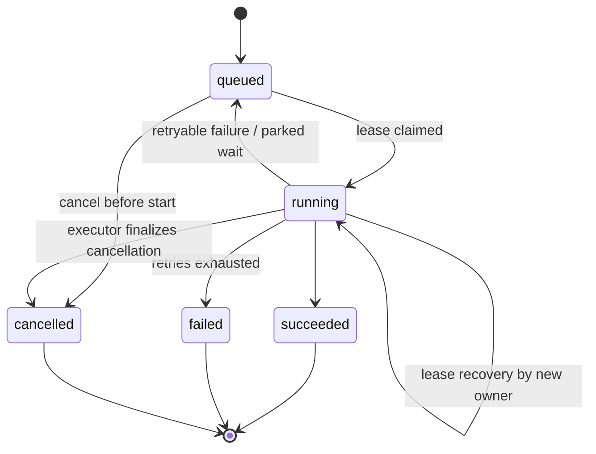

Key mechanics:

- **Claiming**: a drain selects eligible rows with `FOR UPDATE SKIP LOCKED`
  (`queued` with `available_at` reached, or `leased`/`running` with an expired
  lease), increments the attempt count, and marks the row `running` with the
  new owner. The enum's `leased` value is kept for compatibility; new claims
  are written as `running`.
- **Lease**: `lease_owner`, `lease_expires_at`, and `heartbeat_at` record who
  is executing. Handlers heartbeat while running; a crash or timeout lets
  another executor claim the job.
- **At-least-once**: after lease expiry the handler may run again, so every
  handler must be idempotent or recoverable. Idempotency records and
  lease-fenced publication transactions protect business results.
- **Retries**: `attempt_count` vs. `max_attempts`. Transient provider
  failures retry with a delay derived from the provider's retry-after;
  non-retryable failures fail immediately.
- **Cancellation**: cancelling a queued job transitions it immediately to
  `cancelled`. Cancelling a running job records `cancellation_requested_at`
  (the API then reports `cancellation_requested`) and the handler receives an
  abort signal; the executor finalizes the row to `cancelled` and fails any
  in-flight AI run. Non-cancellable jobs reject with `409`.
- **Progress**: `progress_current`, `progress_total`, and `progress_message`
  are durable and exposed by the polling endpoint.
- **Parked state**: when a job hands a model call to an organization browser
  (local AI relay), the drain reports it as `parked` rather than failed; the
  attempt is refunded (the wait does not consume retries), and the job is
  re-queued to wake and check again. The API exposes `waitingOnClient` while
  the progress message is `awaiting_client_inference` (see
  [Local AI](#local-ai)).

### Wake-up adapters

All adapters drain the same queue with the same handlers
(`src/server/platform/jobs/execution/`):

| Adapter | Where | Typical bound |
| --- | --- | --- |
| `after_response` | Next.js `after()`; automatic after `202`, explicit for `200` commands that enqueue follow-up work | 25 jobs, ~4:45 min |
| `recovery_route` | `GET/POST /api/internal/jobs/drain` (cron secret) | 50 jobs, ~4:45 min |

### Job catalog

Job kinds, their triggers, and their outcomes are defined in
`src/server/bootstrap/job-definitions.ts`; handlers live in the domain modules.

| Kind | Trigger | Handler | Result |
| --- | --- | --- | --- |
| `gap_analysis` | Cycle generation request | `src/server/modules/gap-analysis/` | `analysis_output_revision` |
| `gap_conflict_resolution` | Contradiction resolution | `src/server/modules/gap-analysis/` | `analysis_output_revision` |
| `action_plan_generation` | Action Plan start | `src/server/modules/action-plans/` | `action_plan` |
| `report_render` | Report creation | `src/server/modules/reports/` | `report` |
| `document_indexing` | Upload completion / retry | `src/server/modules/documents/` | `document_version` |
| `organization_reembedding` | Embedding model change | `src/server/modules/documents/` | `organization` |
| `legal_source_processing` | Corpus provisioning | `src/server/modules/legal-corpus/` | processing generation |
| `maintenance_cleanup` | Operator scheduling | `src/server/bootstrap/maintenance.ts` | — |

Organization-scoped jobs pin the requester (`requested_by`) and the
organization, so handlers use the pinned identity instead of replaying
a human session. Capability requirements for reading progress and cancelling
are part of each definition.

### Publication safety

Where a handler publishes an immutable business result, it:

1. re-enters a transaction;
2. verifies the parent job is still `running` and owned by this executor's
   current lease (`assertLiveParentJobForAiRun`, action-plan
   `assertActionPlanPublicationLease`);
3. persists the result, the AI-run success state, audit rows, and the current
   pointer atomically.

A candidate produced after lease turnover is discarded instead of published.

### Practical navigation

- Definitions, payload schemas, capabilities: `src/server/bootstrap/job-definitions.ts`.
- State machine: `src/server/platform/jobs/state-machine.ts`.
- Drain and runtime: `src/server/platform/jobs/execution/`.
- Polling/cancellation routes: `app/api/jobs/`.

---

## API Conventions

_Source: `api/conventions.md`_


> Status: current as of 9 September 2026.

All HTTP routes live under `app/api/` and are thin. They authenticate,
validate, enforce limits, and dispatch through a public business-module
interface in `src/server/modules/<domain>/index.ts`. The shared machinery lives
in `src/server/platform/http/`.

### Route handlers

Most routes are declared as exported constants built with `apiRoute(...)`
(`src/server/platform/http/handler.ts`). The wrapper:

- resolves a request ID;
- validates route parameters (any `*Id` param must match the entity ID
  schema);
- calls the handler and serializes the result into the standard envelope;
- maps errors to the error envelope;
- schedules an after-response job drain whenever a handler returns `202`;
- logs method, path, status, and duration per request.

Commands that enqueue work but intentionally return `200` schedule the same
drain explicitly. These include upload completion, document indexing retry,
and organization/model setting changes that start re-embedding.

### Envelope

Success:

```json
{
  "data": { },
  "meta": { "requestId": "..." }
}
```

`meta` may also carry `nextCursor` (pagination) or `version`.

Error:

```json
{
  "error": {
    "code": "INVALID_REQUEST",
    "message": "...",
    "details": {},
    "requestId": "..."
  }
}
```

Every response carries an `x-request-id` header. An inbound
`x-request-id` is accepted if it matches the schema; otherwise a UUID is
generated (`src/server/platform/http/request-id.ts`).

Health endpoints intentionally return bare health payloads. Authorized
document download and source-access endpoints return redirects rather than a
JSON envelope. The guest applicability routes construct the same envelope
directly because they also manage a guest-session cookie.

### Authentication and authorization

- Every protected route calls `requireApiUser()` (`src/server/platform/http/auth.ts`),
  which resolves the Supabase session server-side and returns the
  authenticated actor, or throws `401`.
- Capabilities are role-based. Organization-scoped operations use
  `authorizeOrganizationRead` / `withAuthorizedOrganizationCommand`
  (`src/server/platform/auth/organization-scope.ts`), which pin the organization
  predicate through the whole query or transaction.
- The organization ID in the URL is never authority; it is always re-checked
  against the actor's membership.

### Validation

- Bodies are read and parsed with Zod via `readJsonBody` /
  `readOptionalJsonBody` (`src/server/platform/http/request.ts`). Invalid input throws
  `400` with the Zod issues as `details`.
- The default JSON body ceiling is 8 MB; routes that legitimately move more
  data (relayed embedding results) pass an explicit larger cap.
- Route parameter entity IDs are validated by the wrapper.

### Error codes

`ApiError` (`src/server/platform/http/errors.ts`) maps status codes to stable codes:

| Status | Default code |
| --- | --- |
| 400 | `INVALID_REQUEST` |
| 401 | `AUTHENTICATION_REQUIRED` |
| 403 | `FORBIDDEN` |
| 404 | `NOT_FOUND` |
| 409 | `CONFLICT` |
| 410 | `GONE` |
| 412 / 428 | `PRECONDITION_FAILED` / `PRECONDITION_REQUIRED` |
| 413 | `PAYLOAD_TOO_LARGE` |
| 415 | `UNSUPPORTED_MEDIA_TYPE` |
| 422 | `UNPROCESSABLE_CONTENT` |
| 429 | `RATE_LIMITED` (with `retry-after` header) |
| 502 / 503 | `UPSTREAM_ERROR` / `SERVICE_UNAVAILABLE` |
| 5xx other | `INTERNAL_ERROR` |

Routes may throw `ApiError` with a domain-specific code (e.g.,
`GAP_REASSESSMENT_PREPARE_FAILED`).

### Idempotency

Retryable commands require an `Idempotency-Key` header
(`src/server/platform/http/idempotency.ts`):

- The first request creates an `in_progress` claim in
  `idempotency_records` (fingerprinted by actor, scope, operation, key, and
  request hash).
- A concurrent duplicate races to `409`.
- A completed claim replays the stored result; a failed claim can be retried.

Result locators are typed (e.g., `analysis_output_revision`,
`background_job`, `report`) so the replay returns the same resource.

### Rate limiting

A shared guard and stricter operation policies use one counter implementation:

- Every application API request first passes through one shared limit in the
  Next.js proxy: 300 requests per minute per forwarded client IP. Health probes
  are intentionally outside the proxy matcher.

- `rate-limit.ts` owns the fixed-window PostgreSQL counter and exposes the
  shared request guard plus named operation policies:

| Operation | Limit |
| --- | --- |
| `uploads:create` / `uploads:complete` | 30 / 20 per minute |
| `gap:generate` / `plans:generate` / `reports:create` | 5 per 5 minutes |
| `invitations:write` | 20 per hour |
| `jobs:poll` | 120 per minute |
| `client-inference:claim` / `heartbeat` / `result` / `failure` | 60/60/30/30 per minute |

### Pagination

List routes use signed cursor pagination (`src/server/platform/http/pagination.ts`).
Cursors are HMAC-signed envelopes (`scope` + column values); decoding
validates the signature and scope. The secret is `API_CURSOR_SECRET` (or the
Supabase secret key).

### Long-running commands

Expensive commands (AI generation, indexing, report rendering) enqueue a
`background_jobs` row and let the browser poll the authorized job endpoint
(`GET /api/jobs/:jobId`). Generation and rendering commands normally return
`202`; commands whose primary resource update completed synchronously can
return `200` while their queued follow-up continues. See [Jobs](#background-jobs).

### Practical navigation

- Shared machinery: `src/server/platform/http/` (handler, request, response, errors,
  auth, idempotency, rate-limit, pagination, request-id).
- Contracts for envelopes, IDs, and DTOs: `src/contracts/`.
- Every route: [Route map](#api-route-map).

---

## API Route Map

_Source: `api/route-map.md`_


> Status: current as of 9 September 2026.

All routes are under `app/api/`. JSON application routes return the standard envelope; health checks return a small bare health payload, and document download/source-access routes return redirects. `:id`
placeholders are entity UUIDs; `:organizationId` is the tenant scope.

### Organizations and tenancy

| Method | Route | Purpose |
| --- | --- | --- |
| GET / POST | `/api/organizations` | List own organizations / create one |
| GET / PATCH | `/api/organizations/:organizationId` | Read / update organization |
| POST | `/api/organizations/:organizationId/archive` | Archive (never delete) |
| POST | `/api/organizations/:organizationId/restore` | Restore archived organization |
| GET / PATCH | `/api/organizations/:organizationId/settings` | Read / update settings |
| GET / PUT | `/api/organizations/:organizationId/model-settings` | Read / change AI model settings |
| GET | `/api/organizations/:organizationId/progress` | Organization progress read model |
| GET | `/api/organizations/:organizationId/dashboard` | Dashboard summary, recent activity, and current-year progress history |
| GET | `/api/organizations/:organizationId/dashboard/activity` | Cursor-paginated dashboard activity |
| GET | `/api/organizations/:organizationId/dashboard/progress-history` | Monthly progress history for a requested date range |
| GET | `/api/organizations/:organizationId/audit-events` | Organization audit stream |

### Members and invitations

| Method | Route | Purpose |
| --- | --- | --- |
| GET | `/api/organizations/:organizationId/members` | List members |
| PATCH / DELETE | `/api/organizations/:organizationId/members/:userId` | Change role / remove member |
| POST | `/api/organizations/:organizationId/members/me/leave` | Leave organization |
| GET / POST | `/api/organizations/:organizationId/invitations` | List / create invitations |
| POST | `/api/organizations/:organizationId/invitations/:invitationId/resend` | Resend invitation |
| POST | `/api/organizations/:organizationId/invitations/:invitationId/revoke` | Revoke pending invitation |
| GET | `/api/organization-invitations` | Pending invitations for the current user |
| POST | `/api/organization-invitations/:invitationId/accept` | Accept invitation |

### Applicability check (Betroffenheitscheck)

| Method | Route | Purpose |
| --- | --- | --- |
| GET | `/api/organizations/:organizationId/applicability-check` | Current applicability state |
| GET | `/api/organizations/:organizationId/applicability-check/questionnaire` | Versioned questionnaire |
| GET | `/api/organizations/:organizationId/applicability-check/answers` | Current answers |
| POST | `/api/organizations/:organizationId/applicability-check/submissions` | Submit and evaluate |
| GET | `/api/organizations/:organizationId/applicability-check/result` | Latest result revision |

Guest (public) flow:

| Method | Route | Purpose |
| --- | --- | --- |
| POST | `/api/guest/applicability-check/submissions` | Submit guest check |
| POST | `/api/guest/applicability-check/claim` | Claim a guest result by token |
| GET / DELETE | `/api/guest/applicability-check/result` | Read / delete a guest result |

### Documents

| Method | Route | Purpose |
| --- | --- | --- |
| GET | `/api/organizations/:organizationId/documents` | List documents |
| POST | `/api/organizations/:organizationId/documents/upload-sessions` | Create a signed upload session |
| POST | `/api/organizations/:organizationId/document-upload-sessions/:sessionId/complete` | Verify and complete upload, enqueue indexing |
| GET | `/api/organizations/:organizationId/documents/:documentId` | Document detail and versions |
| GET | `/api/organizations/:organizationId/documents/:documentId/download` | Download current version |
| GET | `/api/organizations/:organizationId/documents/:documentId/source-access` | Access a controlled source rendition |
| POST | `/api/organizations/:organizationId/documents/:documentId/archive` | Archive document |
| POST | `/api/organizations/:organizationId/documents/:documentId/restore` | Restore document |
| POST | `/api/organizations/:organizationId/documents/:documentId/retry-indexing` | Retry failed indexing |

### Gap analysis

| Method | Route | Purpose |
| --- | --- | --- |
| GET | `/api/organizations/:organizationId/gap-analysis` | Gap state and eligibility |
| POST | `/api/organizations/:organizationId/gap-analysis/assessments` | Create gap assessment |
| POST | `/api/organizations/:organizationId/gap-analysis/cycles` | Prepare a cycle (idempotent, 201) |
| GET | `/api/organizations/:organizationId/gap-analysis/cycles/:cycleId` | Read cycle state |
| PUT | `/api/organizations/:organizationId/gap-analysis/cycles/:cycleId/evidence` | Select evidence documents |
| POST | `/api/organizations/:organizationId/gap-analysis/cycles/:cycleId/generation-jobs` | Enqueue generation job (202) |
| PATCH | `/api/organizations/:organizationId/gap-analysis/questionnaire-draft/answers/:questionKey` | Autosave a draft answer |
| POST | `/api/organizations/:organizationId/gap-analysis/questionnaire-submissions` | Finalize questionnaire |
| GET | `/api/organizations/:organizationId/gap-analysis/progress` | Cycle progress |
| GET | `/api/organizations/:organizationId/gap-analysis/history` | Revision history |
| GET | `/api/organizations/:organizationId/gap-analysis/revisions/:revisionId` | Read a Gap revision |
| GET | `/api/organizations/:organizationId/gap-analysis/revisions/:revisionId/inputs` | Pinned inputs of a revision |
| POST | `/api/organizations/:organizationId/gap-analysis/revisions/:revisionId/contradictions/:findingId/resolve` | Enqueue contradiction resolution (202) |

### Action plan

| Method | Route | Purpose |
| --- | --- | --- |
| GET / POST | `/api/organizations/:organizationId/action-plan` | Read plan / start generation (202) |
| GET | `/api/organizations/:organizationId/action-plan/progress` | Generation progress |
| PATCH | `/api/organizations/:organizationId/action-plan/items/:itemId` | Status-only item update |

### Reports

| Method | Route | Purpose |
| --- | --- | --- |
| GET / POST | `/api/organizations/:organizationId/reports` | List / create report (202) |
| GET | `/api/organizations/:organizationId/reports/:reportId` | Report detail and render job state |
| POST | `/api/organizations/:organizationId/reports/:reportId/download` | Authorized PDF download |

### Jobs

| Method | Route | Purpose |
| --- | --- | --- |
| GET | `/api/jobs/:jobId` | Poll a job's state and progress |
| POST | `/api/jobs/:jobId/cancel` | Request cancellation |

### Client inference (local AI relay)

| Method | Route | Purpose |
| --- | --- | --- |
| POST | `/api/organizations/:organizationId/client-inference/claim` | Claim a pending inference request |
| POST | `/api/organizations/:organizationId/client-inference/:requestId/heartbeat` | Extend a claim lease |
| POST | `/api/organizations/:organizationId/client-inference/:requestId/result` | Submit the local model's response |
| POST | `/api/organizations/:organizationId/client-inference/:requestId/failure` | Report a local failure |

### Health and internal

| Method | Route | Purpose |
| --- | --- | --- |
| GET | `/api/health/live` | Process liveness |
| GET | `/api/health/ready` | Database readiness |
| GET / POST | `/api/internal/jobs/drain` | Authenticated scheduled job drain (cron secret) |

### Notes

- There are no platform-administrator web routes: legal corpus processing and
  snapshot activation are operator/job-runtime operations.
- The `202`-returning routes are Gap generation, contradiction resolution,
  Action Plan generation, report creation, and local-inference result/failure
  acknowledgement.
- Upload completion, indexing retry, and settings changes that enqueue
  indexing or re-embedding keep their ordinary success status and explicitly
  schedule the same after-response job drain.
- Route behavior details and DTOs live in `src/contracts/` per domain; the
  shared envelope is documented in [Conventions](#api-conventions).

---

## Authentication and Authorization

_Source: `domains/auth.md`_


> Status: current as of 9 September 2026.

### Authentication

Authentication is provided by Supabase Auth:

- The browser signs in through the application; session cookies terminate at
  the application origin, not in the browser's storage.
- Server-side Supabase clients (`src/supabase/server.ts`) resolve the request
  session; `proxy.ts` (delegating to `src/supabase/proxy.ts`) refreshes
  sessions during navigation and API requests.
- API routes call `requireApiUser()` (`src/server/platform/http/auth.ts`), which
  resolves the authenticated actor or throws `401`.
- Server-rendered pages use the same actor resolution through
  `resolveAuthenticatedActor()` (`src/server/platform/auth/authenticated-actor.ts`).

The authenticated actor is projected into application state
(`src/server/platform/auth/user-projection.ts`): Supabase user identity plus a minimal
`user_profiles` row used for display and audit.

Anonymous users are rejected; a guest applicability check uses its own token
mechanism instead of an account.

### Authorization model

Authorization is capability-based and layered:

1. **Roles** — an `organization_memberships` row gives a user one of three
   roles: `owner`, `contributor`, or `viewer`.
2. **Capabilities** — each role maps to a set of named capabilities
   (`src/server/platform/auth/capabilities.ts`), e.g. `gap:read`, `gap:contribute`,
   `reports:create`, `members:manage`, `audit:read`.
3. **Organization scopes** — services resolve the actor's membership and the
   required capability, then pin the organization predicate through the whole
   query or transaction (`src/server/platform/auth/organization-scope.ts`):
   - `authorizeOrganizationRead` for reads;
   - `withAuthorizedOrganizationCommand` for writes, which locks the
     organization and membership rows inside the transaction so
     archive/removal cannot race the check.

The organization ID in a URL is never authority by itself.

#### Role → capability summary

| Capability | owner | contributor | viewer |
| --- | --- | --- | --- |
| Read org, members, docs, gap, plans, reports | yes | yes | yes |
| Submit applicability, write documents | yes | yes | no |
| Contribute to / review gap, manage plans | yes | yes | no |
| Update org, archive, invite, manage members | yes | no | no |
| Audit read | yes | no | yes |

Platform operators have a separate capability (`corpus:operate`) used by
operator commands and the server-side job runtime, not by web users.

### Row-level security

Every ordinary public table has RLS enabled with no browser-role application
policies. Direct browser access is denied by default; trusted application
connections use the application role and rely on the service-layer scopes
above. This makes RLS a second line of defense rather than the primary
authorization mechanism.

### Audit

Business mutations write append-only `audit_events` rows (actor, event type,
entity, request ID, metadata); platform operations write
`platform_audit_events`. Triggers enforce append-only behavior.

### Practical navigation

- Session and actor resolution: `src/supabase/server.ts`,
  `src/server/platform/auth/authenticated-actor.ts`,
  `src/server/platform/auth/user-projection.ts`.
- Capabilities and scopes: `src/server/platform/auth/capabilities.ts`,
  `src/server/platform/auth/organization-scope.ts`.
- API enforcement: `src/server/platform/http/auth.ts`.

---

## Organizations (Multi-Tenancy)

_Source: `domains/organizations.md`_


> Status: current as of 9 September 2026.

### The tenant model

An organization is the tenant boundary of the application. All compliance
data — applicability results, documents, Gap revisions, Action Plans, and
reports — belongs to exactly one organization, and every query is scoped by
it.

- `organizations` stores identity, country, AI provider mode, and archive
  state.
- `organization_memberships` is existence-based: a user's role in an
  organization is the row itself.
- `organization_invitations` holds only pending invitations (hashed tokens,
  expiry); rows are deleted when accepted, revoked, or expired.
- `user_profiles` mirrors minimal user display data.

### Organization lifecycle

1. A signed-in user creates an organization and becomes `owner`.
2. Owners invite members by email; invitees accept and gain their role.
3. Members can be promoted/demoted within assignable roles
   (`contributor`, `viewer`) and removed. At least one owner must remain;
   self-leave is allowed for non-owners (and owners with another owner
   present).
4. An organization can be **archived**, never deleted. Archive blocks access
   and workflows; restore reverses it.

### Settings and AI configuration

- `organization_model_settings` records the organization's chosen generation
  and embedding models, including thinking style and embedding identity
  (dimensions, instruction profile). This is what selects the browser relay
  for `self_hosted` organizations.
- Changing the embedding model starts a resumable
  `organization_reembedding` migration
  (`src/server/modules/organizations/embedding-migration-service.ts`), tracked in
  `organization_embedding_migrations`, so documents are re-embedded into the
  new vector space without mixing spaces.

### Progress read model

`src/server/modules/organizations/progress-read-model.ts` maintains a per-organization progress
view (applicability done, gap current, action plan state) used by the
dashboard and workflow gates (`GET /api/organizations/:id/progress`).

The richer dashboard read model lives in
`src/server/modules/organizations/dashboard-read-model.ts`:

- `GET /api/organizations/:id/dashboard` returns the current applicability,
  Gap, evidence, Action Plan, and latest-report summaries, three workflow
  steps, suggested next steps, four recent activity items, and current-year
  progress history.
- `GET /api/organizations/:id/dashboard/activity` returns relevant
  `audit_events` using organization-scoped signed-cursor pagination.
- `GET /api/organizations/:id/dashboard/progress-history` reconstructs monthly
  points and milestones from audit events. The default range is the current
  year, only `month` buckets are supported, and a requested range may span at
  most two years.

Dashboard progress is a rounded average of applicability, Gap, and Action
Plan progress. A completed applicability revision contributes 100%; Gap uses
required questionnaire completion until a Gap revision exists; Action Plan
progress counts `done` items fully and `in_progress` items halfway, excluding
cancelled items. An accepted `not_directly_in_scope` applicability result
short-circuits all three components to 100%.

### Workflow permissions

Actions map to capabilities by role (`src/server/modules/organizations/workflow-permissions.ts`
and `src/server/platform/auth/capabilities.ts`): e.g., starting Action Plan generation
requires `plans:manage` (owner/contributor), reading audit requires
`audit:read` (owner/viewer). Expensive commands additionally verify the
workflow state (applicability done, Gap current and unblocked) before
enqueueing.

### Practical navigation

- Service: `src/server/modules/organizations/`.
- Settings: `src/server/modules/organizations/settings-service.ts`.
- Model settings: `src/server/modules/organizations/model-settings-service.ts`.
- Embedding migration: `src/server/modules/organizations/embedding-migration-service.ts`.
- Progress: `src/server/modules/organizations/progress-read-model.ts`.
- Dashboard: `src/server/modules/organizations/dashboard-read-model.ts`,
  `src/server/modules/organizations/dashboard-progress.ts`.
- Routes: `app/api/organizations/`, `app/api/organization-invitations/`.

---

## Object Storage

_Source: `domains/storage.md`_


> Status: current as of 9 September 2026.

### Buckets

Supabase private Storage holds all file content. PostgreSQL owns the stable
identities, versions, processing state, and access metadata.

| Bucket | Contents |
| --- | --- |
| `organization-evidence` | Uploaded organization documents (immutable versions) |
| `legal-corpus` | Legal source renditions and corpus artifacts |
| `compliance-reports` | Rendered PDF reports under deterministic keys |

Buckets are private; browsers never access objects directly except through
short-lived signed URLs issued by the server for uploads.

### Upload flow

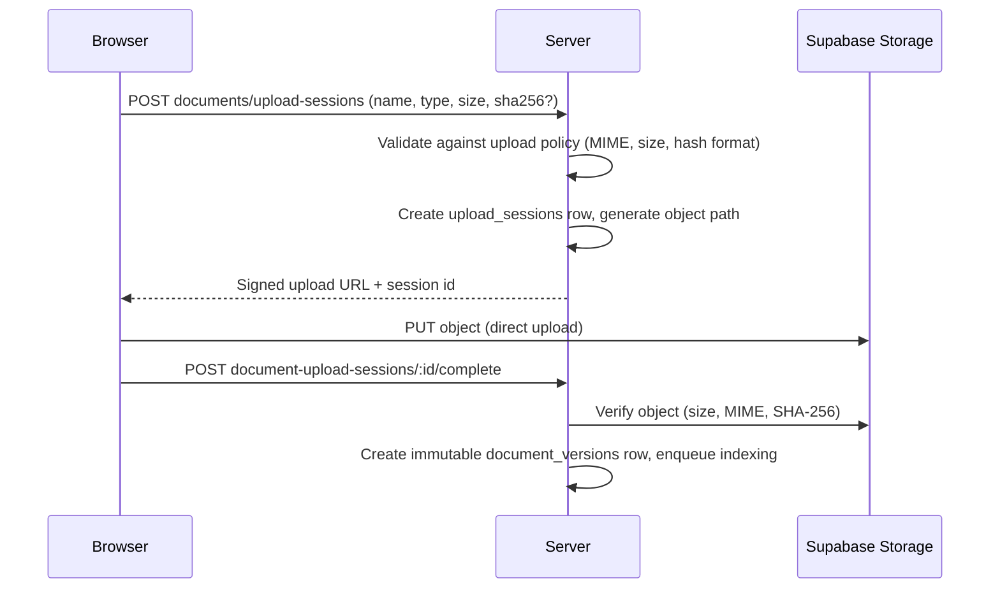

The upload layer (`src/server/platform/storage/`) is generic: it prepares sessions,
signs URLs, and verifies uploaded objects against the expected size, MIME
type, and optional SHA-256. Per-domain policies define allowed types and
size ceilings:

- organization documents: `organization-evidence` bucket, 10 MB max
  (`src/server/modules/documents/document-config.ts`);
- legal sources: `legal-corpus` bucket, 50 MB max, 10-minute session TTL
  (`src/server/modules/legal-corpus/config.ts`);
- reports: written server-side to `compliance-reports`.

Upload creation/completion are rate-limited operations; quotas are enforced
per domain (`src/server/platform/storage/quota.ts`, `src/server/modules/reports/quota.ts`).

### Server-side access

- Downloads (`GET .../documents/:id/download`) and report downloads stream
  from Storage through the server with authorization.
- Job handlers use a server-side Supabase admin client to read and write
  objects (`src/server/platform/storage/supabase-admin.ts`).
- Object identity (bucket + key), content hash, and lineage are recorded on
  the corresponding database rows; Storage itself is treated as
  content-addressed by hash.

### Consistency notes

- Remote Storage and AI work stay **outside** database transactions.
- Business publication re-enters a transaction and verifies the current job
  lease; object writes that must not be orphaned are verified before the
  transactional commit.
- Document versions and corpus renditions are immutable; a re-upload creates
  a new version, never an overwrite.

### Practical navigation

- Upload machinery: `src/server/platform/storage/`.
- Document storage configuration: `src/server/modules/documents/document-config.ts`.
- Corpus storage configuration: `src/server/modules/legal-corpus/config.ts`.
- Report storage: `src/server/modules/reports/report-library.ts`.
- Admin client: `src/server/platform/storage/supabase-admin.ts`.

---

## Organization Documents

_Source: `domains/documents.md`_


> Status: current as of 9 September 2026.

### Purpose

Organizations upload their security-relevant documents so the Gap-Analyse can
cite them as evidence. The document pipeline turns a file into immutable,
searchable, embeddable chunks tied to a stable document identity.

### Lifecycle

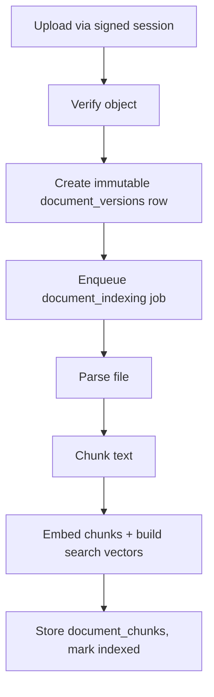

1. **Identity vs. versions**: `documents` is the stable identity with a
   `current_version_id` pointer; every upload creates a new immutable
   `document_versions` row (version number, file metadata, storage key,
   content hash, embedding identity).
2. **Parsing** (`src/server/platform/content-processing/parser.ts`): PDF via `pdf-parse`,
   DOCX via `mammoth`, plus text/markdown; Docling is an optional conversion
   path.
3. **Chunking**: `chunkExtractedPages` produces paragraph-based chunks
   (`paragraph-v1`) with page and section metadata.
4. **Embedding and search**: each chunk stores the embedding vector and a
   generated full-text `search_vector`; retrieval fuses semantic and lexical
   scores.
5. **Indexing state** is durable on the version row. Retrying a failed current
   version (`POST .../documents/:id/retry-indexing`) clears partial chunks and
   failure fields, returns the version to `pending`, enqueues a fresh
   `document_indexing` job, and explicitly wakes the after-response drain. A
   retry is a no-op unless the current version is failed, and archived
   documents must be restored first.

### Embedding identity

Vectors are only comparable within one embedding space. Every version row
records the embedding identity: provider, model, model revision, dimensions,
retrieval instruction profile, and chunking version, all folded into a hash
(`src/server/modules/documents/document-config.ts`,
`src/server/modules/documents/embeddings.ts`). Retrieval filters on that hash
so a half-finished re-index never mixes spaces.

Changing the organization's embedding model triggers an
`organization_reembedding` job that is resumable: each attempt skips versions
already carrying the target model.

### Archiving and access

- Documents can be archived and restored; archived documents are excluded
  from gap evidence selection.
- Downloads and controlled source access are authorized server-side reads
  from Storage.
- Documents selected as evidence are pinned by immutable version ID, so later
  uploads never change what a revision cites.

### Retrieval policy

`src/server/modules/documents/retrieval-policy.ts` decides which versions and chunks
may be retrieved for an organization at a given workflow step (e.g., current
and indexed versions only during gap evidence selection).

### Practical navigation

- Service and indexing jobs: `src/server/modules/documents/`.
- Parsing/chunking/embeddings:
  `src/server/platform/content-processing/parser.ts`,
  `src/server/platform/content-processing/chunker.ts`,
  `src/server/modules/documents/embeddings.ts`.
- Configuration: `src/server/modules/documents/document-config.ts`.
- Routes: `app/api/organizations/:id/documents/...`.

---

## Legal Corpus

_Source: `domains/corpus.md`_


> Status: current as of 9 September 2026.

### Purpose

The authoritative legal corpus is a centrally curated, versioned collection
of legal and regulatory sources shared across organizations. It is the
evidence base for grounded generation: workflows pin a corpus snapshot at
generation time so results stay reproducible after legal content changes.

Legal text is **evidence**, never executable questionnaire configuration.

### Data model

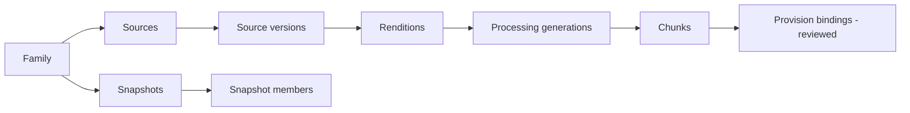

- **Family** (`legal_corpus_families`): a framework/jurisdiction boundary
  (e.g., NIS2 Germany) with a current snapshot pointer.
- **Source** (`legal_sources`): a legal document with an authority tier
  (`primary_authority`, `official_guidance`, `curated_secondary`) and
  jurisdiction.
- **Version** (`legal_source_versions`): immutable versions with effective
  dates and content hash.
- **Rendition** (`legal_source_renditions`): language-specific expressions
  with translation status (`official`, `reviewed_internal`,
  `machine_assisted`) and storage location.
- **Processing generation** (`legal_source_processing_generations`): one
  parse/chunk run per rendition, executed by the `legal_source_processing`
  job.
- **Chunks** (`legal_source_chunks`): text chunks belonging to one processing
  generation, with generated search vectors.
- **Bindings** (`legal_provision_chunk_bindings`): reviewed stable provision
  keys bound to exact chunks — the bridge between legal text and the code's
  requirement keys.
- **Guidance** (`guidance_sources`, `guidance_chunks`,
  `guidance_provision_bindings`): curated secondary material, retrieved
  optionally and never persisted as citable evidence.
- **Snapshot** (`legal_corpus_snapshots` + members): a validated, immutable
  selection of successful processing generations per family. Members store
  only the generation ID and position; rendition, version, and source are
  reached through the normalized parent path. Activation rejects two
  generations derived from the same legal source.

### Operator pipeline

Corpus provisioning is a platform-operator workflow, not an organization
feature:

1. Operators create sources/versions/renditions from a reviewed manifest
   (scripts + `src/server/modules/legal-corpus/`).
2. The portable job runtime processes each rendition into chunks and search vectors.
3. Reviewers bind stable provision keys to exact chunks; validation proves
   completeness and citation resolvability.
4. Activation validates the candidate, then advances the family's immutable
   snapshot pointer atomically (`activateLegalCorpusSnapshot`).

Operator actions are idempotent and audited in `platform_audit_events`.

### Pinning and retrieval

Generation resolves the pinned legal scope per family
(`src/server/modules/grounding/legal-retrieval.ts`): the snapshot active at the
operation is fixed, chunks are ranked lexically against the query, filtered
by authority tier, and surfaced with stable citation IDs. This makes an
AI-run's legal basis exact and reproducible even after new sources are
added.

### Practical navigation

- Domain and services: `src/server/modules/legal-corpus/`.
- Processing job: `src/server/modules/legal-corpus/processing-service.ts`.
- Snapshot activation: `src/server/modules/legal-corpus/snapshot-service.ts`.
- Retrieval integration: `src/server/modules/grounding/legal-retrieval.ts`.
- Operator scripts: `scripts/` (provision, validate, activate, export).

---

## PDF Reports

_Source: `domains/reports.md`_


> Status: current as of 9 September 2026.

### Purpose

A report bundles the organization's compliance state into a downloadable PDF.
Every report pins an applicability revision. When available, it also pins the
current Gap revision, the optional Action Plan, and the selected document
versions.

### Lifecycle

1. A member with `reports:create` calls
   `POST /api/organizations/:id/reports`. The server verifies that the
   applicability check is completed, pins its current revision and, when
   available, the current Gap revision, optional Action Plan, and the Gap
   revision's selected document versions. It then enqueues a `report_render`
   job and returns `202`.
2. The job handler builds an **exact in-memory render snapshot** — including
   current Action Plan item statuses and legal references — and hashes it
   (`src/server/modules/reports/render-snapshot.ts`).
3. The same snapshot object is rendered with `@react-pdf/renderer`
   (`src/server/modules/reports/renderer.tsx`). Applicability-only reports explicitly
   identify their reduced scope and omit the findings and Action Plan pages.
4. The PDF is uploaded to the `compliance-reports` bucket under a
   deterministic key derived from the report inputs.
5. One fenced transaction commits the PDF hash, byte size, bucket/key, and
   metadata, while verifying the job's live lease.

Completed reports are **immutable**: the pinned revisions, the render
snapshot hash, and the PDF hash cannot change. The report is the audit trail
of exactly what was shown at render time.

### Read model metrics

Report list and detail responses derive two summary metrics from the report's
pinned Gap revision, never from the organization's current revision:

- `compliancePercent`: fulfilled findings divided by all findings, rounded to
  a whole percentage;
- `criticalGapCount`: critical findings whose status is not `fulfilled`.

Applicability-only reports have `metrics: null`.

### Download

Downloads are authorized server-side reads
(`POST /api/organizations/:id/reports/:reportId/download`) that stream the
PDF from Storage. Report creation is rate-limited and concurrency-bounded
(at most three active renders per organization,
`src/server/modules/reports/quota.ts`).

### Practical navigation

- Service: `src/server/modules/reports/report-library.ts`.
- Render job: `src/server/modules/reports/job-handler.ts`.
- Snapshot hashing: `src/server/modules/reports/render-snapshot.ts`.
- Renderer and theme: `src/server/modules/reports/renderer.tsx`,
  `src/server/modules/reports/theme.ts`.
- Legal references: `src/server/modules/reports/legal-references.ts`.
- Metrics: `src/server/modules/reports/metrics.ts`,
  `src/server/modules/reports/metrics-reader.ts`.
