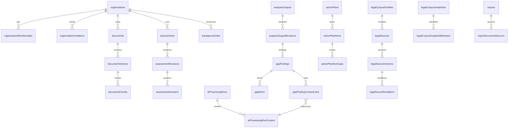

# Database Schema

> Status: current as of 4 September 2026.

## Source of truth

The schema is owned by application code:

- `src/db/schema.ts` — the stable public schema facade used by existing
  imports and Drizzle tooling.
- `src/db/schema/` — ownership-based schema files containing every table,
  column, enum, constraint, index, generated search vector, and RLS
  declaration. Shared enums and helpers live in `_shared.ts`.
- `src/db/relations.ts` — Drizzle relations used by query builders.
- `src/db/index.ts` — connection pool and typed query entry point.

The database is PostgreSQL (Supabase PostgreSQL 15 in self-hosted
deployments). Drizzle ORM talks to it through the `postgres` driver. Two
append-only audit triggers and the `vector` extension are the only operator
SQL outside the schema file.

## What lives in PostgreSQL vs. in code

PostgreSQL stores customer state, immutable snapshots, direct lineage, AI
provenance, evidence, durable operations, legal-source history, and audit.

Application code owns the executable questionnaires, rules, requirement
metadata, mappings, prompts, and localized copy. Those are versioned releases
under their owning business modules in `src/server/modules/`, and changing
them produces new definition hashes rather than database edits.

## Core entity relationships

## Table inventory

All 48 ordinary tables, grouped by domain. Names are the Drizzle export names;
the physical table names are the same in snake_case.

### Tenancy and access

| Table | Purpose |
| --- | --- |
| `organizations` | Tenant root: name, country, AI provider mode, archive flag. |
| `organizationMemberships` | Existence-based membership of a user in an organization with a role. |
| `organizationInvitations` | Pending invitations with hashed tokens and expiry; deleted when accepted/revoked/expired. |
| `userProfiles` | Minimal user display data mirrored from Supabase Auth. |
| `organizationModelSettings` | Per-organization choice of generation/embedding models and embedding identity. |
| `organizationEmbeddingMigrations` | Resumable re-embedding runs when an organization changes embedding provider. |

### Assessments and generated analysis

| Table | Purpose |
| --- | --- |
| `assessments` | Stable identity of one assessment per organization and kind (applicability, gap). |
| `assessmentRevisions` | Immutable submitted answers with definition/build hashes, locale, and input hash. |
| `assessmentAnswers` | Localized answer rows pinned to an assessment revision. |
| `guestApplicabilityChecks` | Temporary public applicability submissions and result snapshots until claim or expiry. |
| `analysisOutputs` | Stable identity of one generated result per organization and kind. |
| `analysisOutputRevisions` | Immutable published result revisions with inputs, outcome metadata, and generation-job lineage. |
| `analysisOutputDocumentSources` | Document versions selected as evidence for an output revision. |

### Documents

| Table | Purpose |
| --- | --- |
| `documents` | Stable document identity with a current-version pointer and archive flag. |
| `documentVersions` | One immutable indexing lifecycle per upload: file metadata, storage location, content hash, embedding identity, indexing status. |
| `documentChunks` | Text chunks with page/section metadata, generated search vector, and embedding vector. |

### Gap analysis

| Table | Purpose |
| --- | --- |
| `gapAnalysisCycles` | One unfinished cycle per organization: stage, draft answers, generation job, and output revision pointers. |
| `gapAnalysisCycleDocuments` | Selected evidence document versions for a cycle. |
| `gapFindings` | Normalized findings per requirement with status, criticality, and contradiction metadata. |
| `gapItems` | Atomic gaps (missing/partial/uncertain) belonging to a finding, with statements and recommendations. |
| `gapFindingContextLinks` | Exact evidence links per finding with relationship (`supporting`/`conflicting`) and resolution disposition. |
| `gapItemContextLinks` | Exact evidence links per atomic gap item. |

### Action plans

| Table | Purpose |
| --- | --- |
| `actionPlans` | The single Action Plan per organization, pinned to a source Gap revision. |
| `actionPlanItems` | Generated plan items with title, separate result text, a JSON string array of suggested evidence, and status-only mutation. |
| `actionPlanItemGaps` | Many-to-many coverage links from plan items to gap items; the owning plan is reached through the item. |

### AI processing

| Table | Purpose |
| --- | --- |
| `aiProcessingRuns` | One inference call: provider/model, prompt and definition hashes, input manifest, validated output, usage, and lifecycle. |
| `aiProcessingRunContext` | The canonical admitted evidence record: exact text, scores, citation metadata, and channel. |
| `clientInferenceRequests` | Browser-relayed inference requests (generation or embedding) with claims, leases, and heartbeats. |

### Legal corpus

| Table | Purpose |
| --- | --- |
| `legalCorpusFamilies` | Framework/jurisdiction boundary with a current snapshot pointer. |
| `legalSources` | Legal documents with authority tier and jurisdiction. |
| `legalSourceVersions` | Immutable versions of a source with effective dates and content hash. |
| `legalSourceRenditions` | Language-specific renditions with translation status and storage location. |
| `legalSourceProcessingGenerations` | One processing run per rendition: parser, status, and job link. |
| `legalSourceChunks` | Chunks of legal text with generated search vector. |
| `legalProvisionChunkBindings` | Reviewed stable provision keys bound to exact chunks. |
| `guidanceSources` | Curated guidance documents with provenance metadata. |
| `guidanceChunks` | Chunks of guidance text. |
| `guidanceProvisionBindings` | Reviewed provision bindings for guidance chunks. |
| `legalCorpusSnapshots` | Validated, immutable selections of processed source versions. |
| `legalCorpusSnapshotMembers` | Exact processing-generation members of a snapshot; rendition, version, and source resolve through the normalized hierarchy. |

### Reports

| Table | Purpose |
| --- | --- |
| `reports` | Immutable PDF reports pinned to an applicability revision, an optional Gap revision and Action Plan, and render metadata. |
| `reportDocumentSources` | Document versions selected for a report. |

### Operations

| Table | Purpose |
| --- | --- |
| `backgroundJobs` | Durable job rows: kind, state, payload, lease, attempts, progress, result locator. |
| `uploadSessions` | Prepared uploads with expected size/hash and completion state. |
| `idempotencyRecords` | Idempotency claims with actor, scope, operation, request hash, and result locator. |
| `apiRateLimitWindows` | Durable rate-limit counters per window. |

### Audit

| Table | Purpose |
| --- | --- |
| `auditEvents` | Organization-scoped append-only audit stream. |
| `platformAuditEvents` | Platform-level append-only audit stream (operator actions). |

## Enums

The schema defines 22 enums, including:

| Enum | Values (key ones) |
| --- | --- |
| `organization_role` | owner, contributor, viewer |
| `ai_provider_mode` | openai, self_hosted |
| `assessment_kind` | applicability, gap |
| `analysis_output_kind` | applicability, gap |
| `gap_analysis_cycle_stage` | draft answers, evidence, generation, review, etc. |
| `gap_finding_status` / `gap_item_kind` | fulfilled/partial/missing statuses; missing/partial/uncertain |
| `action_plan_item_status` | open / in progress / done etc. |
| `background_job_state` | queued, leased, running, succeeded, failed, cancelled (the API reports `cancellation_requested` while a cancellation is pending) |
| `background_job_kind` | gap_analysis, gap_conflict_resolution, action_plan_generation, report_render, document_indexing, organization_reembedding, legal_source_processing, maintenance_cleanup |
| `idempotency_state` | in_progress, completed, failed |
| `legal_authority_tier` | primary_authority, official_guidance, curated_secondary |
| `legal_translation_status` | official, reviewed_internal, machine_assisted |
| `grounding_context_channel` | legal_authority, organization_evidence |

## Security model

- Every ordinary public table is declared with RLS enabled
  (`pgTable.withRLS(...)`).
- Browser-facing roles have no application policies, so direct client access
  is denied by default.
- Trusted application connections authenticate as the application role and
  rely on server-side capability checks and organization scopes for tenant
  locality.
- Audit tables are append-only via operator triggers.

## Lifecycle and immutability rules

- Completed assessment/output revisions, findings/items, generated Action
  Plan content, document versions, reports, corpus snapshots, and audit rows
  are never updated.
- Stable parents (e.g., `documents.current_version_id`,
  `analysis_outputs.current_revision_id`, `legal_corpus_families.current_snapshot_id`)
  are the only mutable current pointers.
- A contradiction decision creates a new Gap revision instead of editing the
  old one.
- Organizations are archived, never deleted.
- Job-linked AI-run creation and Gap/Action Plan/report publication lock the
  parent job and require the executing drain to own its current, unexpired
  lease; a candidate produced after lease turnover is discarded.
- One Action Plan may be created per organization, ever.

Normalized lineage deliberately has one path for each fact:
`gap_item -> finding -> output_revision`,
`action_plan_item_gap -> item -> plan`, and
`legal_chunk/snapshot_member -> processing_generation -> rendition -> version -> source`.
Generated Gap and Action Plan artifacts point to a job; all selected AI runs
are found through `ai_processing_runs.job_id`.

## Practical navigation

- Tables live in ownership-based files under `src/db/schema/`; use
  `src/db/schema.ts` as the public import surface and follow relations in
  `src/db/relations.ts`.
- For a new column or index, extend the schema and use the guarded schema
  workflow from `scripts/`; never hand-edit the database.
- The schema is RLS-everywhere by convention; new tables must follow it.
