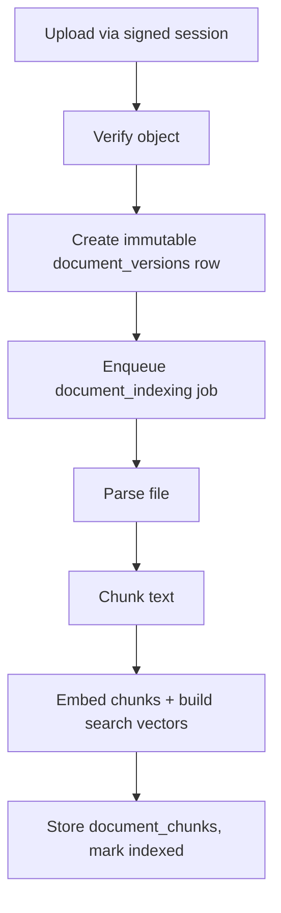

# Organization Documents

> Status: current as of 9 September 2026.

## Purpose

Organizations upload their security-relevant documents so the Gap-Analyse can
cite them as evidence. The document pipeline turns a file into immutable,
searchable, embeddable chunks tied to a stable document identity.

## Lifecycle

1. **Identity vs. versions**: `documents` is the stable identity with a
   `current_version_id` pointer; every upload creates a new immutable
   `document_versions` row (version number, file metadata, storage key,
   content hash, embedding identity).
2. **Parsing** (`src/server/platform/content-processing/parser.ts`): PDF via `pdf-parse`,
   DOCX via `mammoth`, plus text/markdown; Docling is an optional conversion
   path.
3. **Chunking**: `chunkExtractedPages` produces paragraph-based chunks
   (`paragraph-v1`) with page and section metadata.
4. **Embedding and search**: each chunk stores the embedding vector and a
   generated full-text `search_vector`; retrieval fuses semantic and lexical
   scores.
5. **Indexing state** is durable on the version row. Retrying a failed current
   version (`POST .../documents/:id/retry-indexing`) clears partial chunks and
   failure fields, returns the version to `pending`, enqueues a fresh
   `document_indexing` job, and explicitly wakes the after-response drain. A
   retry is a no-op unless the current version is failed, and archived
   documents must be restored first.

## Embedding identity

Vectors are only comparable within one embedding space. Every version row
records the embedding identity: provider, model, model revision, dimensions,
retrieval instruction profile, and chunking version, all folded into a hash
(`src/server/modules/documents/document-config.ts`,
`src/server/modules/documents/embeddings.ts`). Retrieval filters on that hash
so a half-finished re-index never mixes spaces.

Changing the organization's embedding model triggers an
`organization_reembedding` job that is resumable: each attempt skips versions
already carrying the target model.

## Archiving and access

- Documents can be archived and restored; archived documents are excluded
  from gap evidence selection.
- Downloads and controlled source access are authorized server-side reads
  from Storage.
- Documents selected as evidence are pinned by immutable version ID, so later
  uploads never change what a revision cites.

## Retrieval policy

`src/server/modules/documents/retrieval-policy.ts` decides which versions and chunks
may be retrieved for an organization at a given workflow step (e.g., current
and indexed versions only during gap evidence selection).

## Practical navigation

- Service and indexing jobs: `src/server/modules/documents/`.
- Parsing/chunking/embeddings:
  `src/server/platform/content-processing/parser.ts`,
  `src/server/platform/content-processing/chunker.ts`,
  `src/server/modules/documents/embeddings.ts`.
- Configuration: `src/server/modules/documents/document-config.ts`.
- Routes: `app/api/organizations/:id/documents/...`.

