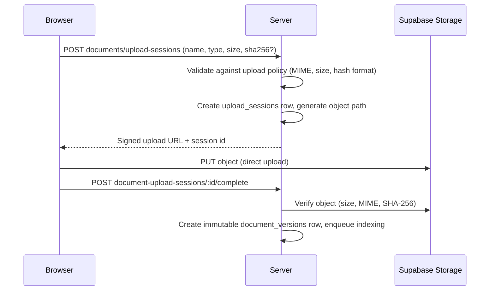

# Object Storage

> Status: current as of 7 August 2026.

## Buckets

Supabase private Storage holds all file content. PostgreSQL owns the stable
identities, versions, processing state, and access metadata.

| Bucket | Contents |
| --- | --- |
| `organization-evidence` | Uploaded organization documents (immutable versions) |
| `legal-corpus` | Legal source renditions and corpus artifacts |
| `compliance-reports` | Rendered PDF reports under deterministic keys |

Buckets are private; browsers never access objects directly except through
short-lived signed URLs issued by the server for uploads.

## Upload flow

The upload layer (`src/server/platform/storage/`) is generic: it prepares sessions,
signs URLs, and verifies uploaded objects against the expected size, MIME
type, and optional SHA-256. Per-domain policies define allowed types and
size ceilings:

- organization documents: `organization-evidence` bucket, 10 MB max
  (`src/server/modules/documents/document-config.ts`);
- legal sources: `legal-corpus` bucket, 50 MB max, 10-minute session TTL
  (`src/server/modules/legal-corpus/config.ts`);
- reports: written server-side to `compliance-reports`.

Upload creation/completion are rate-limited operations; quotas are enforced
per domain (`src/server/platform/storage/quota.ts`, `src/server/modules/reports/quota.ts`).

## Server-side access

- Downloads (`GET .../documents/:id/download`) and report downloads stream
  from Storage through the server with authorization.
- Job handlers use a server-side Supabase admin client to read and write
  objects (`src/server/platform/storage/supabase-admin.ts`).
- Object identity (bucket + key), content hash, and lineage are recorded on
  the corresponding database rows; Storage itself is treated as
  content-addressed by hash.

## Consistency notes

- Remote Storage and AI work stay **outside** database transactions.
- Business publication re-enters a transaction and verifies the current job
  lease; object writes that must not be orphaned are verified before the
  transactional commit.
- Document versions and corpus renditions are immutable; a re-upload creates
  a new version, never an overwrite.

## Practical navigation

- Upload machinery: `src/server/platform/storage/`.
- Document storage configuration: `src/server/modules/documents/document-config.ts`.
- Corpus storage configuration: `src/server/modules/legal-corpus/config.ts`.
- Report storage: `src/server/modules/reports/report-library.ts`.
- Admin client: `src/server/platform/storage/supabase-admin.ts`.
