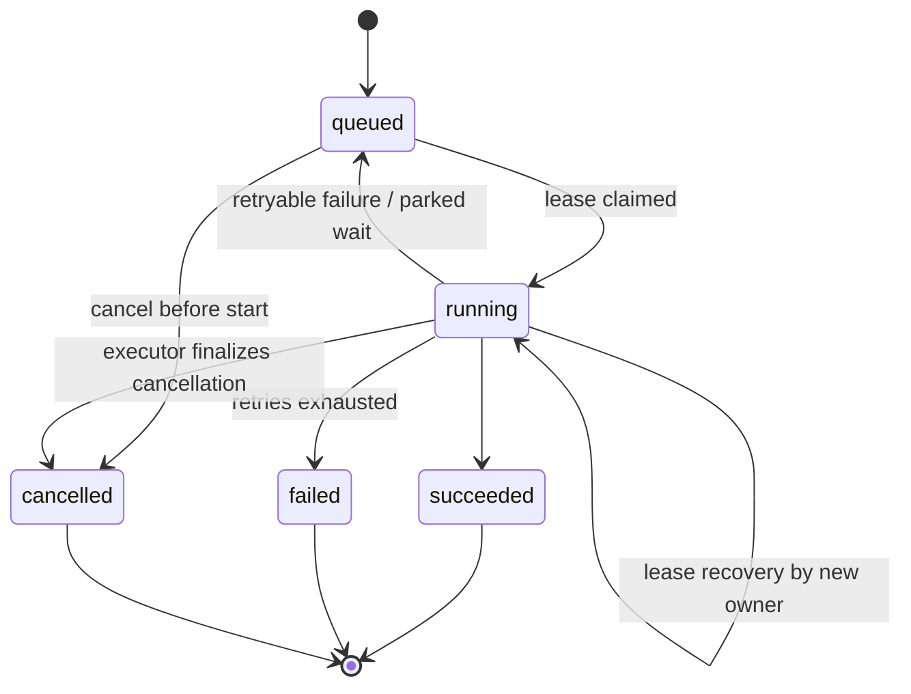

# Background Jobs

> Status: current as of 3 September 2026.

## Why durable jobs

AI generation, document indexing, corpus processing, and PDF rendering can
take minutes. The application does not hold an HTTP request open for them:
an API route enqueues a `background_jobs` row, returns `202`, and the browser
polls `GET /api/jobs/:jobId` for progress and the final result locator.

The queue is PostgreSQL itself — there is no separate message broker.

## Job lifecycle

The database enum `background_job_state` stores `queued`, `leased`
(compatibility), `running`, `succeeded`, `failed`, and `cancelled`. The API
additionally reports `cancellation_requested` while a cancellation is pending
— it is derived from the `cancellation_requested_at` timestamp on a
non-terminal job, not a stored state.

Key mechanics:

- **Claiming**: a drain selects eligible rows with `FOR UPDATE SKIP LOCKED`
  (`queued` with `available_at` reached, or `leased`/`running` with an expired
  lease), increments the attempt count, and marks the row `running` with the
  new owner. The enum's `leased` value is kept for compatibility; new claims
  are written as `running`.
- **Lease**: `lease_owner`, `lease_expires_at`, and `heartbeat_at` record who
  is executing. Handlers heartbeat while running; a crash or timeout lets
  another executor claim the job.
- **At-least-once**: after lease expiry the handler may run again, so every
  handler must be idempotent or recoverable. Idempotency records and
  lease-fenced publication transactions protect business results.
- **Retries**: `attempt_count` vs. `max_attempts`. Transient provider
  failures retry with a delay derived from the provider's retry-after;
  non-retryable failures fail immediately.
- **Cancellation**: cancelling a queued job transitions it immediately to
  `cancelled`. Cancelling a running job records `cancellation_requested_at`
  (the API then reports `cancellation_requested`) and the handler receives an
  abort signal; the executor finalizes the row to `cancelled` and fails any
  in-flight AI run. Non-cancellable jobs reject with `409`.
- **Progress**: `progress_current`, `progress_total`, and `progress_message`
  are durable and exposed by the polling endpoint.
- **Parked state**: when a job hands a model call to an organization browser
  (local AI relay), the drain reports it as `parked` rather than failed; the
  attempt is refunded (the wait does not consume retries), and the job is
  re-queued to wake and check again. The API exposes `waitingOnClient` while
  the progress message is `awaiting_client_inference` (see
  [Local AI](../ai/local-ai.md)).

## Wake-up adapters

All adapters drain the same queue with the same handlers
(`src/server/job-execution/`):

| Adapter | Where | Typical bound |
| --- | --- | --- |
| `after_response` | Next.js `after()` following a `202` response | 25 jobs, ~4:45 min |
| `recovery_route` | `GET/POST /api/internal/jobs/drain` (cron secret) | 50 jobs, ~4:45 min |

## Job catalog

Job kinds, their triggers, and their outcomes are defined in
`src/server/jobs/definitions.ts`; handlers live in the domain modules.

| Kind | Trigger | Handler | Result |
| --- | --- | --- | --- |
| `gap_analysis` | Cycle generation request | `src/server/gap-analysis/` | `analysis_output_revision` |
| `gap_conflict_resolution` | Contradiction resolution | `src/server/gap-analysis/` | `analysis_output_revision` |
| `action_plan_generation` | Action Plan start | `src/server/action-plans/` | `action_plan` |
| `report_render` | Report creation | `src/server/reports/` | `report` |
| `document_indexing` | Upload completion / retry | `src/server/documents/` | `document_version` |
| `organization_reembedding` | Embedding model change | `src/server/documents/` | `organization` |
| `legal_source_processing` | Corpus provisioning | `src/server/corpus/` | processing generation |
| `maintenance_cleanup` | Operator scheduling | `src/server/api/cleanup.ts` | — |

Organization-scoped jobs pin the requester (`requested_by`) and the
organization, so handlers use the pinned identity instead of replaying
a human session. Capability requirements for reading progress and cancelling
are part of each definition.

## Publication safety

Where a handler publishes an immutable business result, it:

1. re-enters a transaction;
2. verifies the parent job is still `running` and owned by this executor's
   current lease (`assertLiveParentJobForAiRun`, action-plan
   `assertActionPlanPublicationLease`);
3. persists the result, the AI-run success state, audit rows, and the current
   pointer atomically.

A candidate produced after lease turnover is discarded instead of published.

## Practical navigation

- Definitions, payload schemas, capabilities: `src/server/jobs/definitions.ts`.
- State machine: `src/server/jobs/state-machine.ts`.
- Drain and runtime: `src/server/job-execution/`.
- Polling/cancellation routes: `app/api/jobs/`.
