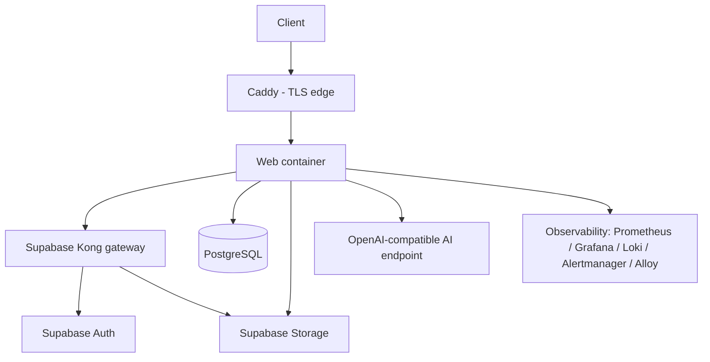

# Deployment

> Status: current as of 3 September 2026.

## Execution model

The application ships as one web process:

- The **web process** (`next start`) serves pages and API routes. After
  returning a `202` response it can run a bounded portable job drain via
  Next.js `after()` (`src/server/platform/jobs/execution/after-response.ts`).
- A scheduled, authenticated recovery route
  (`app/api/internal/jobs/drain/route.ts`) provides durable wake-ups for
  all deployments. Hosted deployments register it as a cron job; self-hosted
  deployments can call the authenticated route from their scheduler.

All execution surfaces use the same handlers; hosting differences only change
who wakes the queue.

## Deployment modes

### Hosted / serverless (Vercel-style)

- Web process only.
- After-response drains plus the scheduled recovery route
  (`vercel.json` registers `/api/internal/jobs/drain` as a daily cron).
- Suitable for low throughput; job processing happens opportunistically after
  responses and on the cron schedule.

### Private self-hosted (Docker Compose)

- Web container with after-response drains plus an authenticated scheduled
  call to the recovery route.
- PostgreSQL, Supabase Auth, and Storage run in the same Compose project
  (`infra/compose/app-host/`), coordinated with Caddy as the TLS edge.
- Blue/green release projects swap application images by digest without
  rebuilding source (`infra/scripts/deploy-app-host.sh`).
- Optional observability stack: Prometheus, Grafana, Loki, Alertmanager, and
  Alloy.

### Local development

- Next.js dev server against a hosted Supabase project; `.env.local` holds
  configuration. Requests trigger after-response drains, and the recovery
  route can be invoked with `CRON_SECRET` when needed.
- Optional local model testing runs Ollama natively on the host
  (`docs/ai/local-ai.md` in this folder).

## Self-hosted topology

Internal `app` and `data` networks are not published to the host; database
backup, Auth SMTP, and Storage S3 egress use a separate un-published network.

## Configuration

Configuration is environment-based and secret-bearing files stay outside Git:

| Area | Environment variables |
| --- | --- |
| Database | `DATABASE_URL` (application role), `DRIZZLE_DATABASE_URL` (operator role), pool settings |
| Supabase | `SUPABASE_URL`, publishable/secret keys, JWT secrets, SMTP settings |
| AI | `AI_DEFAULT_PROVIDER`, `OPENAI_API_KEY`/`OPENAI_MODEL`, `SELF_HOSTED_AI_*` endpoint for local/on-prem inference, embedding model |
| Build | `APP_BUILD_SHA` recorded on revisions and AI runs for provenance |
| Rate limiting / pagination | `API_CURSOR_SECRET` (or Supabase secret) for signed cursors |

The organization's AI provider mode is per-organization application state;
deployment-wide provider configuration only supplies the fallback.

## Security posture of containers

The first-party web container runs non-root, read-only, capability-free,
with PID/memory/CPU bounds and tmpfs for temporary writes. Only Caddy keeps
`NET_BIND_SERVICE`; no service mounts the Docker socket; images are pinned by
digest.

## Health endpoints

- `GET /api/health/live` — process liveness.
- `GET /api/health/ready` — checks database readiness (503 while not ready).

## Notes

- This document describes the topology conceptually. Step-by-step deployment
  procedures are intentionally not part of this self-contained folder.
- Job execution uses the same PostgreSQL schema as the web application; there
  is no separate queue service or worker deployment.
