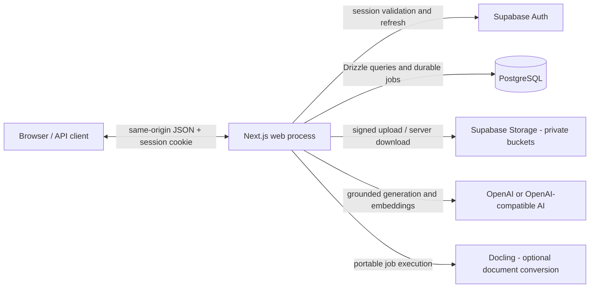
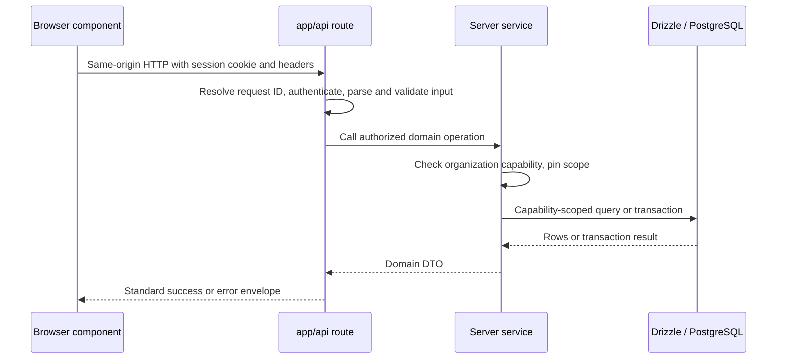

# System Overview

> Status: current as of 4 September 2026.

## Short answer

The product is a Next.js application whose web process serves requests and
runs the portable job runtime after responses or through an authenticated
scheduled recovery route. It uses PostgreSQL and private Supabase object
storage.

- The web process renders pages and exposes thin HTTP API routes.
- Supabase provides authentication and private object storage. Browser
  session cookies terminate at the application origin; server-side Supabase
  clients use the request session.
- Application tables are queried server-side through Drizzle ORM. Browsers
  never query PostgreSQL directly.
- Long-running work (AI generation, document indexing, PDF rendering) runs as
  durable background jobs that execute at least once.
- Immutable business results are published by revision; current pointers,
  drafts, job state, and operational status are mutable.

## System context

## Processes and execution surfaces

There is one code base and one set of handlers. Hosting and wake-up
mechanisms do not create separate business implementations.

| Surface | Location | Role |
| --- | --- | --- |
| Web process | `next start` | Renders pages, serves API routes, runs a portable job drain after responses. |
| Recovery route | `app/api/internal/jobs/drain/route.ts` | Authenticated scheduled endpoint that wakes and drains jobs (cron in hosted deployments). |
| Scripts | `scripts/` | Operator and verification commands run directly against the same services. |

## Module map

| Module | Main location | Responsibility |
| --- | --- | --- |
| HTTP boundary | `app/api/`, `src/server/platform/http/` | Authentication, input validation, envelopes, request IDs, rate limits, service dispatch |
| Business modules | `src/server/modules/`, `src/contracts/` | Authorization, rules, workflows, persistence, and public module interfaces |
| Code-owned definitions | `src/server/modules/applicability-check/release/`, `src/server/modules/compliance/nis2/`, `src/server/modules/gap-analysis/release/` | Questionnaires, rules, requirements, localization, prompt contracts |
| Jobs | `src/server/platform/jobs/`, `src/server/bootstrap/job-definitions.ts` | Generic queue execution plus composition of business handlers |
| AI and retrieval | `src/server/platform/ai/`, `src/server/modules/grounding/`, `src/server/platform/ai/` | Provider integration, evidence retrieval, prompts, generation, validation |
| Database | `src/db/` | Drizzle schema, relations, connection pool |
| Files and output | `src/server/modules/documents/`, `src/server/modules/legal-corpus/`, `src/server/modules/reports/`, `src/server/platform/storage/` | Private objects, versions, chunks, embeddings, legal corpus, PDFs |
| Tenancy and access | `src/server/platform/auth/`, `src/server/modules/organizations/` | Session actors, capabilities, organization scopes, membership |
| Operations | `scripts/`, `src/server/operations/`, `infra/` | Guarded schema operations, provisioning, deployment, verification |

React Server Components can call server services directly for initial reads;
interactive browser components use the HTTP API. Both paths converge on the
same domain services — routes are not an alternate domain layer.

## API request flow

Dependencies point inward from delivery and composition code to stable module
interfaces: `app` and `scripts` call `src/server/modules/<module>/index.ts`;
business modules may use other modules only through those interfaces; platform
code does not import business modules. `src/server/bootstrap/` is the explicit
composition root for workflows that combine both layers.

Every API route authenticates independently with `requireApiUser()` in
`src/server/platform/http/auth.ts`. Organization identity in a URL is never authority:
server services resolve the actor's membership and capability through
`src/server/platform/auth/organization-scope.ts` and pin the organization predicate
through the query or transaction.

All ordinary public tables have RLS enabled with no browser-role application
policies. Default-deny RLS protects direct browser access; the service layer
provides tenant locality for trusted application connections.

Expensive commands normally enqueue a `background_jobs` row, return `202`,
and let the browser poll an authorized status endpoint.

## Cross-cutting guarantees

### Immutability and mutability

| Data | Mutability model |
| --- | --- |
| Questionnaire content, rules, requirements | Code-owned releases; answers and results are immutable snapshots |
| Applicability and Gap results | Published revisions and their evidence/provenance are immutable; current pointers and workflow status advance |
| Gap and Action Plan workflows | Drafts, progress, and status are mutable; finalized revisions and pinned inputs are immutable |
| Users, organizations, memberships, settings | Mutable transactional state with capability and audit controls |
| Uploaded and legal files | Object versions and corpus snapshots are immutable lineage; processing state is mutable |
| Jobs and AI runs | Lease, retry, progress, and terminal status evolve; prompts, context, and published results are retained |

### At-least-once execution

A job drain claims eligible rows with `FOR UPDATE SKIP LOCKED`, records a
lease, and heartbeats while a handler runs. A crash or expired lease can cause
another executor to run the handler again, so delivery is at-least-once.
Where a handler publishes a business result, idempotency records and a
lease-fenced publication transaction prevent duplicate logical commands and
late publication by an executor that lost ownership.

### Code-owned definitions

Executable questionnaire behavior, rules, and prompt contracts are application
code, not database rows. Definition hashes and build hashes are recorded on
revisions and AI runs for provenance and staleness detection. Legal text in
the corpus is evidence for generation, never executable configuration.

## Practical navigation

1. Identify the API route under `app/api/` and follow its import to a public
   module interface in `src/server/modules/<module>/index.ts`.
2. Open the owning module implementation, then follow persistence into the
   matching file under `src/db/schema/`; relations remain in `src/db/relations.ts`.
3. For asynchronous work, inspect the generic runtime in
   `src/server/platform/jobs/`, its composition in
   `src/server/bootstrap/job-definitions.ts`, and the owning module handler.
4. For AI work, distinguish provider/runtime code in `src/server/platform/ai/`
   from compliance evidence coordination in `src/server/modules/grounding/`.
5. For questionnaire or rule changes, follow the owning module's `release/` or
   `nis2/` directory; never edit the database as content management.

## Related documents in this folder

- [Workflows](./workflows.md) — end-to-end journeys through the backend.
- [Deployment](./deployment.md) — deployment modes and self-hosted topology.
- [Database schema](../database/schema.md) — the data model.
- [Jobs](../jobs/jobs.md) — the durable job runtime.
- [API conventions](../api/conventions.md) — request/response contract.
