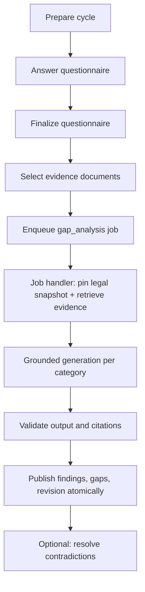

# End-to-End Backend Workflows

> Status: current as of 7 August 2026.

This document walks the main journeys through the backend and shows which
API routes, jobs, AI calls, and database tables fire at each step. It is the
fastest way to see how the parts fit together.

## 1. Guest Betroffenheitscheck (public applicability check)

A visitor who is not signed in can run the applicability check. This is the
only flow that does not require an account.

1. The browser loads the questionnaire for a country and answers questions.
2. `POST /api/guest/applicability-check/submissions` stores the answers in
   `guest_applicability_checks` with a claim token hash and an expiry.
3. The check is evaluated deterministically against the current
   applicability definition (`src/server/applicability-check/`); the result
   snapshot is stored with the submission.
4. The visitor can later claim the result via
   `POST /api/guest/applicability-check/claim`, read it via
   `GET /api/guest/applicability-check/result`, and delete it via
   `DELETE /api/guest/applicability-check/result`.

Tables: `guest_applicability_checks`.

## 2. Organization setup and membership

1. A signed-in user creates an organization (`POST /api/organizations`).
2. The creator becomes `owner`. Owners invite members
   (`POST /api/organizations/:id/invitations`); invitations are pending-only
   rows with token hashes and expiry (`organization_invitations`).
3. Invitees accept via `POST /api/organization-invitations/:invitationId/accept`,
   which creates an `organization_memberships` row with a role
   (`owner`, `contributor`, or `viewer`).
4. Members can be listed, promoted/demoted, and removed under
   `/api/organizations/:id/members`; at least one owner must remain.
5. Owners can configure the organization's AI model settings
   (`GET/PUT /api/organizations/:id/model-settings`) and update settings
   (`GET/PATCH /api/organizations/:id/settings`).

Tables: `organizations`, `organization_memberships`,
`organization_invitations`, `user_profiles`, `organization_model_settings`.

## 3. Document upload and indexing

1. The browser creates an upload session
   (`POST /api/organizations/:id/documents/upload-sessions`). The server
   validates file name, MIME type, size, and optional SHA-256, then returns a
   signed upload URL for the private `organization-evidence` bucket.
2. The browser uploads directly to Storage and completes the session
   (`POST /api/organizations/:id/document-upload-sessions/:sessionId/complete`).
   The server verifies the object's size, MIME type, and hash before creating
   an immutable `document_versions` row.
3. A `document_indexing` job is enqueued. The job handler parses the file
   (`src/server/documents/parser.ts`), chunks it, computes search vectors and
   embeddings, and stores `document_chunks`.
4. Members read the document list and metadata under
   `/api/organizations/:id/documents`; downloads and source access are served
   from Storage through the server.

Tables: `upload_sessions`, `documents`, `document_versions`,
`document_chunks`, `background_jobs`.

## 4. Signed-in applicability check (Betroffenheitscheck)

1. `GET /api/organizations/:id/applicability-check/questionnaire` returns the
   versioned questionnaire.
2. Answers are submitted (`POST .../applicability-check/submissions`), which
   creates an immutable `assessment_revisions` row with the definition and
   build hash, and evaluates the rule set deterministically.
3. The result is published as an `analysis_output_revisions` row of kind
   `applicability`, including `gapEligible` — the flag that unlocks Gap.

Tables: `assessments`, `assessment_revisions`, `assessment_answers`,
`analysis_outputs`, `analysis_output_revisions`.

## 5. Gap-Analyse (gap analysis)

1. An eligible organization prepares one unfinished cycle
   (`POST /api/organizations/:id/gap-analysis/cycles`), which pins the
   applicable definition and locale.
2. Members answer the questionnaire; answers autosave
   (`PATCH .../gap-analysis/questionnaire-draft/answers/:questionKey`) and a
   final submission creates the immutable assessment revision
   (`POST .../gap-analysis/questionnaire-submissions`).
3. The cycle selects current, indexed document versions as evidence
   (`PUT .../gap-analysis/cycles/:cycleId/evidence`).
4. `POST .../gap-analysis/cycles/:cycleId/generation-jobs` enqueues a
   `gap_analysis` job and returns `202`.
5. The job handler pins legal corpus snapshots, retrieves legal and organization
   evidence, invokes the provider through the current contract, and validates
   strict grounded output. One transaction publishes normalized findings,
   atomic gaps, exact evidence links, the immutable output revision,
   successful AI-run state, and current pointers.
6. If a finding contains a material contradiction, the reviewer chooses
   "trust questionnaire" or "trust document"
   (`POST .../gap-analysis/revisions/:revisionId/contradictions/:findingId/resolve`).
   Questionnaire-authoritative decisions reject only the conflicting document
   contexts; document-authoritative decisions regenerate that one finding
   from only those exact excerpts. Either way a new immutable Gap revision is
   created.

Tables: `gap_analysis_cycles`, `gap_analysis_cycle_documents`,
`gap_findings`, `gap_items`, `gap_finding_context_links`,
`gap_item_context_links`, `analysis_output_revisions`,
`ai_processing_runs`, `ai_processing_run_context`, `background_jobs`.

## 6. Action Plan generation

1. A member with the `plans:manage` capability (owner or contributor) starts
   the organization's single Action Plan from the current, compatible,
   unblocked Gap revision
   (`POST /api/organizations/:id/action-plan`, returns `202`).
2. A `action_plan_generation` job runs a distinct grounded provider operation
   that produces complete, category-scoped, many-to-many Gap coverage.
3. Plan, items, gap links, audit rows, and job success publish atomically
   under the executor's live lease.
4. Item statuses can be updated status-only
   (`PATCH /api/organizations/:id/action-plan/items/:itemId`); the plan itself
   is immutable.

Tables: `action_plans`, `action_plan_items`, `action_plan_item_gaps`,
`ai_processing_runs`, `background_jobs`.

## 7. PDF report

1. A member with the `reports:create` capability creates a report
   (`POST /api/organizations/:id/reports`). The server pins the current
   applicability revision and, when available, the current Gap revision, the
   optional Action Plan, and the selected document versions. A report can be
   created before Gap Analysis; that PDF identifies itself as
   applicability-only and omits Gap and Action Plan sections.
2. A `report_render` job builds an exact in-memory render snapshot (including
   current Action Plan item statuses), hashes it, renders the PDF with
   `@react-pdf/renderer`, uploads it to the `compliance-reports` bucket under
   a deterministic key, and commits the hash with all PDF metadata in one
   fenced transaction.
3. Completed reports are immutable and downloadable
   (`POST /api/organizations/:id/reports/:reportId/download`).

Tables: `reports`, `report_document_sources`, `background_jobs`.

## 8. Legal corpus provisioning (operator workflow)

Operators (not organizations) maintain the authoritative legal corpus:

1. Sources, versions, and renditions are created from a reviewed manifest
   (`src/server/corpus/`).
2. A `legal_source_processing` job parses each rendition and produces
   `legal_source_chunks` with search vectors.
3. Reviewers bind stable provision keys to exact chunks
   (`legal_provision_chunk_bindings`); validation proves completeness and
   citation resolvability.
4. Activation advances the immutable family snapshot pointer
   (`legal_corpus_snapshots`, `legal_corpus_snapshot_members`). Workflows pin
   the snapshot at generation time, so results stay reproducible.

Tables: `legal_corpus_families`, `legal_sources`, `legal_source_versions`,
`legal_source_renditions`, `legal_source_processing_generations`,
`legal_source_chunks`, `legal_provision_chunk_bindings`,
`legal_corpus_snapshots`, `legal_corpus_snapshot_members`.

## Where to go next

- [System overview](./overview.md) — the module map and guarantees behind
  these journeys.
- [Database schema](../database/schema.md) — every table mentioned above.
- [Gap analysis calculation](../calculations/gap-analysis.md) — how the
  deterministic and grounded parts combine.
- [Jobs](../jobs/jobs.md) — how the background steps execute reliably.
