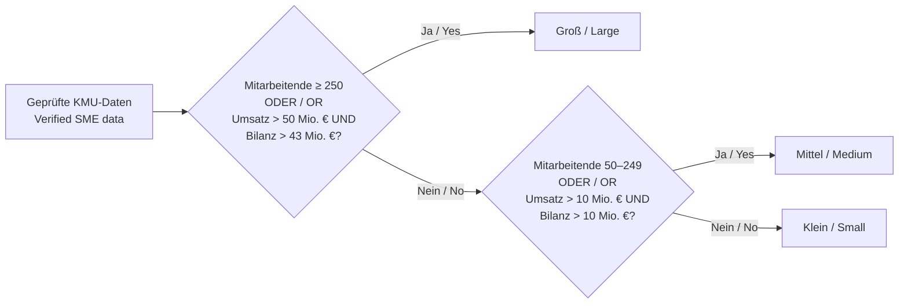

# Aktuelles NIS2-Regelset / Current NIS2 Rule Set

Stand / Snapshot: **2026-08-08**

> **DE:** Diese Darstellung beschreibt das im Repository definierte
> Betroffenheitscheck-Release `2026-v1`. Bereits gespeicherte Prüfungen bleiben
> an ihr veröffentlichtes, unveränderliches Release gebunden. Die automatisierte
> Einstufung ist eine nachvollziehbare Vorprüfung und ersetzt keine rechtliche
> Beratung oder behördliche Entscheidung.
>
> **EN:** This visualization describes applicability-check release `2026-v1`
> as defined in the repository. Existing assessments remain pinned to their
> published, immutable release. The automated classification is a traceable
> preliminary assessment and does not replace legal advice or an authority
> decision.

## Release auf einen Blick / Release at a glance

| Merkmal / Property | Wert / Value |
| --- | --- |
| Prüfung / Check | NIS2-Betroffenheitscheck / NIS2 applicability check |
| Release | `2026-v1` |
| Wirksam ab / Effective from | `2026-03-17` |
| Evaluator | `nis2_scope_v3`, Version `3` |
| Ergebnisschema / Result schema | Version `4` |
| Schwellenwertsatz / Threshold set | `2003-361-v1` |
| Fragebogen / Questionnaire | Geführter Wizard Q1–Q6 (8 Fragen) / Guided wizard Q1–Q6 (8 questions) |
| Vollständig unterstütztes Länderprofil / Fully supported country profile | Deutschland / Germany (`DE`) |
| Deutsches Profil / German profile | `de-bsig-2025-amended-2026-03` |
| EU-Anwendungsidentitäten / EU application identities | 70 |
| Deutsche auswählbare Identitäten / German selectable identities | 73 |
| Deutsche gesetzliche Anhangskategorien / German statutory annex categories | 67 |

## Gesamtlogik / Overall decision flow

```mermaid
flowchart TD
    START([Start]) --> Q1{Q1 Verbindung zu Deutschland?<br/>Q1 Germany connection?}
    Q1 -->|Kritische Anlage / Critical installation| E1[Wesentliche Einrichtung<br/>Essential entity]
    Q1 -->|Bundesverwaltung / Federal administration| E1
    Q1 -->|Regionale Verwaltung / Regional administration| C1[Klärung erforderlich<br/>Clarification required]
    Q1 -->|Keine / None| N1[Nicht direkt im Anwendungsbereich<br/>Not directly in scope]
    Q1 -->|Unsicher / Unsure| C1
    Q1 -->|Niedergelassen / Established| Q2
    Q1 -->|Grenzüberschreitender digitaler Anbieter<br/>Cross-border digital provider| Q2
    Q1 -->|Telekommunikation / Telecom| Q2

    Q2{Q2 Besonderer Status?<br/>Q2 Special status?}
    Q2 -->|Kritische Anlage / Critical installation| E1
    Q2 -->|Wesentlich oder CER / Essential or CER| E1
    Q2 -->|Unsicher / Unsure| C1
    Q2 -->|Wichtig (Floor) / Important (floor)| Q3
    Q2 -->|Keine / None| Q3

    Q3 -->|Keine / None| FLOOR{Important floor?}
    Q3 -->|Unsicher / Unsure| C1
    Q3 -->|Bereiche / Sectors| Q4

    Q4{Welche Tätigkeiten?<br/>Which activities?}
    Q4 -->|E| E1
    Q4 -->|Nur I / Only I| I1[Wichtige Einrichtung<br/>Important entity]
    Q4 -->|Nur R / Only R| C2[Klärung + § 34-Hinweis<br/>Clarification + section 34 overlay]
    Q4 -->|Keine passende / No match| FLOOR
    Q4 -->|T / A1 / A2| Q5[Q5 Größenspannen<br/>Q5 Size ranges]

    FLOOR -->|Ja / Yes| I1
    FLOOR -->|Nein / No| N1

    Q5 --> Q6{Q6 Aggregation?<br/>Q6 Aggregation?}
    Q6 -->|Bestätigt / Confirmed| RESULT([Ergebnis durch Evaluator<br/>Result from evaluator])
    Q6 -->|Nein oder unsicher<br/>No or unsure| C1
```

**DE:** Der geführte Wizard zeigt eine Frage pro Schritt. Endrouten (END)
schreiben die äquivalenten Fakten und überlassen das Ergebnis dem unveränderten
Evaluator; es wird nie am Evaluator vorbei abgekürzt. Q6 wird übersprungen,
wenn die Größenklasse das Ergebnis bereits eindeutig bestimmt (siehe
Größenlogik).

**EN:** The guided wizard shows one question per step. Terminal END routes
write the equivalent facts and let the unchanged evaluator produce the
outcome; the evaluator is never short-circuited. Q6 is skipped when the size
class already determines the result (see size logic).

## Deutsche Klassifikationsmatrix / German classification matrix

Die Reihenfolge in dieser Tabelle entspricht der Reihenfolge im Evaluator. Bei
mehreren ausgewählten Identitäten gilt der erste passende Regeltyp.

The order in this table is the evaluator's precedence order. If several
identities are selected, the first matching rule type applies.

| Priorität / Priority | Regeltyp / Rule type | Anzahl / Count | Klein / Small | Mittel / Medium | Groß / Large |
| ---: | --- | ---: | --- | --- | --- |
| 1 | Immer besonders wichtig oder Bundesverwaltung / Always particularly important or federal administration | 3 + 3 | Wesentlich / Essential | Wesentlich / Essential | Wesentlich / Essential |
| 2 | Immer wichtig / Always important | 1 | Wichtig / Important | Wichtig / Important | Wichtig / Important |
| 3 | Telekommunikation / Telecommunications | 2 | Wichtig / Important | Wesentlich / Essential | Wesentlich / Essential |
| 4 | BSIG Anlage 1, Standard / BSIG Annex 1, standard | 48 | Nicht direkt erfasst / Not directly in scope | Wichtig / Important | Wesentlich / Essential |
| 5 | BSIG Anlage 2, Standard / BSIG Annex 2, standard | 14 | Nicht direkt erfasst / Not directly in scope | Wichtig / Important | Wichtig / Important |
| 6 | Domainnamen-Registrierungsdienste / Domain-name registration services | 1 | Klärung + Pflichtenhinweis / Clarification + obligations overlay | Klärung + Pflichtenhinweis / Clarification + obligations overlay | Klärung + Pflichtenhinweis / Clarification + obligations overlay |
| 7 | Regionale Verwaltung / Regional administration | 1 | Klärung / Clarification | Klärung / Clarification | Klärung / Clarification |

Die 68 Identitäten aus den Anlagen repräsentieren 67 gesetzliche Kategorien,
weil die Kategorie der Vertrauensdiensteanbieter in „qualifiziert“ und „nicht
qualifiziert“ aufgeteilt wird. Hinzu kommen fünf Identitäten außerhalb der
Anlagen.

The 68 annex identities represent 67 statutory categories because the
trust-service-provider category is split into “qualified” and “non-qualified”.
Five out-of-annex identities are added.

## Größenlogik / Size logic

Für größenabhängige Identitäten wird die Größe nur verwendet, wenn die
deutschen Aggregationsregeln ausdrücklich mit einem der folgenden Werte
bestätigt wurden:

For size-dependent identities, size is used only if the German aggregation
rules were explicitly confirmed with one of these values:

- `verified_de_without_it_exception`
- `verified_de_with_it_exception`
- `not_applicable_no_partner_or_linked_enterprises`

Der dritte Wert bedeutet, dass keine Partner- oder verbundenen Unternehmen
bestehen und deshalb keine Aggregation mit anderen Unternehmen erforderlich
ist. Er gilt sowohl im deutschen Profil als auch im EU-Kern als bestätigter
Größenstatus. `no` bedeutet weiterhin, dass relevante Unternehmen nicht
korrekt einbezogen wurden; `unsure` bleibt ebenfalls ungeklärt.

The third value means that there are no partner or linked enterprises and
therefore no aggregation with other enterprises is required. It is accepted
as a verified-size state in both the German profile and the EU-core path.
`no` still means that relevant enterprises were not included correctly;
`unsure` also remains unresolved.

Andernfalls ist die Größe `unknown`; bei Anlage 1, Anlage 2 oder
Telekommunikation führt das zu `clarification_required`.

Otherwise, size is `unknown`; for Annex 1, Annex 2, or telecommunications this
causes `clarification_required`.



Die finanziellen Grenzen werden paarweise geprüft: Nur Umsatz **oder** nur
Bilanzsumme über der jeweiligen Grenze reicht nicht aus.

Financial limits are tested as a pair: turnover **or** balance-sheet total
alone above the respective limit is insufficient.

### Q6-Übersprungstabelle / Q6 skip table

**DE:** Q6 wird nur dann angezeigt, wenn die Aggregation die Einstufung noch
ändern könnte. Ist das Ergebnis bereits eindeutig, bestätigt der Wizard die
Aggregation automatisch mit `verified_de_without_it_exception`.

**EN:** Q6 is shown only when aggregation could still change the
classification. When the result is already decisive, the wizard auto-confirms
aggregation with `verified_de_without_it_exception`.

| Route | Klein / Small | Mittel / Medium | Groß / Large |
| --- | --- | --- | --- |
| T (Telekommunikation / Telecom) | Q6 | übersprungen / skipped | übersprungen / skipped |
| A1 (Anlage 1 / Annex 1) | Q6 | Q6 | übersprungen / skipped |
| A2 (Anlage 2 / Annex 2) | Q6 | übersprungen / skipped | übersprungen / skipped |

## Sonder- und Überschreibungsregeln / Special and override rules

| Bedingung / Condition | Wirkung / Effect |
| --- | --- |
| Keine relevante EU-Tätigkeit / No relevant EU activity | Sofort `not_directly_in_scope`; die Länderunterstützung ist dann unerheblich. / Immediate `not_directly_in_scope`; country support is irrelevant. |
| EU-Tätigkeit unsicher / EU activity unsure | `clarification_required` |
| Relevante EU-Tätigkeit, aber Land ohne unterstütztes Profil / Relevant EU activity, but country has no supported profile | `clarification_required`; derzeit sind alle Länder außer DE nicht unterstützt. / Currently every country except DE is unsupported. |
| Deutsche kritische Anlage / German critical installation | Vorläufig `essential_entity` nach BSIG § 28 Abs. 1 Nr. 1. / Provisional `essential_entity` under BSIG section 28(1)(1). |
| Behördlich wesentlich oder nach CER kritisch / Classified essential by an authority or designated critical under CER | Vorläufig `essential_entity`. / Provisional `essential_entity`. |
| Behördlich wichtig / Classified important by an authority | Hebt jedes nicht-wesentliche Zwischenergebnis auf `important_entity` an. / Upgrades any non-essential intermediate result to `important_entity`. |
| Keine deutsche Einrichtungsart trifft zu / No German entity type applies | `not_directly_in_scope`, weil das DE-Profil negative Ergebnisse erlaubt. / `not_directly_in_scope`, because the DE profile permits negative conclusions. |
| Domainnamen-Registrierungsdienst / Domain-name registration service | Pflichten nach BSIG § 34 werden vermerkt; die Einstufung bleibt klärungsbedürftig. / Obligations under BSIG section 34 are recorded; classification requires clarification. |
| Regionale Verwaltung / Regional administration | Erfordert eine Grundlage im Landesrecht und bleibt klärungsbedürftig. / Requires a Land-law basis and remains subject to clarification. |

## Zuständigkeitsabgleich / Jurisdiction matching

Eine ausgewählte deutsche Identität muss zur angegebenen
Zuständigkeitsgrundlage passen. Andernfalls entsteht
`unresolved_profile_jurisdiction` und damit `clarification_required`.

A selected German identity must match the reported jurisdiction basis.
Otherwise, `unresolved_profile_jurisdiction` is recorded, producing
`clarification_required`.

| Zuständigkeitsgrundlage / Jurisdiction basis | Zulässige deutsche Identitäten / Permitted German identities | Behördenentscheidung nötig? / Authority decision required? |
| --- | ---: | --- |
| Niederlassung in Deutschland / Establishment in Germany | 58 | Nein / No |
| Kritische Anlage in Deutschland / Critical installation located in Germany | 68 | Nein / No |
| Bundesverwaltung / Federal administration | 3 | Nein / No |
| Hauptniederlassung in der EU in Deutschland / Main EU establishment in Germany | 11 digitale grenzüberschreitende Identitäten / 11 cross-border digital identities | Nein / No |
| EU-Vertreter in Deutschland / EU representative in Germany | 11 digitale grenzüberschreitende Identitäten / 11 cross-border digital identities | Nein / No |
| Förmliche BSI-Erklärung ohne Vertreter / Formal BSI declaration without a representative | 11 digitale grenzüberschreitende Identitäten / 11 cross-border digital identities | **Ja / Yes** |
| Ort des öffentlichen Telekommunikationsdienstes / Public telecommunications service location | 2 | Nein / No |
| Regionale Verwaltung nach Landesrecht / Regional administration under Land law | 1 | **Ja / Yes** |

## Klärungsgründe / Clarification reasons

Jeder der folgenden Codes überschreibt das vorläufige Ergebnis:

Each of the following codes overrides the provisional outcome:

| Code | Deutsch | English |
| --- | --- | --- |
| `unresolved_eu_activity` | EU-Tätigkeit ist unsicher. | EU activity is unsure. |
| `unresolved_country` | Zuständiger Staat fehlt oder ist unsicher. | The competent country is missing or unsure. |
| `unresolved_unsupported_profile` | Für den gewählten Staat existiert kein unterstütztes Profil. | No supported profile exists for the selected country. |
| `unresolved_jurisdiction_basis` | Zuständigkeitsgrundlage fehlt oder ist unsicher. | The jurisdiction basis is missing or unsure. |
| `unresolved_entity_type` | Einrichtungsart fehlt, ist unsicher oder gehört nicht zum Länderkatalog. | The entity type is missing, unsure, or outside the country catalog. |
| `unresolved_profile_jurisdiction` | Einrichtungsart und Zuständigkeitsgrundlage passen nicht zusammen. | Entity type and jurisdiction basis do not match. |
| `unresolved_size_aggregation` | Erforderliche Größen- und Aggregationsdaten sind nicht belastbar bestätigt. | Required size and aggregation data were not reliably confirmed. |
| `unresolved_domain_registration_classification` | Domainregistrierungs-Pflichten ergeben noch keine wesentliche/wichtige Einstufung. | Domain-registration duties do not establish an essential/important classification. |
| `unresolved_regional_administration` | Die erforderliche landesrechtliche Grundlage muss geprüft werden. | The required Land-law basis must be checked. |

## Wizard-Fragen / Wizard questions

| Frage / Question | Optionen / Options | Nächster Schritt / Next step |
| --- | --- | --- |
| Q1 Verbindung zu Deutschland / Germany connection | 8 | Endrouten oder Q2 / Terminal routes or Q2 |
| Q2 Besonderer Status / Special status | 5 | Endrouten oder Q3/Q4/Q5 / Terminal routes or continue |
| Q3 Bereiche / Sectors | 14 | Endrouten oder Q4 / Terminal routes or Q4 |
| Q4 Tätigkeiten / Activities | 82 (13 Bereiche) / 82 (13 sections) | Endrouten oder Q5 / Terminal routes or Q5 |
| Q5 Größe / Size | 3 Fragen à 4 Spannen / 3 questions, 4 ranges each | Q6 oder Ende / Q6 or result |
| Q6 Aggregation / Aggregation | 5 | Ergebnis / Result |

## Entfernte Eingaben / Removed inputs

**DE:** Die Fragen `bc.sector_specific_regime`, `bc.critical_customers` und
`bc.security_evidence_requested` wurden mit dem Wizard entfernt. Die
sektorspezifischen Regelwerks-Overlays und der separate Hinweis zur indirekten
Lieferkettenbetroffenheit werden nicht mehr erzeugt; der Evaluator bleibt
unverändert.

**EN:** The questions `bc.sector_specific_regime`, `bc.critical_customers` and
`bc.security_evidence_requested` were removed with the wizard. Sector-regime
overlays and the separate indirect supply-chain notice are no longer produced;
the evaluator is unchanged.

## Eingaben ohne Einfluss auf das v3-Ergebnis / Inputs not affecting the v3 outcome

- **DE:** `sector_specific_regime` wird im Fragebogen erfasst und gespeichert,
  ändert im aktuellen v3-Evaluator aber weder die Einstufung noch die
  Pflichten-Overlays. Im Wizard wird die Frage nicht mehr gestellt; die
  zugrunde liegenden Fakten werden nicht mehr gesetzt.
  **EN:** `sector_specific_regime` is collected and stored by the questionnaire,
  but the current v3 evaluator changes neither classification nor obligation
  overlays based on it. The wizard no longer asks the question and the
  underlying facts are never set.

- **DE:** `member_state_designation = unsure` erzeugt im aktuellen
  v3-Evaluator allein keinen offenen Fakt; die übrige Einrichtungs- und
  Zuständigkeitslogik bestimmt weiterhin das Ergebnis.
  **EN:** In the current v3 evaluator,
  `member_state_designation = unsure` does not by itself create an unresolved
  fact; the remaining entity and jurisdiction logic still determines the
  outcome.

## Ergebnis und Gap-Analyse / Outcome and Gap Analysis

| Ergebnis / Outcome | Gap-Analyse zulässig? / Gap Analysis eligible? |
| --- | --- |
| `essential_entity` — Wesentliche Einrichtung / Essential entity | Ja / Yes |
| `important_entity` — Wichtige Einrichtung / Important entity | Ja / Yes |
| `not_directly_in_scope` — Nicht direkt im Anwendungsbereich / Not directly in scope | Nein / No |
| `clarification_required` — Klärung erforderlich / Clarification required | Nein / No |

„Freigegeben“ bedeutet nur, dass die deterministische Auswertung erfolgreich
gespeichert wurde. Es bedeutet nicht automatisch ein positives Ergebnis oder
die Zulässigkeit der Gap-Analyse.

“Approved” only means that deterministic evaluation was stored successfully.
It does not automatically mean a positive outcome or Gap Analysis eligibility.

## Quellen im Repository / Repository sources

- [Release-Definition / Release definition](../../src/server/compliance/nis2/releases/2026-v1/release.ts)
- [Wizard-Fragen / Wizard questions](../../src/server/compliance/nis2/releases/2026-v1/release-source.ts)
- [Evaluator / Evaluation logic](../../src/server/applicability-check/rules.ts)
- [Fakt-Ableitung / Fact derivation](../../src/server/applicability-check/fact-derivation.ts)
- [Wizard-UI / Wizard UI](../../components/applicability-check/applicability-wizard.tsx)
- [Deutscher Einrichtungsartenkatalog / German entity catalog](../../src/server/compliance/nis2/releases/2026-v1/de-profile.ts)
- [Regelset-Schema / Rule-set schema](../../src/server/applicability-check/rule-set-schema.ts)
- [Aktuelle Länderunterstützung / Current country support](./country-support-current-behavior.md)
