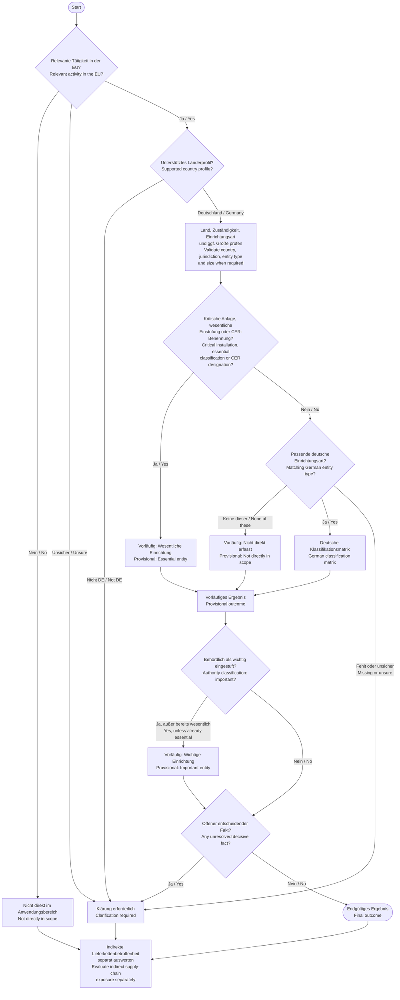
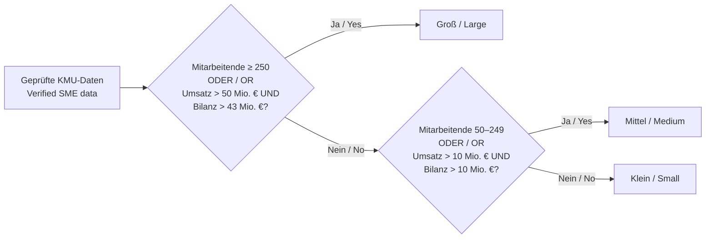
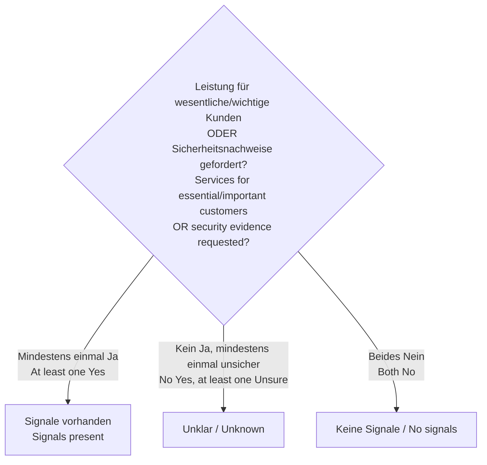

# Aktuelles NIS2-Regelset / Current NIS2 Rule Set

Stand / Snapshot: **2026-07-25**

> **DE:** Diese Darstellung beschreibt das im Repository definierte
> Betroffenheitscheck-Release `2026-v1`. Bereits gespeicherte Prüfungen bleiben
> an ihr veröffentlichtes, unveränderliches Release gebunden. Die automatisierte
> Einstufung ist eine nachvollziehbare Vorprüfung und ersetzt keine rechtliche
> Beratung oder behördliche Entscheidung.
>
> **EN:** This visualization describes applicability-check release `2026-v1`
> as defined in the repository. Existing assessments remain pinned to their
> published, immutable release. The automated classification is a traceable
> preliminary assessment and does not replace legal advice or an authority
> decision.

## Release auf einen Blick / Release at a glance

| Merkmal / Property | Wert / Value |
| --- | --- |
| Prüfung / Check | NIS2-Betroffenheitscheck / NIS2 applicability check |
| Release | `2026-v1` |
| Wirksam ab / Effective from | `2026-03-17` |
| Evaluator | `nis2_scope_v3`, Version `3` |
| Ergebnisschema / Result schema | Version `4` |
| Schwellenwertsatz / Threshold set | `2003-361-v1` |
| Vollständig unterstütztes Länderprofil / Fully supported country profile | Deutschland / Germany (`DE`) |
| Deutsches Profil / German profile | `de-bsig-2025-amended-2026-03` |
| EU-Anwendungsidentitäten / EU application identities | 70 |
| Deutsche auswählbare Identitäten / German selectable identities | 73 |
| Deutsche gesetzliche Anhangskategorien / German statutory annex categories | 67 |

## Gesamtlogik / Overall decision flow

**DE:** Die Einstufung wird zunächst vorläufig berechnet. Jeder erkannte offene
entscheidende Fakt überschreibt anschließend ein positives oder negatives
Zwischenergebnis mit `clarification_required`.

**EN:** Classification is calculated provisionally first. Any detected
unresolved decisive fact then overrides a positive or negative intermediate
result with `clarification_required`.

## Deutsche Klassifikationsmatrix / German classification matrix

Die Reihenfolge in dieser Tabelle entspricht der Reihenfolge im Evaluator. Bei
mehreren ausgewählten Identitäten gilt der erste passende Regeltyp.

The order in this table is the evaluator's precedence order. If several
identities are selected, the first matching rule type applies.

| Priorität / Priority | Regeltyp / Rule type | Anzahl / Count | Klein / Small | Mittel / Medium | Groß / Large |
| ---: | --- | ---: | --- | --- | --- |
| 1 | Immer besonders wichtig oder Bundesverwaltung / Always particularly important or federal administration | 3 + 3 | Wesentlich / Essential | Wesentlich / Essential | Wesentlich / Essential |
| 2 | Immer wichtig / Always important | 1 | Wichtig / Important | Wichtig / Important | Wichtig / Important |
| 3 | Telekommunikation / Telecommunications | 2 | Wichtig / Important | Wesentlich / Essential | Wesentlich / Essential |
| 4 | BSIG Anlage 1, Standard / BSIG Annex 1, standard | 48 | Nicht direkt erfasst / Not directly in scope | Wichtig / Important | Wesentlich / Essential |
| 5 | BSIG Anlage 2, Standard / BSIG Annex 2, standard | 14 | Nicht direkt erfasst / Not directly in scope | Wichtig / Important | Wichtig / Important |
| 6 | Domainnamen-Registrierungsdienste / Domain-name registration services | 1 | Klärung + Pflichtenhinweis / Clarification + obligations overlay | Klärung + Pflichtenhinweis / Clarification + obligations overlay | Klärung + Pflichtenhinweis / Clarification + obligations overlay |
| 7 | Regionale Verwaltung / Regional administration | 1 | Klärung / Clarification | Klärung / Clarification | Klärung / Clarification |

Die 68 Identitäten aus den Anlagen repräsentieren 67 gesetzliche Kategorien,
weil die Kategorie der Vertrauensdiensteanbieter in „qualifiziert“ und „nicht
qualifiziert“ aufgeteilt wird. Hinzu kommen fünf Identitäten außerhalb der
Anlagen.

The 68 annex identities represent 67 statutory categories because the
trust-service-provider category is split into “qualified” and “non-qualified”.
Five out-of-annex identities are added.

## Größenlogik / Size logic

Für größenabhängige Identitäten wird die Größe nur verwendet, wenn die
deutschen Aggregationsregeln ausdrücklich mit einem der folgenden Werte
bestätigt wurden:

For size-dependent identities, size is used only if the German aggregation
rules were explicitly confirmed with one of these values:

- `verified_de_without_it_exception`
- `verified_de_with_it_exception`
- `not_applicable_no_partner_or_linked_enterprises`

Der dritte Wert bedeutet, dass keine Partner- oder verbundenen Unternehmen
bestehen und deshalb keine Aggregation mit anderen Unternehmen erforderlich
ist. Er gilt sowohl im deutschen Profil als auch im EU-Kern als bestätigter
Größenstatus. `no` bedeutet weiterhin, dass relevante Unternehmen nicht
korrekt einbezogen wurden; `unsure` bleibt ebenfalls ungeklärt.

The third value means that there are no partner or linked enterprises and
therefore no aggregation with other enterprises is required. It is accepted
as a verified-size state in both the German profile and the EU-core path.
`no` still means that relevant enterprises were not included correctly;
`unsure` also remains unresolved.

Andernfalls ist die Größe `unknown`; bei Anlage 1, Anlage 2 oder
Telekommunikation führt das zu `clarification_required`.

Otherwise, size is `unknown`; for Annex 1, Annex 2, or telecommunications this
causes `clarification_required`.

Die finanziellen Grenzen werden paarweise geprüft: Nur Umsatz **oder** nur
Bilanzsumme über der jeweiligen Grenze reicht nicht aus.

Financial limits are tested as a pair: turnover **or** balance-sheet total
alone above the respective limit is insufficient.

## Sonder- und Überschreibungsregeln / Special and override rules

| Bedingung / Condition | Wirkung / Effect |
| --- | --- |
| Keine relevante EU-Tätigkeit / No relevant EU activity | Sofort `not_directly_in_scope`; die Länderunterstützung ist dann unerheblich. / Immediate `not_directly_in_scope`; country support is irrelevant. |
| EU-Tätigkeit unsicher / EU activity unsure | `clarification_required` |
| Relevante EU-Tätigkeit, aber Land ohne unterstütztes Profil / Relevant EU activity, but country has no supported profile | `clarification_required`; derzeit sind alle Länder außer DE nicht unterstützt. / Currently every country except DE is unsupported. |
| Deutsche kritische Anlage / German critical installation | Vorläufig `essential_entity` nach BSIG § 28 Abs. 1 Nr. 1. / Provisional `essential_entity` under BSIG section 28(1)(1). |
| Behördlich wesentlich oder nach CER kritisch / Classified essential by an authority or designated critical under CER | Vorläufig `essential_entity`. / Provisional `essential_entity`. |
| Behördlich wichtig / Classified important by an authority | Hebt jedes nicht-wesentliche Zwischenergebnis auf `important_entity` an. / Upgrades any non-essential intermediate result to `important_entity`. |
| Keine deutsche Einrichtungsart trifft zu / No German entity type applies | `not_directly_in_scope`, weil das DE-Profil negative Ergebnisse erlaubt. / `not_directly_in_scope`, because the DE profile permits negative conclusions. |
| Domainnamen-Registrierungsdienst / Domain-name registration service | Pflichten nach BSIG § 34 werden vermerkt; die Einstufung bleibt klärungsbedürftig. / Obligations under BSIG section 34 are recorded; classification requires clarification. |
| Regionale Verwaltung / Regional administration | Erfordert eine Grundlage im Landesrecht und bleibt klärungsbedürftig. / Requires a Land-law basis and remains subject to clarification. |

## Zuständigkeitsabgleich / Jurisdiction matching

Eine ausgewählte deutsche Identität muss zur angegebenen
Zuständigkeitsgrundlage passen. Andernfalls entsteht
`unresolved_profile_jurisdiction` und damit `clarification_required`.

A selected German identity must match the reported jurisdiction basis.
Otherwise, `unresolved_profile_jurisdiction` is recorded, producing
`clarification_required`.

| Zuständigkeitsgrundlage / Jurisdiction basis | Zulässige deutsche Identitäten / Permitted German identities | Behördenentscheidung nötig? / Authority decision required? |
| --- | ---: | --- |
| Niederlassung in Deutschland / Establishment in Germany | 58 | Nein / No |
| Kritische Anlage in Deutschland / Critical installation located in Germany | 68 | Nein / No |
| Bundesverwaltung / Federal administration | 3 | Nein / No |
| Hauptniederlassung in der EU in Deutschland / Main EU establishment in Germany | 11 digitale grenzüberschreitende Identitäten / 11 cross-border digital identities | Nein / No |
| EU-Vertreter in Deutschland / EU representative in Germany | 11 digitale grenzüberschreitende Identitäten / 11 cross-border digital identities | Nein / No |
| Förmliche BSI-Erklärung ohne Vertreter / Formal BSI declaration without a representative | 11 digitale grenzüberschreitende Identitäten / 11 cross-border digital identities | **Ja / Yes** |
| Ort des öffentlichen Telekommunikationsdienstes / Public telecommunications service location | 2 | Nein / No |
| Regionale Verwaltung nach Landesrecht / Regional administration under Land law | 1 | **Ja / Yes** |

## Klärungsgründe / Clarification reasons

Jeder der folgenden Codes überschreibt das vorläufige Ergebnis:

Each of the following codes overrides the provisional outcome:

| Code | Deutsch | English |
| --- | --- | --- |
| `unresolved_eu_activity` | EU-Tätigkeit ist unsicher. | EU activity is unsure. |
| `unresolved_country` | Zuständiger Staat fehlt oder ist unsicher. | The competent country is missing or unsure. |
| `unresolved_unsupported_profile` | Für den gewählten Staat existiert kein unterstütztes Profil. | No supported profile exists for the selected country. |
| `unresolved_jurisdiction_basis` | Zuständigkeitsgrundlage fehlt oder ist unsicher. | The jurisdiction basis is missing or unsure. |
| `unresolved_entity_type` | Einrichtungsart fehlt, ist unsicher oder gehört nicht zum Länderkatalog. | The entity type is missing, unsure, or outside the country catalog. |
| `unresolved_profile_jurisdiction` | Einrichtungsart und Zuständigkeitsgrundlage passen nicht zusammen. | Entity type and jurisdiction basis do not match. |
| `unresolved_size_aggregation` | Erforderliche Größen- und Aggregationsdaten sind nicht belastbar bestätigt. | Required size and aggregation data were not reliably confirmed. |
| `unresolved_domain_registration_classification` | Domainregistrierungs-Pflichten ergeben noch keine wesentliche/wichtige Einstufung. | Domain-registration duties do not establish an essential/important classification. |
| `unresolved_regional_administration` | Die erforderliche landesrechtliche Grundlage muss geprüft werden. | The required Land-law basis must be checked. |

## Separate indirekte Betroffenheit / Separate indirect exposure

Die indirekte Lieferkettenbetroffenheit verändert **nicht** die gesetzliche
Einstufung.

Indirect supply-chain exposure does **not** change the statutory
classification.

## Eingaben ohne Einfluss auf das v3-Ergebnis / Inputs not affecting the v3 outcome

- **DE:** `sector_specific_regime` wird im Fragebogen erfasst und gespeichert,
  ändert im aktuellen v3-Evaluator aber weder die Einstufung noch die
  Pflichten-Overlays.
  **EN:** `sector_specific_regime` is collected and stored by the questionnaire,
  but the current v3 evaluator changes neither classification nor obligation
  overlays based on it.

- **DE:** `member_state_designation = unsure` erzeugt im aktuellen
  v3-Evaluator allein keinen offenen Fakt; die übrige Einrichtungs- und
  Zuständigkeitslogik bestimmt weiterhin das Ergebnis.
  **EN:** In the current v3 evaluator,
  `member_state_designation = unsure` does not by itself create an unresolved
  fact; the remaining entity and jurisdiction logic still determines the
  outcome.

## Ergebnis und Gap-Analyse / Outcome and Gap Analysis

| Ergebnis / Outcome | Gap-Analyse zulässig? / Gap Analysis eligible? |
| --- | --- |
| `essential_entity` — Wesentliche Einrichtung / Essential entity | Ja / Yes |
| `important_entity` — Wichtige Einrichtung / Important entity | Ja / Yes |
| `not_directly_in_scope` — Nicht direkt im Anwendungsbereich / Not directly in scope | Nein / No |
| `clarification_required` — Klärung erforderlich / Clarification required | Nein / No |

„Freigegeben“ bedeutet nur, dass die deterministische Auswertung erfolgreich
gespeichert wurde. Es bedeutet nicht automatisch ein positives Ergebnis oder
die Zulässigkeit der Gap-Analyse.

“Approved” only means that deterministic evaluation was stored successfully.
It does not automatically mean a positive outcome or Gap Analysis eligibility.

## Quellen im Repository / Repository sources

- [Release-Definition / Release definition](../../src/server/compliance/nis2/releases/2026-v1/release.ts)
- [Evaluator / Evaluation logic](../../src/server/applicability-check/rules.ts)
- [Deutscher Einrichtungsartenkatalog / German entity catalog](../../src/server/compliance/nis2/releases/2026-v1/de-profile.ts)
- [Regelset-Schema / Rule-set schema](../../src/server/applicability-check/rule-set-schema.ts)
- [Aktuelle Länderunterstützung / Current country support](./country-support-current-behavior.md)
